# 核心領域模型

> **版本**：2.0  
> **最後更新**：2026-01-18  
> **對象**：開發人員

---

## 1. 概覽

本文件定義構成 iPig 系統領域模型的核心實體、其關係及商業規則。

---

## 2. 實體關係圖

```mermaid
erDiagram
    USERS ||--o{ USER_ROLES : has
    ROLES ||--o{ USER_ROLES : assigned_to
    ROLES ||--o{ ROLE_PERMISSIONS : has
    PERMISSIONS ||--o{ ROLE_PERMISSIONS : granted_to
    
    USERS ||--o{ PROTOCOLS : creates
    USERS ||--o{ USER_PROTOCOLS : participates
    PROTOCOLS ||--o{ USER_PROTOCOLS : has_members
    PROTOCOLS ||--o{ PROTOCOL_VERSIONS : has_versions
    PROTOCOLS ||--o{ PROTOCOL_STATUS_HISTORY : tracks_status
    
    PIGS ||--o{ PIG_OBSERVATIONS : has
    PIGS ||--o{ PIG_SURGERIES : has
    PIGS ||--o{ PIG_WEIGHTS : has
    PIGS ||--o{ PIG_VACCINATIONS : has
    PIGS ||--|| PIG_SACRIFICES : may_have
    PIGS ||--|| PIG_PATHOLOGY_REPORTS : may_have
    PIG_SOURCES ||--o{ PIGS : supplies
    
    USERS ||--o{ ATTENDANCE_RECORDS : logs
    USERS ||--o{ OVERTIME_RECORDS : submits
    USERS ||--o{ LEAVE_REQUESTS : requests
    OVERTIME_RECORDS ||--o{ COMP_TIME_BALANCES : generates
    USERS ||--o{ ANNUAL_LEAVE_ENTITLEMENTS : receives
    
    WAREHOUSES ||--o{ DOCUMENTS : stores
    PARTNERS ||--o{ DOCUMENTS : transacts
    DOCUMENTS ||--o{ DOCUMENT_LINES : contains
    PRODUCTS ||--o{ DOCUMENT_LINES : referenced_in
    DOCUMENTS ||--o{ STOCK_LEDGER : records
```



---

## 3. 核心實體

### 3.1 使用者與認證

#### 使用者 (User)
| 欄位 | 類型 | 說明 |
|------|------|------|
| id | UUID | 主鍵 |
| email | VARCHAR(255) | 唯一登入信箱 |
| password_hash | VARCHAR(255) | Argon2 雜湊 |
| display_name | VARCHAR(100) | 顯示名稱 |
| phone | VARCHAR(20) | 選填 |
| organization | VARCHAR(200) | 選填 |
| is_internal | BOOLEAN | 內部員工標記 |
| is_active | BOOLEAN | 帳號啟用 |
| must_change_password | BOOLEAN | 強制變更密碼 |
| theme_preference | VARCHAR(20) | light/dark/system |
| language_preference | VARCHAR(10) | zh-TW/en |

**商業規則**：
- 信箱必須全系統唯一
- 密碼必須符合複雜度要求
- 內部使用者（`is_internal=true`）可存取 HR 功能
- 帳號可停用但不可刪除（保留稽核軌跡）

#### 角色 (Role)
| 欄位 | 類型 | 說明 |
|------|------|------|
| id | UUID | 主鍵 |
| code | VARCHAR(50) | 唯一代碼 |
| name | VARCHAR(100) | 顯示名稱 |
| is_internal | BOOLEAN | 僅限內部使用者 |
| is_system | BOOLEAN | 系統定義，不可刪除 |
| is_deleted | BOOLEAN | 軟刪除標記 |
| is_active | BOOLEAN | 啟用標記 |

**系統角色**：
- `admin` - 系統管理員
- `iacuc_staff` - 執行秘書
- `experiment_staff` - 試驗工作人員
- `vet` - 獸醫師
- `warehouse` - 倉庫管理員
- `pi` - 計畫主持人
- `client` - 委託人

---

### 3.2 計畫書（AUP 審查系統）

#### 計畫書 (Protocol)
| 欄位 | 類型 | 說明 |
|------|------|------|
| id | UUID | 主鍵 |
| protocol_no | VARCHAR(50) | 系統產生編號 |
| iacuc_no | VARCHAR(50) | IACUC 核准編號 |
| title | VARCHAR(500) | 計畫名稱 |
| status | protocol_status | 目前狀態 |
| pi_user_id | UUID | 計畫主持人 |
| working_content | JSONB | 表單資料 |
| start_date | DATE | 計畫開始日 |
| end_date | DATE | 計畫結束日 |

**狀態列舉 (protocol_status)**：
```
DRAFT → SUBMITTED → PRE_REVIEW → UNDER_REVIEW
                                    ↓
         ┌─────────────────────────────────────────────────┐
         ↓                    ↓                 ↓          ↓
REVISION_REQUIRED ← RESUBMITTED   APPROVED   REJECTED   DEFERRED
         │                        (或 APPROVED_WITH_CONDITIONS)
         └→ RESUBMITTED          
                                    ↓
                    SUSPENDED ←→ CLOSED ← DELETED
```

**計畫書角色 (protocol_role)**：
- `PI` - 計畫主持人
- `CLIENT` - 委託人（資助專案的客戶）
- `CO_EDITOR` - 協編者（具編輯權限）

---

### 3.3 動物（豬隻）

#### 豬隻 (Pig)
| 欄位 | 類型 | 說明 |
|------|------|------|
| id | SERIAL | 主鍵 |
| ear_tag | VARCHAR(10) | 耳號識別碼 |
| status | pig_status | 目前狀態 |
| breed | pig_breed | 品種類型 |
| source_id | UUID | 來源/供應商 |
| gender | pig_gender | male/female |
| birth_date | DATE | 出生日期 |
| entry_date | DATE | 進場日期 |
| entry_weight | NUMERIC(5,1) | 進場體重 (kg) |
| pen_location | VARCHAR(10) | 目前欄位（如「A01」）|
| pre_experiment_code | VARCHAR(20) | 試驗前編號 |
| iacuc_no | VARCHAR(20) | 指派的 IACUC 計畫 |
| experiment_date | DATE | 試驗開始日期 |
| is_deleted | BOOLEAN | 軟刪除標記 |

**狀態列舉 (pig_status)**：
```
unassigned → assigned → in_experiment → completed
                 ↓                          ↓
            transferred              deceased
```

**品種列舉 (pig_breed)**：
- `miniature` - 迷你豬
- `white` - 白豬
- `LYD` - 藍瑞斯×約克夏×杜洛克
- `other` - 其他

#### 豬隻觀察紀錄 (Pig Observation)
| 欄位 | 類型 | 說明 |
|------|------|------|
| id | SERIAL | 主鍵 |
| pig_id | INTEGER | 外鍵關聯 pigs |
| event_date | DATE | 事件日期 |
| record_type | record_type | abnormal/experiment/observation |
| content | TEXT | 觀察內容 |
| no_medication_needed | BOOLEAN | 無需用藥 |
| stop_medication | BOOLEAN | 停藥標記 |
| treatments | JSONB | 治療詳情 |
| vet_read | BOOLEAN | 獸醫已閱讀 |

**紀錄類型列舉 (record_type)**：
- `abnormal` - 異常紀錄
- `experiment` - 試驗紀錄
- `observation` - 一般觀察

#### 豬隻手術紀錄 (Pig Surgery)
| 欄位 | 類型 | 說明 |
|------|------|------|
| id | SERIAL | 主鍵 |
| pig_id | INTEGER | 外鍵關聯 pigs |
| is_first_experiment | BOOLEAN | 首次實驗標記 |
| surgery_date | DATE | 手術日期 |
| surgery_site | VARCHAR(200) | 手術部位 |
| induction_anesthesia | JSONB | 誘導麻醉詳情 |
| pre_surgery_medication | JSONB | 術前用藥 |
| anesthesia_maintenance | JSONB | 維持麻醉詳情 |
| vital_signs | JSONB | 生命徵象追蹤 |
| post_surgery_medication | JSONB | 術後用藥 |
| vet_read | BOOLEAN | 獸醫已閱讀 |

---

### 3.4 ERP（庫存與採購）

#### 產品 (Product)
| 欄位 | 類型 | 說明 |
|------|------|------|
| id | UUID | 主鍵 |
| sku | VARCHAR(50) | 庫存單位 |
| name | VARCHAR(200) | 產品名稱 |
| spec | TEXT | 規格 |
| category_code | CHAR(3) | SKU 類別 |
| subcategory_code | CHAR(3) | SKU 子類別 |
| base_uom | VARCHAR(20) | 基本計量單位 |
| track_batch | BOOLEAN | 追蹤批號 |
| track_expiry | BOOLEAN | 追蹤效期 |
| safety_stock | NUMERIC(18,4) | 安全庫存量 |
| status | VARCHAR(20) | active/inactive/discontinued |

**SKU 格式**：`[CAT][SUB]-[SEQUENCE]`（如 `DRG-ANT-001`）

#### 單據 (Document)
| 欄位 | 類型 | 說明 |
|------|------|------|
| id | UUID | 主鍵 |
| doc_type | doc_type | 單據類型 |
| doc_no | VARCHAR(50) | 唯一單據編號 |
| status | doc_status | draft/submitted/approved/cancelled |
| warehouse_id | UUID | 目標倉庫 |
| partner_id | UUID | 供應商或客戶 |
| doc_date | DATE | 單據日期 |

**單據類型 (doc_type)**：
- `PO` - Purchase Order（採購單）
- `GRN` - Goods Receipt Note（入庫單）
- `PR` - Purchase Requisition（請購單）
- `SO` - Sales Order（銷售單）
- `DO` - Delivery Order（出貨單）
- `SR` - Stock Return（退貨單）
- `TR` - Transfer（調撥單）
- `STK` - Stocktake（盤點單）
- `ADJ` - Adjustment（調整單）
- `RTN` - Return（退回單）

---

### 3.5 人事管理

#### 出勤紀錄 (Attendance Record)
| 欄位 | 類型 | 說明 |
|------|------|------|
| id | UUID | 主鍵 |
| user_id | UUID | 員工 |
| work_date | DATE | 工作日期 |
| clock_in_time | TIMESTAMPTZ | 簽到時間 |
| clock_out_time | TIMESTAMPTZ | 簽退時間 |
| regular_hours | NUMERIC(5,2) | 正常工時 |
| overtime_hours | NUMERIC(5,2) | 加班時數 |
| status | VARCHAR(20) | normal/late/early_leave/absent/leave/holiday |

#### 請假申請 (Leave Request)
| 欄位 | 類型 | 說明 |
|------|------|------|
| id | UUID | 主鍵 |
| user_id | UUID | 申請人 |
| proxy_user_id | UUID | 代理人（選填）|
| leave_type | leave_type | 請假類型 |
| start_date | DATE | 請假開始日 |
| end_date | DATE | 請假結束日 |
| total_days | NUMERIC(5,2) | 總天數 |
| status | leave_status | 目前狀態 |
| current_approver_id | UUID | 下一位審核者 |

**請假類型 (leave_type)**：
- `ANNUAL` - 特休假
- `PERSONAL` - 事假
- `SICK` - 病假
- `COMPENSATORY` - 補休假
- `MARRIAGE` - 婚假
- `BEREAVEMENT` - 喪假
- `MATERNITY` - 產假
- `PATERNITY` - 陪產假
- `MENSTRUAL` - 生理假
- `OFFICIAL` - 公假
- `UNPAID` - 無薪假

---

## 4. 跨實體關係

### 4.1 計畫書 ↔ 豬隻
- 豬隻透過 `iacuc_no` 指派至計畫書
- 一個計畫書可有多隻豬
- 一隻豬只能指派至一個活動計畫

### 4.2 使用者 ↔ 角色 ↔ 權限
- 使用者擁有多個角色（透過 `user_roles` 多對多）
- 角色擁有多個權限（透過 `role_permissions` 多對多）
- 權限檢查在處理器層級執行

### 4.3 加班 ↔ 補休
- 核准的加班產生補休時數
- 補休自加班日起 1 年到期
- 使用順序為 FIFO（最舊先過期）

### 4.4 請假 ↔ 餘額
- 特休來自 `annual_leave_entitlements`（2 年到期）
- 補休來自 `comp_time_balances`（1 年到期）
- 請假申請從各自餘額扣除

---

## 5. 稽核軌跡

所有實體透過以下方式維護稽核軌跡：
- `created_at` / `updated_at` 時間戳記
- `created_by` / `updated_by` 使用者參照
- `user_activity_logs` 詳細變更追蹤
- `audit_logs` ERP 作業紀錄

---

*下一章：[模組與邊界](./03_MODULES_AND_BOUNDARIES.md)*
