# 核心領域模型

> **版本**：5.0  
> **最後更新**：2026-02-17  
> **對象**：開發人員

---

## 1. 概覽

本文件定義構成 iPig 系統領域模型的核心實體、其關係及商業規則。

---

## 2. 實體關係圖

```mermaid
erDiagram
    USERS ||--o{ USER_ROLES : has
    ROLES ||--o{ USER_ROLES : assigned
    ROLES ||--o{ ROLE_PERMISSIONS : has
    PERMISSIONS ||--o{ ROLE_PERMISSIONS : granted

    USERS ||--o{ PROTOCOLS : "owns (PI)"
    USERS ||--o{ USER_PROTOCOLS : participates
    PROTOCOLS ||--o{ USER_PROTOCOLS : has_members
    PROTOCOLS ||--o{ PROTOCOL_VERSIONS : versioned
    PROTOCOLS ||--o{ REVIEW_ASSIGNMENTS : reviewed
    PROTOCOLS ||--o{ AMENDMENTS : amended
    PROTOCOLS ||--o{ PROTOCOL_ACTIVITIES : logs
    PROTOCOLS ||--o{ PROTOCOL_STATUS_HISTORY : tracks
    
    ANIMAL_SOURCES ||--o{ ANIMALS : provides
    ANIMALS ||--o{ ANIMAL_OBSERVATIONS : has
    ANIMALS ||--o{ ANIMAL_SURGERIES : undergoes
    ANIMALS ||--o{ ANIMAL_WEIGHTS : measured
    ANIMALS ||--o{ ANIMAL_VACCINATIONS : receives
    ANIMALS ||--o{ ANIMAL_BLOOD_TESTS : tested
    ANIMALS ||--|| ANIMAL_SACRIFICES : "may have"
    ANIMALS ||--|| ANIMAL_PATHOLOGY_REPORTS : "may have"
    ANIMALS ||--o{ EUTHANASIA_ORDERS : "may have"
    ANIMALS ||--|| ANIMAL_SUDDEN_DEATHS : "may have"
    ANIMALS ||--o{ ANIMAL_TRANSFERS : "may transfer"
    ANIMAL_TRANSFERS ||--o{ TRANSFER_VET_EVALUATIONS : evaluated
    
    BLOOD_TEST_TEMPLATES ||--o{ ANIMAL_BLOOD_TEST_ITEMS : used_in
    BLOOD_TEST_PANELS ||--o{ BLOOD_TEST_PANEL_ITEMS : contains
    BLOOD_TEST_TEMPLATES ||--o{ BLOOD_TEST_PANEL_ITEMS : grouped
    
    WAREHOUSES ||--o{ DOCUMENTS : stores
    PARTNERS ||--o{ DOCUMENTS : transacts
    DOCUMENTS ||--o{ DOCUMENT_LINES : contains
    PRODUCTS ||--o{ DOCUMENT_LINES : referenced_in
    DOCUMENTS ||--o{ STOCK_LEDGER : records
    WAREHOUSES ||--o{ STORAGE_LOCATIONS : has
    
    USERS ||--o{ ATTENDANCE_RECORDS : has
    USERS ||--o{ LEAVE_REQUESTS : applies
    USERS ||--o{ OVERTIME_RECORDS : submits
    
    USERS ||--o{ USER_ACTIVITY_LOGS : generates
    USERS ||--o{ USER_SESSIONS : has
    USERS ||--o{ LOGIN_EVENTS : triggers
```

---

## 3. 核心實體

### 3.1 使用者與認證

#### 使用者 (User)
| 欄位 | 類型 | 說明 |
|------|------|------|
| id | UUID | 主鍵 |
| email | VARCHAR(255) | 唯一登入信箱 |
| password_hash | VARCHAR(255) | Argon2 雜湊 |
| display_name | VARCHAR(100) | 顯示名稱 |
| phone | VARCHAR(20) | 聯絡電話 |
| organization | VARCHAR(200) | 所屬機構 |
| department_id | UUID | FK → departments |
| direct_manager_id | UUID | FK → users（直屬主管）|
| is_internal | BOOLEAN | 內部/外部使用者 |
| is_active | BOOLEAN | 帳號狀態 |
| must_change_password | BOOLEAN | 首次登入需變更密碼 |
| last_login_at | TIMESTAMPTZ | 最後登入時間 |
| login_attempts | INTEGER | 連續失敗次數 |
| locked_until | TIMESTAMPTZ | 帳號鎖定截止時間 |

**角色列舉**：
- `admin` - 系統管理員
- `ADMIN_STAFF` - 行政人員
- `iacuc_staff` - 執行秘書
- `iacuc_chair` - IACUC 主席
- `experiment_staff` - 試驗工作人員
- `vet` - 獸醫師
- `warehouse` - 倉庫管理員
- `purchasing` - 採購人員
- `reviewer` - 審查委員
- `pi` - 計畫主持人
- `client` - 委託人

#### 使用者偏好設定 (User Preferences)
| 欄位 | 類型 | 說明 |
|------|------|------|
| id | UUID | 主鍵 |
| user_id | UUID | FK → users |
| preference_key | VARCHAR(100) | 偏好鍵名 |
| preference_value | JSONB | 偏好值 |

---

### 3.2 計畫書（AUP 審查系統）

#### 計畫書 (Protocol)
| 欄位 | 類型 | 說明 |
|------|------|------|
| id | UUID | 主鍵 |
| protocol_no | VARCHAR(50) | 系統產生編號 |
| iacuc_no | VARCHAR(50) | IACUC 核准編號 |
| title | VARCHAR(500) | 計畫名稱 |
| status | protocol_status | 目前狀態 |
| pi_user_id | UUID | 計畫主持人 |
| working_content | JSONB | 計畫書表單內容（Section 1-8）|
| start_date | DATE | 計畫起始日 |
| end_date | DATE | 計畫結束日 |

**計畫狀態列舉 (protocol_status)**：
- `DRAFT` → `SUBMITTED` → `PRE_REVIEW` → `VET_REVIEW` → `UNDER_REVIEW`
- → `REVISION_REQUIRED` → `RESUBMITTED`
- → `APPROVED` / `APPROVED_WITH_CONDITIONS`
- → `DEFERRED` / `REJECTED`
- → `SUSPENDED` / `CLOSED` / `DELETED`

#### 變更申請 (Amendment)
| 欄位 | 類型 | 說明 |
|------|------|------|
| id | UUID | 主鍵 |
| protocol_id | UUID | FK → protocols |
| amendment_no | VARCHAR(50) | 變更編號 |
| status | amendment_status | 變更狀態 |
| change_type | amendment_type | 變更分類（MAJOR/MINOR/PENDING）|
| content | JSONB | 變更內容 |
| previous_content | JSONB | 變更前內容 |

---

### 3.3 動物管理

#### 動物 (Animal)
| 欄位 | 類型 | 說明 |
|------|------|------|
| id | SERIAL | 主鍵 |
| ear_tag | VARCHAR(10) | 耳號識別碼 |
| status | animal_status | 目前狀態 |
| breed | animal_breed | 品種類型 |
| source_id | UUID | 來源/供應商 |
| gender | animal_gender | male/female |
| birth_date | DATE | 出生日期 |
| entry_date | DATE | 進場日期 |
| entry_weight | NUMERIC(5,1) | 進場體重 (kg) |
| pen_location | VARCHAR(10) | 欄位位置 |
| pen_id | UUID | FK → pens（設施欄位）|
| iacuc_no | VARCHAR(50) | IACUC 計畫編號 |
| experiment_date | DATE | 實驗開始日 |
| pre_experiment_code | VARCHAR(20) | 術前代碼 |
| is_deleted | BOOLEAN | 軟刪除標記 |

**動物狀態列舉 (animal_status)**：
- `unassigned` - 未分配
- `in_experiment` - 實驗中
- `completed` - 實驗完畢
- `euthanized` - 已安樂死（終端狀態）
- `sudden_death` - 猝死（終端狀態）
- `transferred` - 已轉讓（終端狀態）

**品種列舉 (animal_breed)**：`miniature`、`white`、`LYD`、`other`

**性別列舉 (animal_gender)**：`male`、`female`

#### 觀察試驗紀錄 (Animal Observation)
| 欄位 | 類型 | 說明 |
|------|------|------|
| id | SERIAL | 主鍵 |
| animal_id | INTEGER | FK → animals |
| event_date | DATE | 事件日期 |
| record_type | record_type | 紀錄類型 |
| content | TEXT | 內容 |
| no_medication_needed | BOOLEAN | 無需用藥 |
| stop_medication | BOOLEAN | 停止用藥 |
| treatments | JSONB | 治療方式 |
| vet_read | BOOLEAN | 獸醫已閱讀 |

**紀錄類型列舉 (record_type)**：`abnormal`、`experiment`、`observation`

#### 手術紀錄 (Animal Surgery)
| 欄位 | 類型 | 說明 |
|------|------|------|
| id | SERIAL | 主鍵 |
| animal_id | INTEGER | FK → animals |
| is_first_experiment | BOOLEAN | 首次實驗標記 |
| surgery_date | DATE | 手術日期 |
| surgery_site | VARCHAR(200) | 手術部位 |
| induction_anesthesia | JSONB | 誘導麻醉 |
| anesthesia_maintenance | JSONB | 維持麻醉 |
| vital_signs | JSONB | 生理數值（多筆時序資料）|
| vet_read | BOOLEAN | 獸醫已閱讀 |

#### 血液檢查 (Animal Blood Test)
| 欄位 | 類型 | 說明 |
|------|------|------|
| id | UUID | 主鍵 |
| animal_id | INTEGER | FK → animals |
| test_date | DATE | 檢查日期 |
| lab_name | VARCHAR(200) | 檢驗機構 |
| status | VARCHAR(20) | pending / completed |
| remark | TEXT | 備註 |
| vet_read | BOOLEAN | 獸醫已閱讀 |
| is_deleted | BOOLEAN | 軟刪除 |

#### 猝死紀錄 (Animal Sudden Death)
| 欄位 | 類型 | 說明 |
|------|------|------|
| id | SERIAL | 主鍵 |
| animal_id | INTEGER | FK → animals（UNIQUE）|
| death_date | DATE | 死亡日期 |
| description | TEXT | 死亡情境描述 |
| discovered_by | UUID | 發現者 |
| reported_by | UUID | 登記者 |

#### 動物轉讓 (Animal Transfer)
| 欄位 | 類型 | 說明 |
|------|------|------|
| id | SERIAL | 主鍵 |
| animal_id | INTEGER | FK → animals |
| status | animal_transfer_status | 轉讓狀態（6 步）|
| from_protocol_id | UUID | 來源計劃 |
| to_protocol_id | UUID | 目標計劃 |
| reason | TEXT | 轉讓原因 |
| initiated_by | UUID | 發起者 |
| transfer_date | TIMESTAMPTZ | 轉讓完成日期 |

**轉讓狀態列舉 (animal_transfer_status)**：
`pending_source_pi` → `pending_vet_evaluation` → `pending_target_pi` → `pending_iacuc_approval` → `approved` → `completed`

#### 轉讓獸醫評估 (Transfer Vet Evaluation)
| 欄位 | 類型 | 說明 |
|------|------|------|
| id | SERIAL | 主鍵 |
| transfer_id | INTEGER | FK → animal_transfers |
| vet_id | UUID | 獸醫 |
| health_status | TEXT | 健康狀態評估 |
| is_fit_for_transfer | BOOLEAN | 是否適合轉讓 |
| notes | TEXT | 備註 |

#### 血液檢查項目模板 (Blood Test Template)
| 欄位 | 類型 | 說明 |
|------|------|------|
| id | UUID | 主鍵 |
| code | VARCHAR(20) | 唯一代碼（如 AST、ALT）|
| name | VARCHAR(200) | 項目名稱 |
| default_unit | VARCHAR(50) | 預設單位 |
| reference_range | VARCHAR(100) | 參考範圍 |
| default_price | NUMERIC(10,2) | 預設價格 |
| sort_order | INTEGER | 排序 |
| is_active | BOOLEAN | 啟用狀態 |

#### 檢驗組合 (Blood Test Panel)
| 欄位 | 類型 | 說明 |
|------|------|------|
| id | UUID | 主鍵 |
| key | VARCHAR(30) | 組合代碼（LIVER、CBC...）|
| name | VARCHAR(100) | 組合名稱 |
| icon | VARCHAR(100) | 顯示圖示 |

---

### 3.4 安樂死管理 (Euthanasia)

#### 安樂死申請單 (Euthanasia Order)
| 欄位 | 類型 | 說明 |
|------|------|------|
| id | UUID | 主鍵 |
| animal_id | INTEGER | FK → animals |
| status | euthanasia_order_status | 核准狀態 |
| reason | TEXT | 申請原因 |
| requested_by | UUID | 申請者 |
| approved_by | UUID | 核准者 |

---

### 3.5 ERP 進銷存

#### 產品 (Product)
| 欄位 | 類型 | 說明 |
|------|------|------|
| id | UUID | 主鍵 |
| sku | VARCHAR(50) | 唯一 SKU 編號 |
| name | VARCHAR(200) | 產品名稱 |
| category_code | CHAR(3) | SKU 大類 |
| subcategory_code | CHAR(3) | SKU 小類 |
| base_uom | VARCHAR(20) | 基本計量單位 |
| safety_stock | NUMERIC | 安全庫存 |
| track_batch | BOOLEAN | 追蹤批號 |
| track_expiry | BOOLEAN | 追蹤效期 |

#### 單據 (Document)
| 欄位 | 類型 | 說明 |
|------|------|------|
| id | UUID | 主鍵 |
| doc_type | doc_type | 單據類型 |
| doc_no | VARCHAR(50) | 唯一單據編號 |
| status | doc_status | draft/submitted/approved/cancelled |
| warehouse_id | UUID | 目標倉庫 |
| partner_id | UUID | 供應商或客戶 |
| doc_date | DATE | 單據日期 |

**單據類型 (doc_type)**：
- `PO` - Purchase Order（採購單）
- `GRN` - Goods Receipt Note（入庫單）
- `PR` - Purchase Requisition（請購單）
- `SO` - Sales Order（銷售單）
- `DO` - Delivery Order（出貨單）
- `SR` - Sales Return（銷退單）
- `TR` - Transfer（調撥單）
- `STK` - Stock Take（盤點單）
- `ADJ` - Adjustment（調整單）
- `RTN` - Return（退貨單）

#### 倉庫儲位 (Storage Location)
| 欄位 | 類型 | 說明 |
|------|------|------|
| id | UUID | 主鍵 |
| warehouse_id | UUID | FK → warehouses |
| code | VARCHAR(50) | 儲位代碼 |
| name | VARCHAR(200) | 儲位名稱 |

---

### 3.6 人事管理

#### 請假申請 (Leave Request)
| 欄位 | 類型 | 說明 |
|------|------|------|
| id | UUID | 主鍵 |
| user_id | UUID | 申請者 |
| proxy_user_id | UUID | 代理人 |
| leave_type | leave_type | 請假類型 |
| start_date | DATE | 請假開始日 |
| end_date | DATE | 請假結束日 |
| total_days | NUMERIC(5,2) | 總天數 |
| status | leave_status | 目前狀態 |
| current_approver_id | UUID | 下一位審核者 |

**請假類型 (leave_type)**：
`ANNUAL`、`PERSONAL`、`SICK`、`COMPENSATORY`、`MARRIAGE`、`BEREAVEMENT`、`MATERNITY`、`PATERNITY`、`MENSTRUAL`、`OFFICIAL`、`UNPAID`

**請假狀態 (leave_status)**：
`DRAFT` → `PENDING_L1` → `PENDING_L2` → `PENDING_HR` → `PENDING_GM` → `APPROVED` / `REJECTED` / `CANCELLED` / `REVOKED`

---

### 3.7 電子簽章與標註 (GLP Compliance)

#### 電子簽章 (Electronic Signature)
| 欄位 | 類型 | 說明 |
|------|------|------|
| id | UUID | 主鍵 |
| record_type | VARCHAR | 紀錄類型（sacrifice, observation, euthanasia, transfer, protocol）|
| record_id | INTEGER | 紀錄 ID |
| signer_id | UUID | 簽署者 |
| signature_data | JSONB | 簽章資料（密碼驗證結果）|
| signature_method | VARCHAR(20) | 簽章方式（`password` / `handwriting`）|
| handwriting_svg | TEXT | 手寫簽名 SVG 圖片 |
| stroke_data | JSONB | 原始筆跡座標數據 |

#### 紀錄標註 (Record Annotation)
| 欄位 | 類型 | 說明 |
|------|------|------|
| id | UUID | 主鍵 |
| record_type | VARCHAR | 紀錄類型 |
| record_id | INTEGER | 紀錄 ID |
| content | TEXT | 標註內容 |
| created_by | UUID | 建立者 |

---

## 4. 共通模式

### 4.1 軟刪除

多數實體支援軟刪除：
- `is_deleted` BOOLEAN
- `deleted_at` TIMESTAMPTZ
- `deleted_by` UUID（操作者）
- `delete_reason` TEXT

### 4.2 時間戳記與稽核

所有實體具備：
- `created_at` / `updated_at` 時間戳記
- `created_by` / `updated_by` 使用者參照
- `user_activity_logs` 詳細變更追蹤

### 4.3 版本控制

重要紀錄（觀察、手術、計畫書）具備：
- `record_versions` 表儲存歷史快照
- 版本號遞增，JSON 快照保留

### 4.4 資料隔離（轉讓）

動物轉讓完成後，新計劃使用者預設只能看到轉讓時間之後的資料：
- 所有醫療紀錄 API 支援 `?after=` 時間過濾
- 特權角色（ADMIN、VET、IACUC_STAFF、IACUC_CHAIR）可繞過隔離

---

*下一章：[模組與邊界](./03_MODULES_AND_BOUNDARIES.md)*
