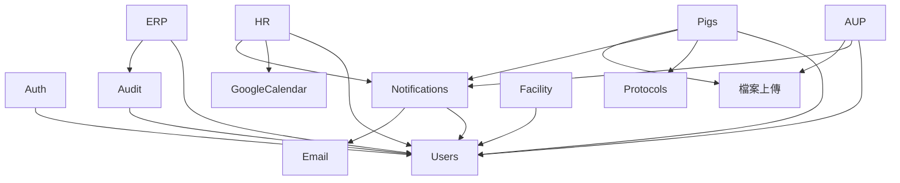

# 模組與邊界

> **版本**：2.0  
> **最後更新**：2026-01-18  
> **對象**：架構師、資深開發人員

---

## 1. 系統拆解

iPig 系統組織成獨立的有界上下文：

```
┌─────────────────────────────────────────────────────────────────────────────┐
│                         iPig 統一入口                                         │
├─────────────────────────────────────────────────────────────────────────────┤
│                                                                             │
│  ┌─────────────────┐  ┌─────────────────┐  ┌─────────────────────────────┐ │
│  │  AUP 審查系統   │  │   iPig ERP      │  │  動物管理系統               │ │
│  │  (計畫書)       │  │  (進銷存)       │  │  (豬隻)                     │ │
│  └────────┬────────┘  └────────┬────────┘  └────────────┬────────────────┘ │
│           │                    │                        │                   │
│  ┌────────┴────────────────────┴────────────────────────┴────────────────┐ │
│  │                      人事管理系統                                       │ │
│  │    (出勤、請假、加班、行事曆同步)                                        │ │
│  └───────────────────────────────────────────────────────────────────────┘ │
│                                                                             │
├─────────────────────────────────────────────────────────────────────────────┤
│                        橫切關注點                                            │
│   ┌─────────────┐  ┌─────────────┐  ┌─────────────┐  ┌─────────────────┐   │
│   │    認證     │  │    稽核     │  │   通知      │  │    設施         │   │
│   │   (JWT)     │  │  (日誌)     │  │  (Email)    │  │  (物種/欄位)    │   │
│   └─────────────┘  └─────────────┘  └─────────────┘  └─────────────────┘   │
└─────────────────────────────────────────────────────────────────────────────┘
```

---

## 2. 模組定義

### 2.1 認證與授權模組

**目的**：管理使用者身份、認證及存取控制。

| 元件 | 檔案 | 說明 |
|------|------|------|
| 認證處理器 | `handlers/auth.rs` | 登入、登出、刷新、密碼重設 |
| 認證服務 | `services/auth.rs` | Token 產生、驗證 |
| 工作階段管理 | `services/session_manager.rs` | 工作階段追蹤 |
| 登入追蹤 | `services/login_tracker.rs` | 登入失敗偵測 |
| 認證中間件 | `middleware/auth_middleware.rs` | 請求認證 |

**API 前綴**：`/api/auth/*`

**主要端點**：
- `POST /auth/login` - 使用者登入
- `POST /auth/refresh` - Token 刷新
- `POST /auth/forgot-password` - 密碼重設請求
- `POST /auth/reset-password` - 使用 Token 重設
- `POST /auth/logout` - 使用者登出

---

### 2.2 AUP 審查模組（計畫書）

**目的**：管理 IACUC 計畫書提交、審查及核准流程。

| 元件 | 檔案 | 說明 |
|------|------|------|
| 計畫書處理器 | `handlers/protocol.rs` | CRUD、狀態變更 |
| 計畫書服務 | `services/protocol.rs` | 商業邏輯 |
| 計畫書模型 | `models/protocol.rs` | 資料結構 |

**API 前綴**：`/api/protocols/*`、`/api/reviews/*`、`/api/my-projects`

**主要端點**：
- `GET/POST /protocols` - 列表/建立計畫書
- `GET/PUT /protocols/:id` - 檢視/更新計畫書
- `POST /protocols/:id/submit` - 送審
- `POST /protocols/:id/status` - 狀態變更
- `GET /protocols/:id/versions` - 版本歷程
- `GET/POST /reviews/assignments` - 審查人員指派
- `GET/POST /reviews/comments` - 審查意見
- `GET /my-projects` - 使用者的計畫書

**依賴**：
- 使用者（PI、審查員、客戶）
- 文件（附件）
- 通知（狀態變更）

---

### 2.3 動物管理模組（豬隻）

**目的**：實驗動物完整生命週期管理。

| 元件 | 檔案 | 說明 |
|------|------|------|
| 豬隻處理器 | `handlers/pig.rs` | 34KB - 廣泛操作 |
| 豬隻服務 | `services/pig.rs` | 80KB - 完整邏輯 |
| 豬隻模型 | `models/pig.rs` | 24KB - 複雜結構 |

**API 前綴**：`/api/pigs/*`、`/api/observations/*`、`/api/surgeries/*`、`/api/weights/*`、`/api/vaccinations/*`

**主要端點**：
- `GET/POST /pigs` - 列表/建立豬隻
- `GET/PUT/DELETE /pigs/:id` - CRUD 操作
- `GET /pigs/by-pen` - 依欄位檢視
- `POST /pigs/batch/assign` - 批次指派
- `POST /pigs/batch/start-experiment` - 批次開始實驗
- `GET/POST /pigs/:id/observations` - 觀察紀錄
- `GET/POST /pigs/:id/surgeries` - 手術紀錄
- `GET/POST /pigs/:id/weights` - 體重紀錄
- `GET/POST /pigs/:id/vaccinations` - 疫苗紀錄
- `GET/POST /pigs/:id/sacrifice` - 犧牲紀錄
- `GET/POST /pigs/:id/pathology` - 病理報告
- `POST /pigs/:id/export` - 匯出醫療資料

**子領域**：
- **觀察紀錄**：每日監測、治療
- **手術紀錄**：含麻醉追蹤的手術紀錄
- **體重紀錄**：長期體重追蹤
- **疫苗紀錄**：疫苗與驅蟲紀錄
- **犧牲紀錄**：生命終結程序
- **病理報告**：死後報告
- **獸醫建議**：獸醫師對紀錄的建議

---

### 2.4 ERP 模組（庫存與採購）

**目的**：管理庫存、採購及成本追蹤。

| 元件 | 檔案 | 說明 |
|------|------|------|
| 單據處理器 | `handlers/document.rs` | 單據操作 |
| 單據服務 | `services/document.rs` | 30KB 商業邏輯 |
| 產品服務 | `services/product.rs` | 產品管理 |
| SKU 服務 | `services/sku.rs` | 18KB SKU 產生 |
| 庫存服務 | `services/stock.rs` | 18KB 庫存追蹤 |
| 倉庫服務 | `services/warehouse.rs` | 倉庫管理 |
| 夥伴服務 | `services/partner.rs` | 供應商/客戶管理 |

**API 前綴**：`/api/documents/*`、`/api/products/*`、`/api/sku/*`、`/api/inventory/*`、`/api/warehouses/*`、`/api/partners/*`

**主要端點**：
- `GET/POST /documents` - 列表/建立單據
- `POST /documents/:id/submit|approve|cancel` - 流程操作
- `GET/POST /products` - 產品管理
- `POST /products/with-sku` - 建立含自動 SKU
- `POST /sku/generate` - 產生 SKU
- `GET /inventory/on-hand` - 現有庫存
- `GET /inventory/ledger` - 庫存異動

---

### 2.5 人事管理模組

**目的**：管理出勤、請假、加班及行事曆同步。

| 元件 | 檔案 | 說明 |
|------|------|------|
| HR 處理器 | `handlers/hr.rs` | 18KB 處理器操作 |
| HR 服務 | `services/hr.rs` | 44KB 完整邏輯 |
| 行事曆處理器 | `handlers/calendar.rs` | 行事曆操作 |
| 行事曆服務 | `services/calendar.rs` | 25KB 同步邏輯 |
| Google 行事曆 | `services/google_calendar.rs` | 17KB Google API |
| 餘額到期 | `services/balance_expiration.rs` | 6KB 到期處理 |
| HR 模型 | `models/hr.rs` | 13KB 資料結構 |
| 行事曆模型 | `models/calendar.rs` | 7KB 同步結構 |

**API 前綴**：`/api/hr/*`

**主要端點**：
- `GET /hr/attendance` - 出勤列表
- `POST /hr/attendance/clock-in|clock-out` - 打卡操作
- `GET/POST /hr/overtime` - 加班管理
- `POST /hr/overtime/:id/submit|approve|reject` - 流程
- `GET/POST /hr/leaves` - 請假申請
- `POST /hr/leaves/:id/submit|approve|reject|cancel` - 流程
- `GET /hr/balances/annual|comp-time|summary` - 餘額查詢
- `GET/POST /hr/calendar/sync` - 行事曆同步
- `GET /hr/calendar/conflicts` - 衝突管理

---

### 2.6 稽核與日誌模組

**目的**：GLP 合規活動追蹤及安全監控。

| 元件 | 檔案 | 說明 |
|------|------|------|
| 稽核處理器 | `handlers/audit.rs` | 管理員稽核檢視 |
| 稽核服務 | `services/audit.rs` | 19KB 日誌邏輯 |
| 稽核模型 | `models/audit.rs` | 9KB 結構 |

**API 前綴**：`/api/admin/audit/*`

**主要端點**：
- `GET /admin/audit/activities` - 活動日誌
- `GET /admin/audit/activities/user/:id` - 使用者時間軸
- `GET /admin/audit/activities/entity/:type/:id` - 實體歷程
- `GET /admin/audit/logins` - 登入事件
- `GET /admin/audit/sessions` - 活動工作階段
- `POST /admin/audit/sessions/:id/logout` - 強制登出
- `GET /admin/audit/alerts` - 安全警報
- `GET /admin/audit/dashboard` - 稽核儀表板

---

### 2.7 設施管理模組

**目的**：管理物種、建築、區域、欄位及部門。

| 元件 | 檔案 | 說明 |
|------|------|------|
| 設施處理器 | `handlers/facility.rs` | 10KB 操作 |
| 設施服務 | `services/facility.rs` | 18KB 邏輯 |
| 設施模型 | `models/facility.rs` | 8KB 結構 |

**API 前綴**：`/api/facilities/*`

**主要端點**：
- `GET/POST /facilities/species` - 物種管理
- `GET/POST /facilities` - 設施 CRUD
- `GET/POST /facilities/buildings` - 建築 CRUD
- `GET/POST /facilities/zones` - 區域 CRUD
- `GET/POST /facilities/pens` - 欄位 CRUD
- `GET/POST /facilities/departments` - 部門 CRUD

---

### 2.8 通知模組

**目的**：站內及 Email 通知。

| 元件 | 檔案 | 說明 |
|------|------|------|
| 通知處理器 | `handlers/notification.rs` | 10KB 操作 |
| 通知服務 | `services/notification.rs` | 24KB 邏輯 |
| Email 服務 | `services/email.rs` | 41KB 郵件發送 |
| 通知模型 | `models/notification.rs` | 7KB 結構 |

**API 前綴**：`/api/notifications/*`

**主要端點**：
- `GET /notifications` - 通知列表
- `GET /notifications/unread-count` - 未讀數量
- `POST /notifications/read` - 標記已讀
- `POST /notifications/read-all` - 全部標記已讀
- `GET/PUT /notifications/settings` - 通知偏好設定

---

### 2.9 報表模組

**目的**：產生庫存及營運報表。

| 元件 | 檔案 | 說明 |
|------|------|------|
| 報表處理器 | `handlers/report.rs` | 報表端點 |
| 報表服務 | `services/report.rs` | 11KB 報表邏輯 |

**API 前綴**：`/api/reports/*`、`/api/scheduled-reports/*`

**主要端點**：
- `GET /reports/stock-on-hand` - 現有庫存報表
- `GET /reports/stock-ledger` - 異動歷程
- `GET /reports/purchase-lines` - 採購明細
- `GET /reports/sales-lines` - 銷售明細
- `GET /reports/cost-summary` - 成本分析
- `GET/POST /scheduled-reports` - 排程報表設定
- `GET /report-history` - 報表歷程

---

## 3. 模組依賴



---

## 4. 前端頁面結構

```
/                           → 儀表板
/login                      → 登入
/forgot-password            → 密碼復原
/reset-password             → 密碼重設

/protocols/*                → AUP 審查系統
  /protocols                → 計畫書列表
  /protocols/new            → 建立計畫書
  /protocols/:id            → 檢視/編輯計畫書

/pigs/*                     → 動物管理
  /pigs                     → 豬隻列表含篩選
  /pigs/:id                 → 豬隻詳情檢視

/my-projects                → 使用者指派的計畫

/documents/*                → ERP 單據
/inventory/*                → 庫存檢視
/reports/*                  → 報表檢視

/hr/*                       → 人事模組
  /hr/attendance            → 出勤頁面
  /hr/leave                 → 請假管理
  /hr/calendar              → 行事曆同步設定

/admin/*                    → 系統管理
  /admin/users              → 使用者管理
  /admin/roles              → 角色管理
  /admin/audit              → 稽核日誌

/master/*                   → 主檔資料
  /master/products          → 產品
  /master/partners          → 夥伴
  /master/warehouses        → 倉庫
```

---

## 5. 模組間資料流程

### 5.1 計畫書 → 豬隻指派
1. 計畫書核准 → 產生 `iacuc_no`
2. 豬隻透過 `pigs.iacuc_no` 指派至計畫
3. 豬隻狀態變更為 `assigned`
4. 實驗開始 → 狀態變更為 `in_experiment`

### 5.2 加班 → 補休
1. 加班紀錄提交 → 等待核准
2. 加班核准 → 建立 `comp_time_balances` 記錄
3. 補休時數 = 加班時數 × 倍率
4. 到期日設為加班日起 1 年

### 5.3 請假 → 行事曆同步
1. 請假申請核准 → 觸發 `queue_calendar_sync_on_leave_change`
2. 在 `calendar_event_sync` 建立記錄，狀態為 `pending_create`
3. 同步工作推送至 Google 行事曆
4. 儲存 Google 事件 ID 供後續更新

---

*下一章：[資料庫綱要](./04_DATABASE_SCHEMA.md)*
