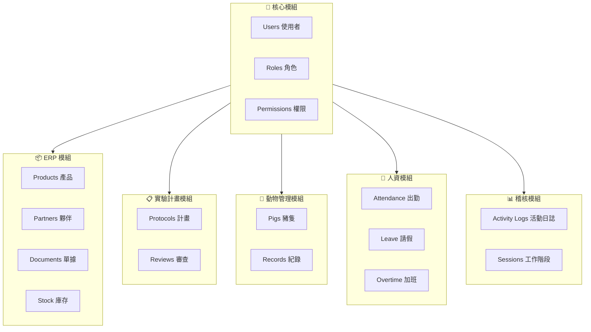
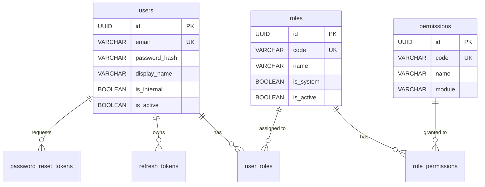
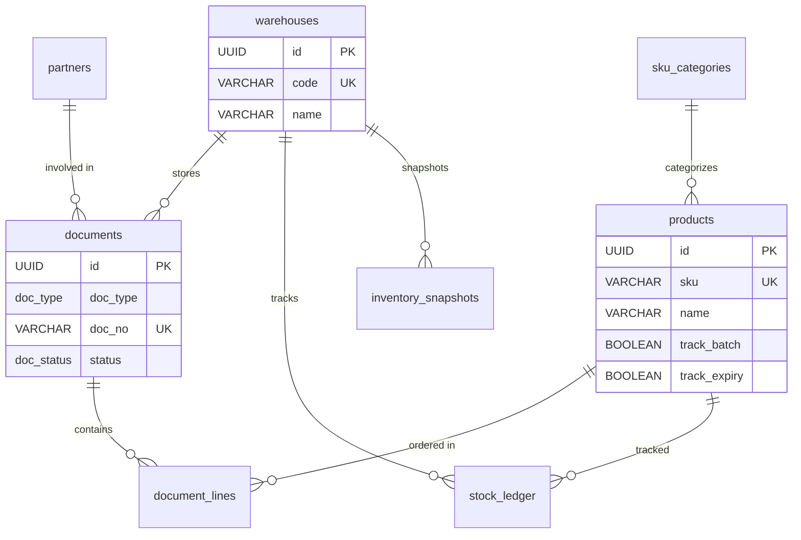
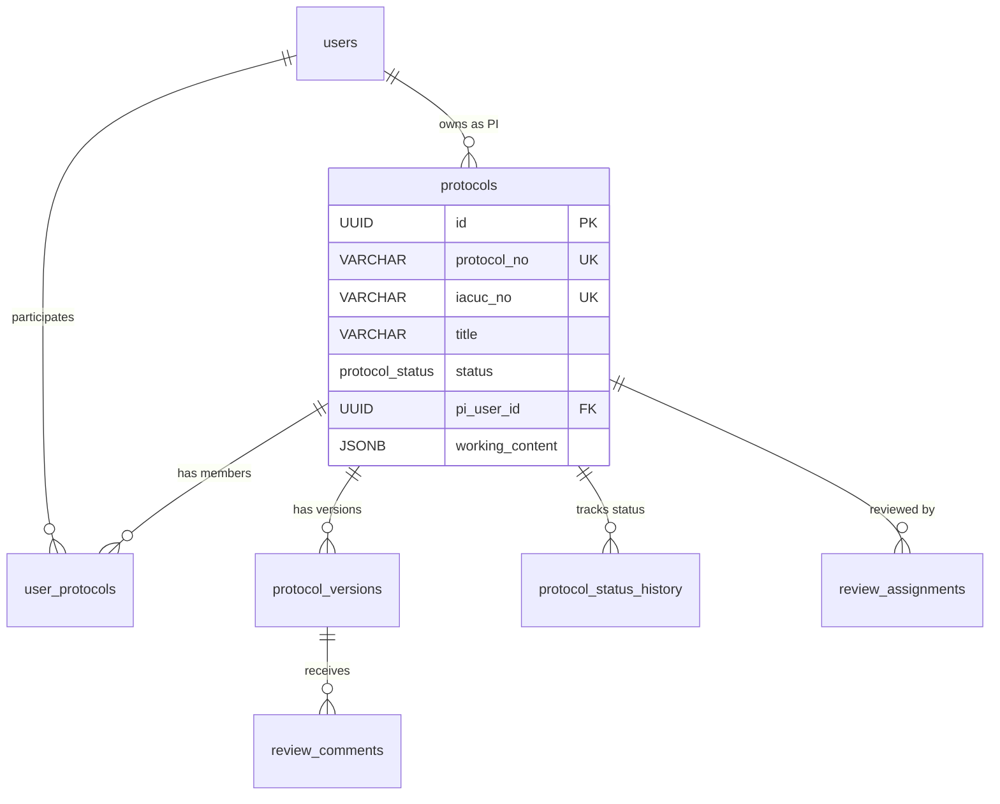
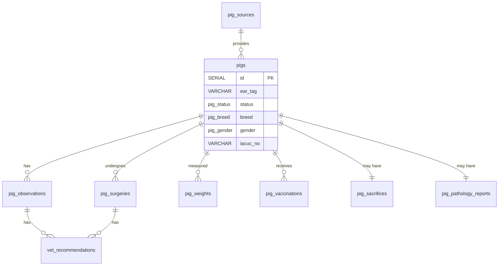
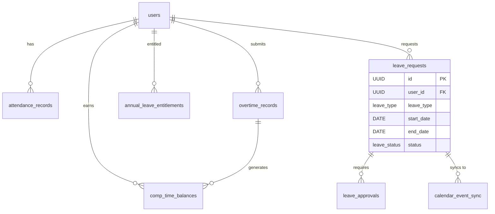
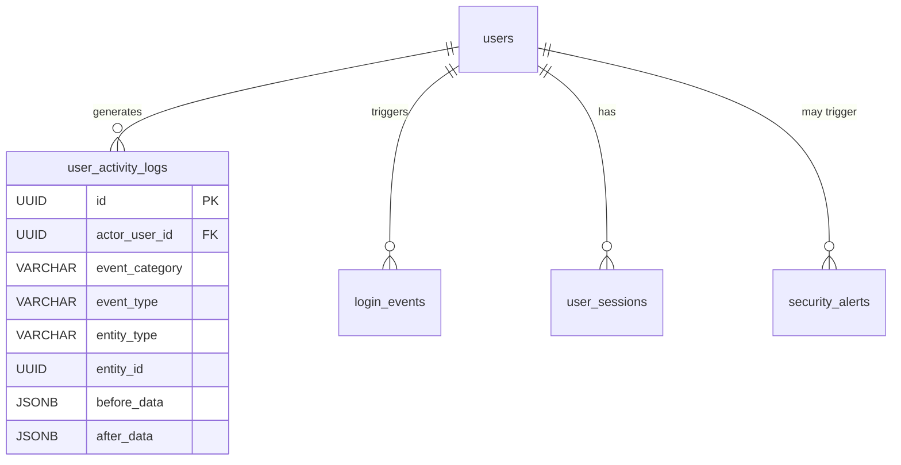

# Database Schema

> **Version**: 2.0  
> **Last Updated**: 2026-01-29  
> **Audience**: Database Administrators, Developers

---

## 1. Overview

The iPig database runs on PostgreSQL 15 and consists of 10 migration files organized by module:

| Migration | Description |
|-----------|-------------|
| 001_aup_system.sql | Core schema: users, roles, ERP, protocols, pigs, notifications |
| 002_erp_base_data.sql | SKU categories, product categories seed data |
| 003_seed_accounts.sql | Initial admin account and roles |
| 004_hr_system.sql | Attendance, overtime, leave management |
| 005_calendar_sync.sql | Google Calendar integration |
| 006_audit_system.sql | GLP-compliant audit logging |
| 007_seed_data.sql | Reference data (pig sources, permissions) |
| 008_reset_admin.sql | Admin password reset |
| 009_add_roles_is_active.sql | Role active flag |
| 010_add_deleted_at_column.sql | Soft delete for pigs |

### Module Overview



---

## 2. Custom Types (Enums)

### Partner & ERP Types
```sql
CREATE TYPE partner_type AS ENUM ('supplier', 'customer');
CREATE TYPE supplier_category AS ENUM ('drug', 'consumable', 'feed', 'equipment', 'other');
CREATE TYPE doc_type AS ENUM ('PO', 'GRN', 'PR', 'SO', 'DO', 'SR', 'TR', 'STK', 'ADJ', 'RTN');
CREATE TYPE doc_status AS ENUM ('draft', 'submitted', 'approved', 'cancelled');
CREATE TYPE stock_direction AS ENUM ('in', 'out', 'transfer_in', 'transfer_out', 'adjust_in', 'adjust_out');
```

| doc_type | 中文 | 說明 |
|----------|------|------|
| PO | 採購單 | Purchase Order - 向供應商下訂 |
| GRN | 進貨單 | Goods Received Note - 確認收貨入庫 |
| PR | 採購申請 | Purchase Requisition - 內部申請採購 |
| SO | 銷貨單 | Sales Order - 客戶訂單 |
| DO | 出貨單 | Delivery Order - 出庫交貨 |
| SR | 銷貨退回 | Sales Return - 客戶退貨 |
| TR | 調撥單 | Transfer - 倉庫間調撥 |
| STK | 盤點單 | Stock Take - 實物盤點 |
| ADJ | 調整單 | Adjustment - 帳面調整 |
| RTN | 退貨單 | Return - 向供應商退貨 |

### Protocol Types
```sql
CREATE TYPE protocol_role AS ENUM ('PI', 'CLIENT', 'CO_EDITOR');
CREATE TYPE protocol_status AS ENUM (
    'DRAFT', 'SUBMITTED', 'PRE_REVIEW', 'UNDER_REVIEW',
    'REVISION_REQUIRED', 'RESUBMITTED', 'APPROVED', 'APPROVED_WITH_CONDITIONS',
    'DEFERRED', 'REJECTED', 'SUSPENDED', 'CLOSED', 'DELETED'
);
```

### Animal Types
```sql
CREATE TYPE pig_status AS ENUM ('unassigned', 'assigned', 'in_experiment', 'completed', 'transferred', 'deceased');
CREATE TYPE pig_breed AS ENUM ('miniature', 'white', 'LYD', 'other');
CREATE TYPE pig_gender AS ENUM ('male', 'female');
CREATE TYPE record_type AS ENUM ('abnormal', 'experiment', 'observation');
CREATE TYPE pig_record_type AS ENUM ('observation', 'surgery', 'sacrifice', 'pathology');
CREATE TYPE vet_record_type AS ENUM ('observation', 'surgery');
```

| pig_status | 中文 | 說明 |
|------------|------|------|
| unassigned | 未指派 | 尚未分配到實驗計畫 |
| assigned | 已指派 | 已分配實驗計畫，等待實驗 |
| in_experiment | 實驗中 | 正在進行實驗 |
| completed | 完成 | 實驗結束 |
| transferred | 轉出 | 轉移至其他單位 |
| deceased | 死亡 | 已死亡/犧牲 |

### HR Types
```sql
CREATE TYPE leave_type AS ENUM (
    'ANNUAL', 'PERSONAL', 'SICK', 'COMPENSATORY', 'MARRIAGE',
    'BEREAVEMENT', 'MATERNITY', 'PATERNITY', 'MENSTRUAL', 'OFFICIAL', 'UNPAID'
);
CREATE TYPE leave_status AS ENUM (
    'DRAFT', 'PENDING_L1', 'PENDING_L2', 'PENDING_HR', 'PENDING_GM',
    'APPROVED', 'REJECTED', 'CANCELLED', 'REVOKED'
);
```

| leave_type | 中文 | 說明 |
|------------|------|------|
| ANNUAL | 特休 | 年度特別休假 |
| PERSONAL | 事假 | 私人事務請假 |
| SICK | 病假 | 因病無法上班 |
| COMPENSATORY | 補休 | 使用加班換得的補休時數 |
| MARRIAGE | 婚假 | 結婚假 |
| BEREAVEMENT | 喪假 | 親屬過世 |
| MATERNITY | 產假 | 生產假 (女性) |
| PATERNITY | 陪產假 | 配偶生產 (男性) |
| MENSTRUAL | 生理假 | 女性生理期 |
| OFFICIAL | 公假 | 因公外出 |
| UNPAID | 無薪假 | 留職停薪 |

### Notification & Report Types
```sql
CREATE TYPE notification_type AS ENUM (
    'low_stock', 'expiry_warning', 'document_approval',
    'protocol_status', 'vet_recommendation', 'system_alert', 'monthly_report'
);
CREATE TYPE schedule_type AS ENUM ('daily', 'weekly', 'monthly');
CREATE TYPE report_type AS ENUM (
    'stock_on_hand', 'stock_ledger', 'purchase_summary',
    'cost_summary', 'expiry_report', 'low_stock_report'
);
```

---

## 3. Core Tables

### 3.1 Users & Authentication



#### users (使用者)

> **用途**: 儲存系統所有使用者的帳號資訊，包含內部員工與外部合作夥伴

```sql
CREATE TABLE users (
    id UUID PRIMARY KEY,
    email VARCHAR(255) NOT NULL UNIQUE,        -- 登入帳號，全系統唯一
    password_hash VARCHAR(255) NOT NULL,       -- bcrypt 加密，不可逆
    display_name VARCHAR(100) NOT NULL,        -- 中文姓名或暱稱
    phone VARCHAR(20),                         -- 行動電話，用於緊急聯繫
    organization VARCHAR(200),                 -- 外部使用者所屬公司/機構
    is_internal BOOLEAN NOT NULL DEFAULT true, -- true=公司員工, false=外部委託者
    is_active BOOLEAN NOT NULL DEFAULT true,   -- false 時無法登入
    must_change_password BOOLEAN NOT NULL DEFAULT true, -- 首次登入須變更
    last_login_at TIMESTAMPTZ,                 -- 用於安全稽核與閒置帳號偵測
    login_attempts INTEGER NOT NULL DEFAULT 0, -- 連續失敗超過 5 次將鎖定
    locked_until TIMESTAMPTZ,                  -- 帳號鎖定解除時間
    theme_preference VARCHAR(20) NOT NULL DEFAULT 'light',
    language_preference VARCHAR(10) NOT NULL DEFAULT 'zh-TW',
    created_at TIMESTAMPTZ NOT NULL DEFAULT NOW(),
    updated_at TIMESTAMPTZ NOT NULL DEFAULT NOW()
);
```

#### roles (角色)

> **用途**: 定義系統角色，用於權限群組管理 (RBAC 模型)

```sql
CREATE TABLE roles (
    id UUID PRIMARY KEY,
    code VARCHAR(50) NOT NULL UNIQUE,          -- 程式內部使用，如 ADMIN, VET
    name VARCHAR(100) NOT NULL,                -- 前端顯示名稱，如「系統管理員」
    description TEXT,
    is_internal BOOLEAN NOT NULL DEFAULT true, -- true=僅內部員工可持有
    is_system BOOLEAN NOT NULL DEFAULT false,  -- true=系統預設角色，不可刪除
    is_deleted BOOLEAN NOT NULL DEFAULT false,
    is_active BOOLEAN NOT NULL DEFAULT true,
    created_at TIMESTAMPTZ NOT NULL DEFAULT NOW(),
    updated_at TIMESTAMPTZ NOT NULL DEFAULT NOW()
);
```

#### permissions (權限)

> **用途**: 定義細粒度權限項目，如「查看豬隻」、「編輯實驗計畫」

```sql
CREATE TABLE permissions (
    id UUID PRIMARY KEY,
    code VARCHAR(100) NOT NULL UNIQUE,  -- 格式: MODULE.ACTION，如 pig.view
    name VARCHAR(200) NOT NULL,         -- 前端顯示名稱
    module VARCHAR(50),                 -- 所屬功能模組，用於分組顯示
    description TEXT,
    created_at TIMESTAMPTZ NOT NULL DEFAULT NOW()
);
```

#### Junction Tables

```sql
CREATE TABLE role_permissions (
    role_id UUID REFERENCES roles(id),
    permission_id UUID REFERENCES permissions(id),
    PRIMARY KEY (role_id, permission_id)
);

CREATE TABLE user_roles (
    user_id UUID REFERENCES users(id),
    role_id UUID REFERENCES roles(id),
    assigned_at TIMESTAMPTZ,
    assigned_by UUID REFERENCES users(id),  -- 記錄哪位管理員指派
    PRIMARY KEY (user_id, role_id)
);

CREATE TABLE refresh_tokens (
    id UUID PRIMARY KEY,
    user_id UUID REFERENCES users(id),
    token_hash VARCHAR,       -- 僅儲存雜湊值，原始 token 由客戶端保管
    expires_at TIMESTAMPTZ,   -- 通常設定為 7 天
    revoked_at TIMESTAMPTZ    -- 非 null 表示已被強制登出
);

CREATE TABLE password_reset_tokens (
    id UUID PRIMARY KEY,
    user_id UUID REFERENCES users(id),
    token_hash VARCHAR,       -- 透過 email 發送給使用者
    expires_at TIMESTAMPTZ,   -- 通常 1 小時內有效
    used_at TIMESTAMPTZ       -- 非 null 表示已使用，不可重複使用
);
```

---

### 3.2 ERP Tables



#### warehouses (倉庫)

> **用途**: 定義實體倉儲位置，支援多倉庫管理

```sql
CREATE TABLE warehouses (
    id UUID PRIMARY KEY,
    code VARCHAR(50) UNIQUE,    -- 簡短編號，如 WH01, WH02
    name VARCHAR(200),          -- 如「主倉庫」、「冷藏室」
    address TEXT,
    is_active BOOLEAN           -- false 時不可新增庫存異動
);
```

#### products (產品)

> **用途**: 產品主檔，可追蹤批號與效期

```sql
CREATE TABLE products (
    id UUID PRIMARY KEY,
    sku VARCHAR(50) NOT NULL UNIQUE,      -- 格式: 分類碼-子分類碼-流水號
    name VARCHAR(200) NOT NULL,
    spec TEXT,                            -- 如「500mg x 100錠」
    category_code CHAR(3),                -- 關聯 sku_categories
    subcategory_code CHAR(3),
    base_uom VARCHAR(20) NOT NULL DEFAULT 'pcs',  -- 如 pcs, box, ml, kg
    track_batch BOOLEAN DEFAULT false,    -- 藥品類通常需要
    track_expiry BOOLEAN DEFAULT false,   -- 有效期限管理
    safety_stock NUMERIC(18,4),           -- 低於此數量觸發警告
    status VARCHAR(20) DEFAULT 'active',
    is_active BOOLEAN DEFAULT true
);
```

#### documents (單據表頭)

> **用途**: 所有庫存單據的表頭資訊 (採購單、進貨單、調撥單等)

```sql
CREATE TABLE documents (
    id UUID PRIMARY KEY,
    doc_type doc_type NOT NULL,            -- PO=採購單, GRN=進貨單, TR=調撥單
    doc_no VARCHAR(50) NOT NULL UNIQUE,    -- 自動產生，格式: 類型-YYYYMMDD-流水號
    status doc_status DEFAULT 'draft',     -- draft→submitted→approved/cancelled
    warehouse_id UUID REFERENCES warehouses(id),
    partner_id UUID REFERENCES partners(id),
    doc_date DATE NOT NULL,
    created_by UUID NOT NULL REFERENCES users(id),
    approved_by UUID REFERENCES users(id)  -- 核准後才能影響庫存
);

CREATE TABLE document_lines (
    id UUID PRIMARY KEY,
    document_id UUID NOT NULL REFERENCES documents(id),
    line_no INTEGER NOT NULL,
    product_id UUID NOT NULL REFERENCES products(id),
    qty NUMERIC(18,4) NOT NULL,   -- 支援小數，如 2.5kg
    uom VARCHAR(20) NOT NULL,     -- 可與 base_uom 不同
    unit_price NUMERIC(18,4)
);
```

#### stock_ledger (庫存分類帳)

> **用途**: 記錄每筆庫存異動，可追溯任何時點的庫存數量

```sql
CREATE TABLE stock_ledger (
    id UUID PRIMARY KEY,
    warehouse_id UUID NOT NULL REFERENCES warehouses(id),
    product_id UUID NOT NULL REFERENCES products(id),
    trx_date TIMESTAMPTZ NOT NULL,
    doc_type doc_type NOT NULL,
    doc_id UUID NOT NULL,
    direction stock_direction NOT NULL,  -- in=入庫, out=出庫, adjust_in=調增
    qty_base NUMERIC(18,4) NOT NULL      -- 統一換算為基本單位
);

CREATE TABLE inventory_snapshots (
    warehouse_id UUID REFERENCES warehouses(id),
    product_id UUID REFERENCES products(id),
    on_hand_qty_base NUMERIC(18,4) DEFAULT 0,  -- 由 trigger 自動維護
    PRIMARY KEY (warehouse_id, product_id)
);
```

---

### 3.3 Protocol Tables



#### protocols (實驗計畫)

> **用途**: 儲存 IACUC 動物實驗計畫，需通過審查流程

```sql
CREATE TABLE protocols (
    id UUID PRIMARY KEY,
    protocol_no VARCHAR(50) NOT NULL UNIQUE,  -- 內部編號
    iacuc_no VARCHAR(50) UNIQUE,              -- 審查通過後由委員會核發
    title VARCHAR(500) NOT NULL,
    status protocol_status DEFAULT 'DRAFT',
    pi_user_id UUID NOT NULL REFERENCES users(id),  -- 計畫主持人 (PI)
    working_content JSONB,                    -- 計畫書內容，JSON 格式
    start_date DATE,
    end_date DATE
);

CREATE TABLE user_protocols (
    user_id UUID NOT NULL REFERENCES users(id),
    protocol_id UUID NOT NULL REFERENCES protocols(id),
    role_in_protocol protocol_role NOT NULL,  -- PI=主持人, CLIENT=委託者, CO_EDITOR=共編
    PRIMARY KEY (user_id, protocol_id)
);

CREATE TABLE protocol_versions (
    id UUID PRIMARY KEY,
    protocol_id UUID NOT NULL REFERENCES protocols(id),
    version_no INTEGER NOT NULL,
    content_snapshot JSONB NOT NULL,
    submitted_at TIMESTAMPTZ DEFAULT NOW()
);

CREATE TABLE protocol_status_history (
    id UUID PRIMARY KEY,
    protocol_id UUID NOT NULL REFERENCES protocols(id),
    from_status protocol_status,
    to_status protocol_status NOT NULL,
    changed_by UUID NOT NULL REFERENCES users(id),
    remark TEXT
);

CREATE TABLE review_assignments (
    id UUID PRIMARY KEY,
    protocol_id UUID REFERENCES protocols(id),
    reviewer_id UUID REFERENCES users(id),
    assigned_by UUID REFERENCES users(id)
);

CREATE TABLE review_comments (
    id UUID PRIMARY KEY,
    protocol_version_id UUID REFERENCES protocol_versions(id),
    reviewer_id UUID REFERENCES users(id),
    content TEXT,
    is_resolved BOOLEAN
);
```

---

### 3.4 Animal (Pig) Tables



#### pigs (豬隻)

> **用途**: 豬隻基本資料，每隻豬有唯一耳標

```sql
CREATE TABLE pigs (
    id SERIAL PRIMARY KEY,
    ear_tag VARCHAR(10) NOT NULL,        -- 豬隻唯一識別碼，如 M001, F023
    status pig_status DEFAULT 'unassigned',
    breed pig_breed NOT NULL,            -- miniature=迷你豬, white=白豬, LYD
    source_id UUID REFERENCES pig_sources(id),
    gender pig_gender NOT NULL,
    birth_date DATE,
    entry_date DATE NOT NULL,            -- 進入設施的日期
    entry_weight NUMERIC(5,1),           -- 單位: kg
    pen_location VARCHAR(10),            -- 目前所在欄舍，如 A-01, B-03
    pre_experiment_code VARCHAR(20),
    iacuc_no VARCHAR(20),                -- 分配到的實驗計畫
    experiment_date DATE,
    is_deleted BOOLEAN DEFAULT false,
    deleted_at TIMESTAMPTZ,
    deleted_by UUID REFERENCES users(id)
);
```

#### pig_observations (豬隻觀察紀錄)

> **用途**: 每日健康觀察、異常紀錄、用藥處置

```sql
CREATE TABLE pig_observations (
    id SERIAL PRIMARY KEY,
    pig_id INTEGER NOT NULL REFERENCES pigs(id),
    event_date DATE NOT NULL,
    record_type record_type NOT NULL,    -- abnormal=異常, observation=一般觀察
    content TEXT NOT NULL,
    no_medication_needed BOOLEAN DEFAULT false,
    stop_medication BOOLEAN DEFAULT false,
    treatments JSONB,                    -- 用藥資訊 JSON
    vet_read BOOLEAN DEFAULT false       -- 獸醫確認批次閱讀
);
```

#### pig_surgeries (豬隻手術紀錄)

> **用途**: 實驗手術記錄，包含麻醉與生命徵象

```sql
CREATE TABLE pig_surgeries (
    id SERIAL PRIMARY KEY,
    pig_id INTEGER NOT NULL REFERENCES pigs(id),
    is_first_experiment BOOLEAN DEFAULT true,
    surgery_date DATE NOT NULL,
    surgery_site VARCHAR(200) NOT NULL,  -- 如「左頸動脈」
    induction_anesthesia JSONB,          -- 麻醉藥物與劑量
    anesthesia_maintenance JSONB,
    vital_signs JSONB,                   -- 心率、血壓等監測數據
    vet_read BOOLEAN DEFAULT false
);

CREATE TABLE pig_weights (id SERIAL PRIMARY KEY, pig_id INTEGER REFERENCES pigs(id), measure_date DATE, weight NUMERIC(5,1));
CREATE TABLE pig_vaccinations (id SERIAL PRIMARY KEY, pig_id INTEGER REFERENCES pigs(id), administered_date DATE, vaccine VARCHAR(100));
CREATE TABLE pig_sacrifices (id SERIAL PRIMARY KEY, pig_id INTEGER UNIQUE REFERENCES pigs(id), sacrifice_date DATE, confirmed_sacrifice BOOLEAN);
CREATE TABLE pig_pathology_reports (id SERIAL PRIMARY KEY, pig_id INTEGER UNIQUE REFERENCES pigs(id));
CREATE TABLE pig_record_attachments (id UUID PRIMARY KEY, record_type pig_record_type, record_id INTEGER, file_path VARCHAR);
CREATE TABLE vet_recommendations (id SERIAL PRIMARY KEY, record_type vet_record_type, record_id INTEGER, content TEXT);
```

---

### 3.5 HR Tables



#### attendance_records (出勤紀錄)

> **用途**: 員工每日出勤打卡記錄

```sql
CREATE TABLE attendance_records (
    id UUID PRIMARY KEY,
    user_id UUID NOT NULL REFERENCES users(id),
    work_date DATE NOT NULL,
    clock_in_time TIMESTAMPTZ,
    clock_out_time TIMESTAMPTZ,
    regular_hours NUMERIC(5,2) DEFAULT 0,   -- 自動計算
    overtime_hours NUMERIC(5,2) DEFAULT 0,  -- 超過 8 小時部分
    status VARCHAR(20) DEFAULT 'normal',    -- normal, late, early_leave, absent
    UNIQUE(user_id, work_date)
);
```

#### overtime_records (加班紀錄)

> **用途**: 加班申請與補休時數計算

```sql
CREATE TABLE overtime_records (
    id UUID PRIMARY KEY,
    user_id UUID NOT NULL REFERENCES users(id),
    overtime_date DATE NOT NULL,
    start_time TIMESTAMPTZ NOT NULL,
    end_time TIMESTAMPTZ NOT NULL,
    hours NUMERIC(5,2) NOT NULL,
    overtime_type VARCHAR(20) NOT NULL,      -- weekday=平日, weekend=假日, holiday=國定
    multiplier NUMERIC(3,2) DEFAULT 1.0,     -- 平日1.0, 假日1.34, 國定2.0
    comp_time_hours NUMERIC(5,2) NOT NULL,   -- = hours × multiplier
    comp_time_expires_at DATE NOT NULL,      -- 加班日起 6 個月內需使用
    status VARCHAR(20) DEFAULT 'draft'
);
```

#### leave_requests (請假單)

> **用途**: 員工請假申請，需經主管簽核

```sql
CREATE TABLE leave_requests (
    id UUID PRIMARY KEY,
    user_id UUID NOT NULL REFERENCES users(id),
    proxy_user_id UUID REFERENCES users(id),   -- 請假期間的職務代理人
    leave_type leave_type NOT NULL,
    start_date DATE NOT NULL,
    end_date DATE NOT NULL,
    total_days NUMERIC(5,2) NOT NULL,         -- 支援半天假 (0.5)
    reason TEXT,
    status leave_status DEFAULT 'DRAFT',
    current_approver_id UUID REFERENCES users(id)
);

CREATE TABLE annual_leave_entitlements (
    id UUID PRIMARY KEY,
    user_id UUID NOT NULL REFERENCES users(id),
    entitlement_year INTEGER NOT NULL,
    entitled_days NUMERIC(5,2) NOT NULL,
    used_days NUMERIC(5,2) DEFAULT 0,
    expires_at DATE NOT NULL,
    is_expired BOOLEAN DEFAULT false,
    UNIQUE(user_id, entitlement_year)
);

CREATE TABLE comp_time_balances (
    id UUID PRIMARY KEY,
    user_id UUID NOT NULL REFERENCES users(id),
    overtime_record_id UUID NOT NULL REFERENCES overtime_records(id),
    original_hours NUMERIC(5,2) NOT NULL,
    used_hours NUMERIC(5,2) DEFAULT 0,
    earned_date DATE NOT NULL,
    expires_at DATE NOT NULL,
    is_expired BOOLEAN DEFAULT false
);

CREATE TABLE leave_approvals (
    id UUID PRIMARY KEY,
    leave_request_id UUID NOT NULL REFERENCES leave_requests(id),
    approver_id UUID NOT NULL REFERENCES users(id),
    approval_level VARCHAR(20) NOT NULL,
    action VARCHAR(20) NOT NULL    -- 'APPROVE', 'REJECT', etc.
);
```

---

### 3.6 Calendar Sync Tables

```sql
CREATE TABLE google_calendar_config (
    id UUID PRIMARY KEY,
    calendar_id VARCHAR(255) NOT NULL,
    calendar_name VARCHAR(100),
    is_configured BOOLEAN DEFAULT false,
    sync_enabled BOOLEAN DEFAULT true,
    last_sync_at TIMESTAMPTZ,
    last_sync_status VARCHAR(20)
);

CREATE TABLE calendar_event_sync (
    id UUID PRIMARY KEY,
    leave_request_id UUID NOT NULL REFERENCES leave_requests(id) UNIQUE,
    google_event_id VARCHAR(255),
    sync_version INTEGER DEFAULT 0,
    sync_status VARCHAR(20) DEFAULT 'pending_create'
);

CREATE TABLE calendar_sync_conflicts (
    id UUID PRIMARY KEY,
    leave_request_id UUID REFERENCES leave_requests(id),
    conflict_type VARCHAR(50) NOT NULL,
    ipig_data JSONB NOT NULL,
    google_data JSONB,
    status VARCHAR(20) DEFAULT 'pending'
);

CREATE TABLE calendar_sync_history (
    id UUID PRIMARY KEY,
    job_type VARCHAR(20) NOT NULL,
    started_at TIMESTAMPTZ DEFAULT NOW(),
    status VARCHAR(20) DEFAULT 'running',
    events_created INTEGER DEFAULT 0
);
```

---

### 3.7 Audit Tables



#### user_activity_logs (使用者活動日誌)

> **用途**: GLP 合規稽核，記錄所有資料異動

```sql
-- Partitioned by quarter for performance
CREATE TABLE user_activity_logs (
    id UUID DEFAULT gen_random_uuid(),
    actor_user_id UUID REFERENCES users(id),
    actor_email VARCHAR(255),
    event_category VARCHAR(50) NOT NULL,  -- AUTH, DATA, CONFIG 等
    event_type VARCHAR(100) NOT NULL,     -- 如 pig.create, protocol.approve
    entity_type VARCHAR(50),              -- 被操作的資料表名稱
    entity_id UUID,
    before_data JSONB,                    -- UPDATE/DELETE 時記錄原值
    after_data JSONB,                     -- INSERT/UPDATE 時記錄新值
    changed_fields TEXT[],                -- 列出哪些欄位被修改
    ip_address INET,
    partition_date DATE NOT NULL DEFAULT CURRENT_DATE,
    PRIMARY KEY (id, partition_date)
) PARTITION BY RANGE (partition_date);
```

> ⚠️ **注意**: 此表按季度分區，每季自動建立新分區

#### login_events (登入事件)

> **用途**: 記錄登入登出，偵測異常登入行為

```sql
CREATE TABLE login_events (
    id UUID PRIMARY KEY,
    user_id UUID REFERENCES users(id),
    email VARCHAR(255) NOT NULL,
    event_type VARCHAR(20) NOT NULL,  -- 'login_success', 'login_failure', 'logout'
    ip_address INET,
    is_unusual_time BOOLEAN DEFAULT false,
    is_unusual_location BOOLEAN DEFAULT false,
    is_new_device BOOLEAN DEFAULT false,
    failure_reason VARCHAR(100)
);

CREATE TABLE user_sessions (
    id UUID PRIMARY KEY,
    user_id UUID NOT NULL REFERENCES users(id),
    started_at TIMESTAMPTZ DEFAULT NOW(),
    ended_at TIMESTAMPTZ,
    last_activity_at TIMESTAMPTZ DEFAULT NOW(),
    is_active BOOLEAN DEFAULT true,
    ended_reason VARCHAR(50)  -- 'logout', 'expired', 'forced_logout'
);

CREATE TABLE security_alerts (
    id UUID PRIMARY KEY,
    alert_type VARCHAR(50) NOT NULL,
    severity VARCHAR(20) DEFAULT 'warning',
    title VARCHAR(255) NOT NULL,
    user_id UUID REFERENCES users(id),
    status VARCHAR(20) DEFAULT 'open'
);
```

---

### 3.8 Notification Tables

```sql
CREATE TABLE notifications (
    id UUID PRIMARY KEY DEFAULT gen_random_uuid(),
    user_id UUID NOT NULL REFERENCES users(id),
    type notification_type NOT NULL,
    title VARCHAR(200) NOT NULL,
    content TEXT,
    is_read BOOLEAN DEFAULT false,
    related_entity_type VARCHAR(50),
    related_entity_id UUID
);

CREATE TABLE notification_settings (
    user_id UUID PRIMARY KEY REFERENCES users(id),
    email_low_stock BOOLEAN DEFAULT true,
    email_expiry_warning BOOLEAN DEFAULT true,
    email_document_approval BOOLEAN DEFAULT true,
    email_protocol_status BOOLEAN DEFAULT true,
    expiry_warning_days INTEGER DEFAULT 30
);

CREATE TABLE scheduled_reports (
    id UUID PRIMARY KEY,
    name VARCHAR(100) NOT NULL,
    report_type report_type NOT NULL,
    schedule_type schedule_type NOT NULL,
    schedule_config JSONB,
    recipients TEXT[],
    is_active BOOLEAN DEFAULT true
);
```

---

## 4. Key Indexes

```sql
-- Users
CREATE INDEX idx_users_email ON users(email);
CREATE INDEX idx_users_is_active ON users(is_active);

-- Pigs
CREATE INDEX idx_pigs_ear_tag ON pigs(ear_tag);
CREATE INDEX idx_pigs_status ON pigs(status);
CREATE INDEX idx_pigs_iacuc_no ON pigs(iacuc_no);
CREATE INDEX idx_pigs_pen_location ON pigs(pen_location);
CREATE INDEX idx_pigs_is_deleted ON pigs(is_deleted);

-- Protocols
CREATE INDEX idx_protocols_status ON protocols(status);
CREATE INDEX idx_protocols_pi_user_id ON protocols(pi_user_id);
CREATE INDEX idx_protocols_iacuc_no ON protocols(iacuc_no);

-- HR
CREATE INDEX idx_attendance_user_date ON attendance_records(user_id, work_date DESC);
CREATE INDEX idx_leave_user ON leave_requests(user_id, start_date DESC);
CREATE INDEX idx_leave_status ON leave_requests(status);

-- Audit (partitioned)
CREATE INDEX idx_activity_actor ON user_activity_logs(actor_user_id, created_at DESC);
CREATE INDEX idx_activity_entity ON user_activity_logs(entity_type, entity_id, created_at DESC);
```

---

## 5. Database Functions

```sql
-- Get remaining annual leave for user
CREATE FUNCTION get_annual_leave_balance(p_user_id UUID) RETURNS TABLE (...);

-- Get remaining comp time for user (FIFO order)
CREATE FUNCTION get_comp_time_balance(p_user_id UUID) RETURNS TABLE (...);

-- Calculate total comp time remaining
CREATE FUNCTION get_total_comp_time_hours(p_user_id UUID) RETURNS NUMERIC;

-- Log an activity
CREATE FUNCTION log_activity(...) RETURNS UUID;

-- Check for brute force attacks
CREATE FUNCTION check_brute_force(p_email VARCHAR) RETURNS BOOLEAN;
```

---

## 6. Triggers

```sql
-- Queue calendar sync when leave status changes
CREATE TRIGGER trg_queue_calendar_sync
    AFTER INSERT OR UPDATE OF status ON leave_requests
    FOR EACH ROW
    EXECUTE FUNCTION queue_calendar_sync_on_leave_change();
```

---

## Summary

| Module | Tables |
|--------|--------|
| Core Authentication | 7 |
| ERP Inventory | 10 |
| Protocol | 6 |
| Animal Management | 11 |
| HR | 6 |
| Calendar & Notification | 7 |
| Audit & Security | 4 |
| **Total** | **51** |

---

*Next: [API Specification](./05_API_SPECIFICATION.md)*
