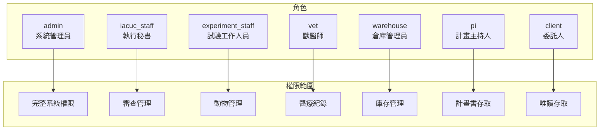

# 權限與 RBAC

> **版本**：2.0  
> **最後更新**：2026-01-18  
> **對象**：系統管理員、開發人員

---

## 1. 概覽

iPig 使用角色權限控制（Role-Based Access Control, RBAC）來管理存取權限：

- **權限**：定義使用者可執行的具體操作
- **角色**：將權限組合成邏輯群組
- **使用者-角色**：將角色指派給使用者

```
使用者 ──(多對多)──► 角色 ──(多對多)──► 權限
```

---

## 2. 系統角色

### 2.1 系統定義角色

這些角色由系統預設建立且不可刪除：

| 角色代碼 | 名稱 | 說明 | 適用對象 |
|----------|------|------|----------|
| admin | 系統管理員 | 完整系統存取權限 | 僅限內部 |
| iacuc_staff | 執行秘書 | 計畫書審查管理 | 僅限內部 |
| experiment_staff | 試驗工作人員 | 動物管理操作 | 僅限內部 |
| vet | 獸醫師 | 醫療紀錄與建議 | 僅限內部 |
| warehouse | 倉庫管理員 | 庫存管理 | 僅限內部 |
| pi | 計畫主持人 | 計畫書擁有者 | 內部/外部 |
| client | 委託人 | 檢視計畫與動物 | 內部/外部 |

### 2.2 角色權限規劃



---

## 3. 權限代碼

### 3.1 使用者管理

| 權限代碼 | 說明 |
|----------|------|
| user.read | 檢視使用者列表 |
| user.create | 建立新使用者 |
| user.update | 更新使用者資料 |
| user.delete | 停用使用者 |
| role.read | 檢視角色 |
| role.create | 建立自訂角色 |
| role.update | 更新角色權限 |
| role.delete | 刪除自訂角色 |

### 3.2 計畫書管理

| 權限代碼 | 說明 |
|----------|------|
| protocol.read | 檢視計畫書 |
| protocol.create | 建立新計畫書 |
| protocol.update | 編輯計畫書 |
| protocol.delete | 刪除草稿計畫書 |
| protocol.submit | 送審計畫書 |
| protocol.review | 指派審查員 |
| protocol.approve | 核准/駁回計畫書 |
| review.comment | 新增審查意見 |
| review.resolve | 解決意見 |

### 3.3 動物管理

| 權限代碼 | 說明 |
|----------|------|
| pig.read | 檢視豬隻資料 |
| pig.create | 登錄新豬隻 |
| pig.update | 更新豬隻資訊 |
| pig.delete | 軟刪除豬隻紀錄 |
| pig.assign | 指派豬隻至計畫 |
| observation.read | 檢視觀察紀錄 |
| observation.create | 新增觀察紀錄 |
| observation.update | 編輯觀察紀錄 |
| surgery.read | 檢視手術紀錄 |
| surgery.create | 新增手術紀錄 |
| surgery.update | 編輯手術紀錄 |
| vet.recommend | 新增獸醫建議 |
| vet.mark_read | 標記紀錄已閱讀 |

### 3.4 ERP 管理

| 權限代碼 | 說明 |
|----------|------|
| product.read | 檢視產品 |
| product.create | 建立產品 |
| product.update | 更新產品 |
| document.read | 檢視單據 |
| document.create | 建立單據 |
| document.submit | 送審單據 |
| document.approve | 核准單據 |
| inventory.read | 檢視庫存 |
| inventory.adjust | 調整庫存 |
| warehouse.manage | 管理倉庫 |
| partner.manage | 管理夥伴 |
| report.view | 檢視報表 |
| report.export | 匯出報表 |

### 3.5 人事管理

| 權限代碼 | 說明 |
|----------|------|
| hr.attendance.view.own | 檢視個人出勤 |
| hr.attendance.clock | 打卡 |
| hr.attendance.view.all | 檢視所有出勤 |
| hr.attendance.correct | 修正出勤 |
| hr.overtime.view.own | 檢視個人加班 |
| hr.overtime.create | 申請加班 |
| hr.overtime.approve | 核准加班 |
| hr.leave.view.own | 檢視個人請假 |
| hr.leave.create | 申請請假 |
| hr.leave.approve.l1 | L1 核准 |
| hr.leave.approve.l2 | L2 核准 |
| hr.leave.approve.hr | HR 核准 |
| hr.leave.approve.gm | GM 核准 |
| hr.balance.view.own | 檢視個人餘額 |
| hr.balance.view.all | 檢視所有餘額 |
| hr.balance.manage | 調整餘額 |
| hr.calendar.config | 設定行事曆 |
| hr.calendar.sync | 觸發同步 |

### 3.6 系統管理

| 權限代碼 | 說明 |
|----------|------|
| admin.settings | 管理系統設定 |
| admin.audit | 檢視稽核日誌 |
| admin.session | 管理使用者工作階段 |
| admin.alerts | 管理安全警報 |
| facility.manage | 管理設施/欄位 |
| notification.send | 發送系統通知 |

---

## 4. 預設角色權限

### 4.1 admin（系統管理員）
完整系統存取權限 - 所有權限

### 4.2 iacuc_staff（執行秘書）
```
protocol.read, protocol.create, protocol.update, protocol.submit,
protocol.review, protocol.approve, review.comment, review.resolve,
pig.read, pig.assign, user.read, notification.send
```

### 4.3 experiment_staff（試驗工作人員）
```
pig.read, pig.create, pig.update, pig.assign,
observation.read, observation.create, observation.update,
surgery.read, surgery.create, surgery.update,
protocol.read（所屬計畫）
```

### 4.4 vet（獸醫師）
```
pig.read,
observation.read, observation.update,
surgery.read, surgery.update,
vet.recommend, vet.mark_read
```

### 4.5 warehouse（倉庫管理員）
```
product.read, product.create, product.update,
document.read, document.create, document.submit, document.approve,
inventory.read, inventory.adjust,
warehouse.manage, partner.manage,
report.view, report.export
```

### 4.6 pi（計畫主持人）
```
protocol.read（本人計畫）, protocol.create, protocol.update, protocol.submit,
pig.read（所屬計畫）, observation.read, surgery.read
```

### 4.7 client（委託人）
```
protocol.read（已關聯）,
pig.read（所屬計畫）
```

---

## 5. 權限繼承

### 5.1 資源擁有權

| 資源類型 | 擁有權判斷 |
|----------|------------|
| 計畫書 | PI = 擁有者，CLIENT = 協作者 |
| 豬隻 | 透過 iacuc_no 關聯計畫 |
| 觀察紀錄 | 繼承自豬隻 |
| 請假申請 | user_id = 擁有者 |

### 5.2 階層式權限

某些權限隱含較低層級權限：

```
protocol.approve ⊃ protocol.review ⊃ protocol.read
document.approve ⊃ document.submit ⊃ document.create ⊃ document.read
hr.leave.approve.gm ⊃ hr.leave.approve.hr ⊃ hr.leave.approve.l2 ⊃ hr.leave.approve.l1
```

---

## 6. 權限檢查實作

### 6.1 中間件檢查

```rust
// 在路由設定
.route("/protocols", post(create_protocol))
    .route_layer(middleware::from_fn(require_permission("protocol.create")))

// 中間件函數
async fn require_permission(permission: &str) -> impl Middleware {
    // 從 JWT 取得使用者權限
    // 檢查使用者是否具備該權限
    // 若無，回傳 403 Forbidden
}
```

### 6.2 服務層檢查

```rust
// 對於複雜的擁有權檢查
async fn update_protocol(user: &User, protocol_id: Uuid, data: UpdateProtocol) {
    let protocol = get_protocol(protocol_id).await?;
    
    // 檢查擁有權或管理員權限
    if protocol.pi_user_id != user.id && !user.has_permission("protocol.approve") {
        return Err(Error::Forbidden);
    }
    
    // 繼續更新...
}
```

### 6.3 前端檢查

```typescript
// 於元件中
const { user } = useAuth();

const canApprove = user.permissions.includes('protocol.approve');

return (
  <Button disabled={!canApprove} onClick={handleApprove}>
    核准
  </Button>
);
```

---

## 7. 特殊情境

### 7.1 自我審批限制

使用者不可審批自己的請求：
- 請假申請
- 加班申請
- 計畫書審查

### 7.2 跨計畫存取

- PI 只能檢視自己的計畫
- CLIENT 只能檢視已被關聯的計畫
- iacuc_staff 可檢視所有計畫
- admin 可執行所有操作

### 7.3 內部員工專屬功能

僅限 `is_internal = true` 的使用者：
- 出勤打卡
- 請假申請
- 加班申請
- 行事曆同步

---

## 8. 最佳實踐

### 8.1 最小權限原則

僅授予使用者完成工作所需的最少權限。

### 8.2 職責分離

關鍵操作應由不同使用者執行：
- 建立者 ≠ 審核者
- 請求者 ≠ 核准者

### 8.3 定期審查

建議每季審查使用者角色指派。

### 8.4 稽核追蹤

所有權限變更均記錄於稽核日誌：
- 角色指派/移除
- 權限新增/移除
- 敏感操作

---

*下一章：[出勤模組](./08_ATTENDANCE_MODULE.md)*
