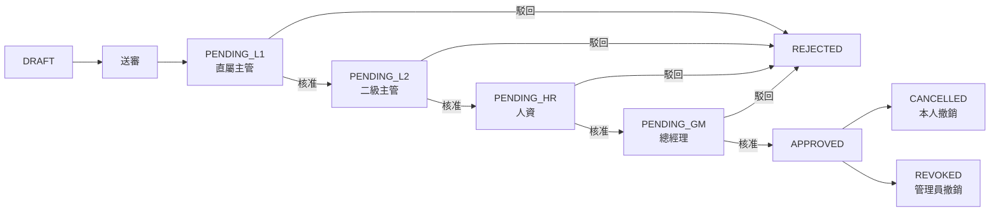

# 出勤模組規格

> **版本**：3.0  
> **最後更新**：2026-02-15  
> **對象**：人資團隊、開發人員

---

## 1. 目的

出勤模組為內部員工提供完整的出勤與請假管理，包含：

- **出勤打卡**：上班/下班打卡、工時計算
- **請假管理**：多種假別、多級審核流程
- **加班管理**：加班申請、審核
- **假期餘額**：特休/補休餘額、自動到期
- **行事曆同步**：Google Calendar 雙向同步

---

## 2. 出勤打卡

### 2.1 打卡流程

```
員工上班 → POST /hr/attendance/clock-in → 建立 attendance_record
          ↓
員工下班 → POST /hr/attendance/clock-out → 更新 clock_out, 計算 work_hours
          ↓
如有異常 → PUT /hr/attendance/:id → 管理員修正打卡
```

### 2.2 出勤 API

| 端點 | 說明 |
|------|------|
| `GET /hr/attendance` | 出勤紀錄列表（支援日期範圍篩選）|
| `POST /hr/attendance/clock-in` | 上班打卡 |
| `POST /hr/attendance/clock-out` | 下班打卡 |
| `GET /hr/attendance/stats` | 出勤統計（月統計、總工時）|
| `PUT /hr/attendance/:id` | 修正打卡紀錄 |

### 2.3 打卡規則

| 規則 | 說明 |
|------|------|
| 每日限一次上班打卡 | 重複打卡系統阻擋 |
| 下班打卡需先有上班記錄 | 系統驗證 |
| 工時自動計算 | clock_out - clock_in |
| 管理員修正 | 需 `hr.attendance.correct` 權限 |

---

## 3. 請假管理

### 3.1 假別

| 假別 | 代碼 | 薪資 | 上限規則 |
|------|------|------|----------|
| 特休 | ANNUAL | 有薪 | 依勞基法年資計算 |
| 事假 | PERSONAL | 無薪 | 年度 14 天 |
| 病假 | SICK | 半薪 | 年度 30 天 |
| 補休 | COMPENSATORY | 有薪 | 依加班時數 |
| 婚假 | MARRIAGE | 有薪 | 8 天 |
| 喪假 | BEREAVEMENT | 有薪 | 依親屬3-8天 |
| 產假 | MATERNITY | 有薪 | 8 週 |
| 陪產假 | PATERNITY | 有薪 | 7 天 |
| 生理假 | MENSTRUAL | 依規定 | 每月 1 天 |
| 公假 | OFFICIAL | 有薪 | 無上限 |

### 3.2 請假審核流程



**審核層級自動判定**：
- 天數 ≤ 1：L1 → HR
- 天數 > 1 且 ≤ 3：L1 → L2 → HR
- 天數 > 3：L1 → L2 → HR → GM

### 3.3 請假 API

| 端點 | 說明 |
|------|------|
| `GET /hr/leaves` | 請假列表 |
| `POST /hr/leaves` | 新增請假 |
| `GET /hr/leaves/:id` | 請假詳情 |
| `PUT /hr/leaves/:id` | 更新請假 |
| `DELETE /hr/leaves/:id` | 刪除草稿 |
| `POST /hr/leaves/:id/submit` | 送審 |
| `POST /hr/leaves/:id/approve` | 核准 |
| `POST /hr/leaves/:id/reject` | 駁回 |
| `POST /hr/leaves/:id/cancel` | 撤銷 |
| `POST /hr/leaves/attachments` | 上傳附件 |

---

## 4. 加班管理

### 4.1 加班流程

```
員工提交 → POST /hr/overtime → DRAFT
         ↓
送審      → POST /hr/overtime/:id/submit → PENDING
         ↓
審核      → POST /hr/overtime/:id/approve → APPROVED
                                          → REJECTED
```

### 4.2 加班 API

| 端點 | 說明 |
|------|------|
| `GET /hr/overtime` | 加班列表 |
| `POST /hr/overtime` | 新增加班 |
| `GET /hr/overtime/:id` | 加班詳情 |
| `PUT /hr/overtime/:id` | 更新加班 |
| `DELETE /hr/overtime/:id` | 刪除 |
| `POST /hr/overtime/:id/submit` | 送審 |
| `POST /hr/overtime/:id/approve` | 核准 |
| `POST /hr/overtime/:id/reject` | 駁回 |

### 4.3 加班轉補休

核准的加班時數自動轉入 `COMPENSATORY` 假期餘額。

---

## 5. 假期餘額

### 5.1 特休

| 規則 | 說明 |
|------|------|
| 給假依據 | 依勞動基準法年資計算 |
| 給假時間 | 每年初（系統管理員操作）|
| 有效期限 | 自給假年度結束起 **2 年** |
| 到期處理 | `balance_expiration.rs` 排程檢查 |
| 到期補償 | 查詢 `GET /hr/balances/expired-compensation` |

### 5.2 補休

| 規則 | 說明 |
|------|------|
| 來源 | 加班核准後自動累積 |
| 有效期限 | 依勞基法規定 |
| 使用順序 | 先到期先使用 |

### 5.3 餘額 API

| 端點 | 說明 |
|------|------|
| `GET /hr/balances/annual` | 特休餘額 |
| `GET /hr/balances/comp-time` | 補休餘額 |
| `GET /hr/balances/summary` | 餘額摘要 |
| `POST /hr/balances/annual-entitlements` | 新增特休配額 |
| `POST /hr/balances/:id/adjust` | 調整餘額 |
| `GET /hr/balances/expired-compensation` | 過期補償查詢 |

---

## 6. Google 行事曆同步

### 6.1 架構

```
iPig 系統                              Google Calendar
┌──────────────┐                     ┌──────────────────┐
│ calendar.rs  │ ◄── sync events ──► │ calendar/events  │
│ settings     │                     │                  │
│ sync_tokens  │ ◄── watch ────────► │ push notifications│
│ conflicts    │                     │                  │
└──────────────┘                     └──────────────────┘
       │
       ├── google_calendar.rs (17KB)
       └── Google Service Account (Docker Secret)
```

### 6.2 同步功能

| 功能 | 說明 |
|------|------|
| 請假事件 | 核准的請假自動建立行事曆事件 |
| 衝突偵測 | 偵測並報告同步衝突 |
| 手動觸發 | `POST /hr/calendar/sync` |
| 歷程紀錄 | 所有同步操作記錄 |

### 6.3 行事曆 API

| 端點 | 說明 |
|------|------|
| `GET /hr/calendar/status` | 同步狀態 |
| `GET/PUT /hr/calendar/config` | 設定管理 |
| `POST /hr/calendar/connect` | 連接 Google Calendar |
| `POST /hr/calendar/disconnect` | 中斷連接 |
| `POST /hr/calendar/sync` | 觸發同步 |
| `GET /hr/calendar/history` | 同步歷程 |
| `GET /hr/calendar/pending` | 待同步項目 |
| `GET /hr/calendar/conflicts` | 衝突列表 |
| `POST /hr/calendar/conflicts/:id/resolve` | 解決衝突 |
| `GET /hr/calendar/events` | 日曆事件列表 |

---

## 7. HR 儀表板與人員

| 端點 | 說明 |
|------|------|
| `GET /hr/dashboard/calendar` | 部門行事曆（誰在請假）|
| `GET /hr/staff` | 內部員工列表（代理人下拉選單）|
| `GET /hr/internal-users` | 內部使用者列表（餘額管理用）|

---

## 8. 前端頁面

| 路由 | 頁面 | 說明 |
|------|------|------|
| `/hr/attendance` | HrAttendancePage | 打卡與出勤紀錄 |
| `/hr/leaves` | HrLeavePage | 請假管理 |
| `/hr/overtime` | HrOvertimePage | 加班管理 |
| `/hr/annual-leave` | HrAnnualLeavePage | 特休管理（需 hr.balance.manage）|
| `/hr/calendar` | CalendarSyncSettingsPage | 行事曆同步設定 |

---

## 9. 權限

| 權限 | 說明 | 角色 |
|------|------|------|
| hr.attendance.view | 查看自己出勤 | 所有內部員工 |
| hr.attendance.view_all | 查看所有出勤 | ADMIN_STAFF |
| hr.attendance.clock | 打卡 | 所有內部員工 |
| hr.attendance.correct | 修正打卡 | ADMIN_STAFF |
| hr.leave.view | 查看自己請假 | 所有內部員工 |
| hr.leave.view_all | 查看所有請假 | ADMIN_STAFF |
| hr.leave.create | 申請請假 | 所有內部員工 |
| hr.leave.approve | 審核請假 | ADMIN_STAFF、主管 |
| hr.leave.manage | 管理假別 | ADMIN_STAFF |
| hr.overtime.view | 查看加班 | 所有內部員工 |
| hr.overtime.create | 申請加班 | 所有內部員工 |
| hr.overtime.approve | 審核加班 | ADMIN_STAFF |
| hr.balance.view | 查看自己餘額 | 所有內部員工 |
| hr.balance.view_all | 查看所有餘額 | ADMIN_STAFF |
| hr.balance.manage | 管理餘額 | ADMIN_STAFF |

---

*下一章：[擴展性](./09_EXTENSIBILITY.md)*
