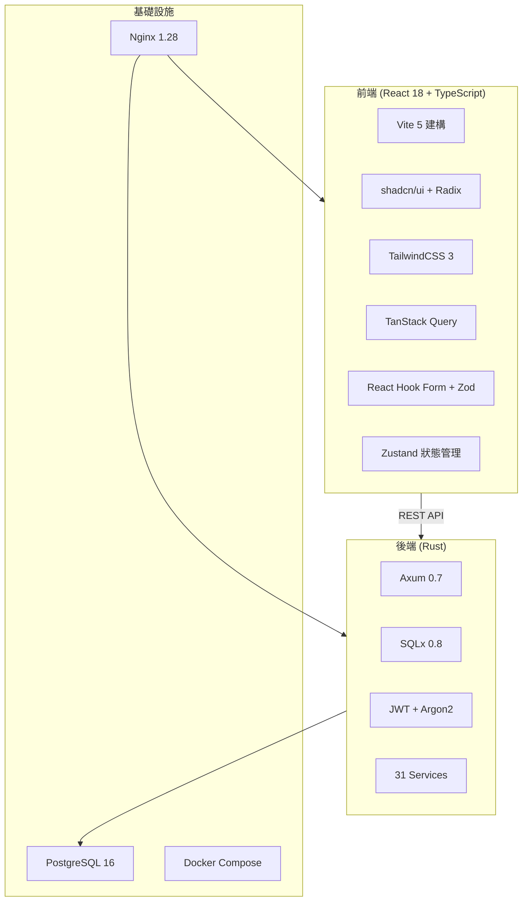

# 豬博士 iPig 系統 — 專案全面分析與評估報告

> **評估日期：** 2026-02-14  
> **專案位置：** `d:\Coding\ipig_system`

---

## 1. 專案總覽

**豬博士 iPig 系統**是一套針對實驗動物管理機構的整合型平台，涵蓋六大子系統：

| 子系統 | 用途 |
|--------|------|
| **共用基礎架構** | JWT 認證、RBAC 權限、稽核日誌、Email 服務 |
| **AUP 審查系統** | IACUC 動物使用計畫書 — 全 9 節撰寫、12 種狀態機、審查流程 |
| **iPig ERP** | 進銷存管理（採購/銷售/庫存/報表） |
| **實驗動物管理** | 豬隻管理、觀察/手術紀錄、血液檢查、PDF 匯出、GLP 合規 |
| **通知系統** | Email 通知、站內通知、排程任務 |
| **HR 人事管理** | 特休管理、考勤、Google Calendar 同步 |

---

## 2. 技術架構

| 層級 | 技術選型 | 版本 |
|------|----------|------|
| 前端 | React + TypeScript + Vite | r18 / TS 5.3 / Vite 5.1 |
| UI 庫 | shadcn/ui (Radix) + TailwindCSS | ^3.4 |
| 後端 | Rust + Axum + SQLx | Rust 1.92 / Axum 0.7 |
| 資料庫 | PostgreSQL | 16-alpine |
| 容器化 | Docker Compose + Nginx | nginx:1.28-alpine |
| 測試 | Python pytest（整合測試） | 3.x |

> [!TIP]
> 技術選型相當現代且合理。Rust 後端確保高效能與記憶體安全性，React + shadcn/ui 提供良好的開發效率與使用者體驗。

---

## 3. 程式碼規模統計

| 區域 | 語言 | 行數 | 檔案數 |
|------|------|-----:|-------:|
| **後端** | Rust (.rs) | **34,167** | ~80 |
| **前端** | TypeScript/CSS | **44,481** | ~113 |
| **資料庫** | SQL migrations | **2,953** | 10 |
| **測試** | Python | **37,775** | 8 |
| **合計** | — | **~119,376** | ~211 |

### 後端結構

| 目錄 | 檔案數 | 最大檔案 | 說明 |
|------|-------:|----------|------|
| `handlers/` | 24 | `animal.rs` (72KB) | API 請求處理 |
| `models/` | 20 | `animal.rs` (35KB) | 資料模型 |
| `services/` | 31 | `animal.rs` (114KB) | 業務邏輯 |
| `middleware/` | 3 | — | Auth、Rate Limiter、Real IP |

### 前端結構

| 目錄 | 檔案/子目錄數 | 說明 |
|------|-------------:|------|
| `pages/` | 46 | 頁面元件（含子目錄） |
| `components/` | 62 | UI 元件（含子目錄） |
| `stores/` | 2 | Zustand 狀態管理 |
| `locales/` | 2 | i18n 國際化 |
| `types/` | 4 | TypeScript 型別定義 |
| `hooks/` | 3 | 自定義 Hooks |

---

## 4. 功能完成度評估

| 子系統 | 後端 | 前端 | DB | 測試 | 整體 |
|--------|:----:|:----:|:--:|:----:|:----:|
| 共用基礎架構 | ✅ 100% | ✅ 100% | ✅ | ✅ | **100%** |
| AUP 審查系統 | ✅ 100% | ✅ 100% | ✅ | ✅ 14/14 | **100%** |
| iPig ERP | ✅ 100% | ✅ 100% | ✅ | ✅ 9/9 | **100%** |
| 實驗動物管理 | ✅ 100% | ✅ 100% | ✅ | ✅ 21/21 | **100%** |
| 通知系統 | ✅ 100% | ✅ 100% | ✅ | — | **100%** |
| HR 人事管理 | ✅ 100% | ✅ 100% | ✅ | ✅ | **100%** |
| **資料分析模組** | 🔴 0% | 🔴 0% | 🔴 | 🔴 | **未啟動** |

整體功能完成度約 **96%**（若將資料分析模組納入計算）。

---

## 5. 測試覆蓋分析

### 整合測試套件

| 測試檔案 | 測試項目 | 結果 |
|----------|---------|------|
| `test_aup_full.py` | AUP 完整審查流程（14 步） | ✅ 全通過 |
| `test_erp_full.py` | ERP 倉庫管理+報表（9 步） | ✅ 全通過 |
| `test_erp_permissions.py` | ERP 權限測試 | ✅ 全通過 |
| `test_animal_full.py` | 動物管理系統（21 步） | ✅ 全通過 |
| `test_amendment_full.py` | 計畫變更（14 步） | ✅ 全通過 |
| `test_blood_panel.py` | 血液檢查組合（28 步） | ✅ 全通過 |
| `test_hr_full.py` | 人事管理 | ✅ 全通過 |
| `audit_verify.py` | 稽核日誌驗證 | ✅ 全通過 |

> **最後一次全部測試**：2026-02-14 02:33，耗時 5.3 秒，全部通過。

> [!IMPORTANT]
> 測試使用 Python API-level 整合測試，驗證完整 API 流程，但**缺少後端單元測試**（Rust 層）與**前端單元/E2E 測試**。

---

## 6. 安全性評估

### 已完成的安全強化（10 項）

| 等級 | 項目 | 狀態 |
|------|------|:----:|
| P0 嚴重 | Refresh Token 改用 SHA-256 雜湊 | ✅ |
| P0 嚴重 | 移除硬編碼管理員密碼 | ✅ |
| P0 嚴重 | 開發帳號設 `must_change_password` | ✅ |
| P1 高 | API Rate Limiting（auth 10/min, 一般 120/min） | ✅ |
| P1 高 | Nginx 安全標頭（5 個） | ✅ |
| P1 高 | Docker 後端容器非 root 用戶 | ✅ |
| P1 高 | 密碼強度驗證 | ✅ |
| P2 中 | JWT Access Token 1h 有效期 | ✅ |
| P2 中 | 代理操作安全增強 | ✅ |
| P2 中 | 隱藏 Nginx 版本號 | ✅ |

### 待辦安全項目

| 等級 | 項目 | 說明 |
|------|------|------|
| P2 中 | Token 改存 HttpOnly Cookie | 需前後端大幅變更 |
| P3 低 | 檔案上傳 Magic Number 驗證 | 防止偽造副檔名 |
| P3 低 | 遷移至 Cloudflare Named Tunnel | 目前使用 Quick Tunnel |

---

## 7. 架構優缺點分析

### ✅ 優點

1. **技術選型現代**：Rust 後端（高效能、記憶體安全），React + shadcn/ui 前端
2. **完整子系統覆蓋**：六大子系統功能齊全，AUP 表單涵蓋完整 9 個章節
3. **GLP 合規設計**：電子簽章、附註、變更原因記錄、記錄鎖定、稽核日誌
4. **安全性到位**：Rate limiting、JWT refresh、密碼強度、非 root 容器、安全標頭
5. **自動化測試**：8 套整合測試覆蓋主要流程，5.3 秒快速執行
6. **文件完善**：Profiling Spec 涵蓋架構、模型、API、權限、模組等 14+ 份文件
7. **容器化部署**：Docker Compose 一鍵部署
8. **i18n 支援**：前端國際化（中/英）
9. **10 個角色**：細粒度 RBAC 權限控制

### ⚠️ 需關注的問題

1. **`main.rs` 過於臃腫**（893 行）：包含 `ensure_admin_user`、`seed_dev_users`、`ensure_all_role_permissions` 等初始化邏輯，建議拆分
2. **Service 層單檔過大**：`animal.rs`（114KB）、`protocol.rs`（71KB）應拆分為子模組
3. **缺少 Rust 單元測試**：僅有 Python 整合測試，Rust 層無單元測試
4. **前端缺少自動化測試**：沒有 Jest/Vitest 或 Playwright E2E 測試
5. **Token 仍存 localStorage**：XSS 風險，待遷移至 HttpOnly Cookie（TODO 中已列）
6. **使用 Quick Tunnel**：每次重啟 URL 會改變，應遷移至 Named Tunnel（TODO 中已列）
7. **Migration 檔案命名跳號**：如 009 → 013 → 022 → 024 → 026，中間有合併痕跡
8. **Git commit message 品質**：部分 commit message 過於簡略（如 "test"、"bug fixed"）

---

## 8. 開發活動分析

| 指標 | 數值 |
|------|------|
| 2 月份 commits | 47 |
| 測試結果記錄 | 20 份（tests/results/） |
| 每日活躍開發 | 2026-02-02 ~ 2026-02-14（連續 13 天） |
| 最近一次部署 | Docker 容器重建成功（2026-02-14） |

---

## 9. 建議優先改善事項

### 短期（1-2 週）

| # | 項目 | 重要性 | 說明 |
|---|------|:------:|------|
| 1 | **Token → HttpOnly Cookie** | 🔴 高 | 消除 XSS token 竊取風險 |
| 2 | **遷移 Named Tunnel** | 🟡 中 | 穩定外部存取 URL |
| 3 | **拆分 `main.rs`** | 🟡 中 | 將初始化邏輯拆到獨立模組 |
| 4 | **拆分超大 Service** | 🟡 中 | 如 `animal.rs` 可按功能拆分 |

### 中期（1-2 個月）

| # | 項目 | 重要性 | 說明 |
|---|------|:------:|------|
| 5 | **新增 Rust 單元測試** | 🟡 中 | 尤其是核心業務邏輯 |
| 6 | **前端 E2E 測試** | 🟡 中 | 使用 Playwright 覆蓋關鍵流程 |
| 7 | **資料分析模組** | 🟡 中 | 血液檢查結果統計與視覺化 |
| 8 | **行動端適配** | 🟢 低 | 響應式設計優化 |

---

## 10. 結論

**豬博士 iPig 系統是一個功能完整、架構成熟的實驗動物管理平台。** 在約 12 萬行程式碼中實作了 6 大子系統（含 1 個規劃中模組），從 AUP 計畫書審查到 ERP 進銷存管理、從動物紀錄到 HR 人事系統，功能覆蓋全面。

**核心評分：**

| 面向 | 評分 | 說明 |
|------|:----:|------|
| 功能完整度 | ⭐⭐⭐⭐⭐ | 96%+ 功能已上線 |
| 架構設計 | ⭐⭐⭐⭐ | 乾淨的分層架構，但部分檔案過大 |
| 安全性 | ⭐⭐⭐⭐ | 10 項安全強化已完成，3 項待辦 |
| 測試覆蓋 | ⭐⭐⭐ | 整合測試完善，單元/E2E 測試不足 |
| 文件品質 | ⭐⭐⭐⭐⭐ | 14+ 份規格文件，進度追蹤清晰 |
| 部署與營運 | ⭐⭐⭐⭐ | Docker 一鍵部署，但使用 Quick Tunnel |

**整體而言，這是一個已進入可用階段的高品質專案，主要改善方向在於安全性（HttpOnly Cookie）、程式碼結構優化（拆分大檔案）、以及補充測試覆蓋率。**
