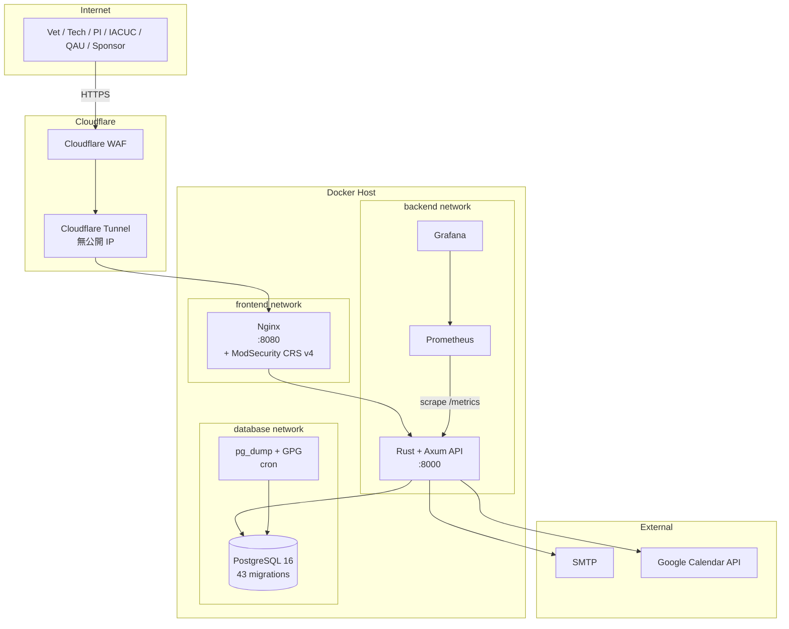

# ipig_system — CRO Research Animal Management System

> 實驗動物 CRO（Contract Research Organisation）管理系統
>
> **狀態：** 功能開發完成，GLP / 21 CFR Part 11 合規補強中（R30 階段）
> **最後更新：** 2026-04-28
> **授權：** MIT License © 2026 iPig System Contributors

---

## 60-Second Abstract

**繁體中文：** ipig_system 是一套為**實驗動物 CRO（Contract Research Organisation，受託研究機構）**量身打造的動物管理平台。CRO 是**為客戶（sponsor）執行非臨床動物研究**的服務型機構，使用者是**研究獸醫**，工作對象是**一隻一隻**被精心照顧的研究豬（非畜產業群體管理）。系統整合 IACUC 計畫立案、動物全生命週期紀錄、實驗執行（觀察 / 手術 / 血檢 / 體重 / 用藥 / 安樂死）、人事與庫存。核心特色是**深度對齊 GLP（OECD §1–10）與 21 CFR Part 11**：每一筆 mutation 同 transaction 寫入 HMAC-chained audit trail，電子簽章使用後紀錄即鎖定，DB-level triggers 強制 append-only — 客戶稽核或將資料送 FDA / PMDA / EMA 時，每一筆紀錄都能完整還原。

**English:** `ipig_system` is an **animal management platform for laboratory-animal CROs (Contract Research Organisations)** — service organisations that **run non-clinical animal studies on behalf of sponsor clients**. Users are **research veterinarians** caring for individual research pigs (not herd-scale farming). The system covers IACUC protocol review, full animal lifecycle records, experimental procedures, HR, and inventory. Its distinguishing feature is **deep alignment with GLP (OECD §1–10) and 21 CFR Part 11 electronic records / electronic signatures**: every mutation writes an HMAC-chained audit trail in the same transaction, signed records are immutable via DB-level triggers, and signing meaning / record locks / append-only enforcement are first-class — so when a sponsor audits, or submits the data to FDA / PMDA / EMA, every record is fully reconstructable.

---

## What / Who / Why

### What
- **CRO 級實驗動物管理系統**，整合 IACUC 計畫、動物紀錄、實驗執行、HR 與庫存
- **多研究案並行 + 客戶資料隔離（multi-study / multi-sponsor）**：每年 10–30 個 active study annually，不同 sponsor 之間資料嚴格隔離
- **對齊 GLP + 21 CFR Part 11 + OECD §10**：HMAC chain audit、electronic signature with meaning、record lock、append-only triggers、20 年 retention 排程，完整支援客戶稽核與主管機關（FDA / PMDA / EMA）資料還原
- **單頁應用 + REST API**：Rust + Axum 後端、React + TypeScript 前端、PostgreSQL 16

### Scale（典型營運規模）
- **人員：~20 人** — 研究獸醫、技術員、QAU、IT admin、業務 / 客戶聯繫
- **動物：同時養 100–200 隻豬** — 中型 CRO 規模，個體照顧而非群體管理
- **每年 active study：10–30 個** — 來自不同 sponsor，需 multi-tenant 等級的資料隔離
- **資料量級**：年增 ~3–5 GB DB（user_activity_logs 為主）+ ~30–50 GB 附件（影像、報告、簽章 PDF）；20 年 retention 累積仍在 PostgreSQL + 本地 NAS / 雲端冷儲存可負擔範圍

### Who
| 角色 | 主要職責 | 系統用途 |
|---|---|---|
| 研究獸醫 (VET) | 個體動物健康管理 | 觀察、手術、血檢、用藥、疼痛評估、獸醫建議 |
| 技術員 (TECH) | 日常照顧與紀錄 | 餵養、採樣、體重、給藥執行紀錄 |
| 計畫主持人 (PI) | IACUC protocol 撰寫與動物分配 | 計畫書、Amendment、動物指派 |
| IACUC 委員 / 主席 | 計畫審查、核准、否決 | 審查工作流、電子簽章 |
| QAU | 紀錄完整性稽核、SOP 對照、客戶稽核應對 | Traceability matrix、audit chain 驗證、記錄鎖定查證 |
| Sponsor Liaison / 業務 | 客戶溝通與進度回報 | 計畫狀態、結果摘要產出 |
| 系統管理員 | 帳號 / 權限 / 設施 / 維運 | 全模組 admin、強制 TOTP 2FA |
| 委託人 / Sponsor (CLIENT) | 委託研究進度追蹤、稽核 | 唯讀其委託 study 之計畫與動物紀錄 |

### Why（CRO 為什麼不能用 Excel / 通用 LIMS？）
- **Excel** 無 audit trail、無權限分層、無電子簽章、無法滿足 §11.10(e)/(g)/(h) — **CRO 客戶第一次稽核就會被退**
- **通用 LIMS**（LabWare / SampleManager 等）以批次樣本為中心；研究獸醫的工作流是**個體動物 × 試驗時序**，欄位與工作流不對盤
- **CRO 特有需求**：客戶（sponsor）會稽核、客戶可能將資料送 FDA / PMDA / EMA — 系統必須支援
  - **客戶資料追溯（sponsor traceability）**：任意一筆觀察 / 簽章 / 變更，必須能回到原始操作者、時間、原因
  - **多 study 隔離**：A sponsor 不應看到 B sponsor 的任何資料
  - **稽核級資料還原**：20 年內任意時點的紀錄狀態都能查詢（OECD §10）
- 市售工具補不齊「**CRO 日常獸醫工作流 + 多 sponsor 隔離 + 法規簽章**」這條鏈

---

## High-level Architecture



子系統互動與請求生命週期（middleware → handler → service → repository → DB + audit-in-tx）詳見 [docs/spec/architecture/ARCHITECTURE.md](docs/spec/architecture/ARCHITECTURE.md)。

---

## Key Concepts（讀完這節再讀 code）

### IACUC Protocol（動物使用計畫書）
研究機構**對動物做任何研究前，必須有審核通過的 protocol**。系統實作完整生命週期：草稿 → 提交 → 委員審查 → 主席核准 → 變更申請（Amendment）→ 結案。每個狀態轉移寫 audit + 必要時觸發電子簽章。

### Animal Lifecycle
每隻動物有唯一 ID + IACUC 編號綁定。生命週期：`入欄 → 試驗執行（觀察 / 手術 / 血檢 / 體重 / 疫苗 / 用藥 / 疼痛評估 / 獸醫建議）→ 結束（犧牲 / 安樂死 / 轉讓 / 猝死）`。安樂死走 IACUC 審批 + 主席簽字 + record lock。

### Service-driven Audit Pattern (R26)
**所有 mutation 必須在 service 層、與業務 SQL 同 transaction 內**呼叫 `AuditService::log_activity_tx`，寫入 `user_activity_logs`：
- 每筆 audit 計算 `record_hmac = HMAC-SHA256(secret, prev_hmac || current_canonical)`，形成 hash chain
- Canonical 編碼為 **HMAC chain v2 length-prefix**，避免欄位邊界歧義
- BEFORE UPDATE/DELETE triggers (migration 041) 在 DB 層阻止改 / 刪 audit log
- 排程 job 每日驗證 chain 連續性，斷鏈走 [`docs/runbooks/audit-chain-broken-runbook.md`](docs/runbooks/audit-chain-broken-runbook.md)

### Electronic Signature
- 簽章前需密碼 + （admin）TOTP 雙因素驗證（21 CFR §11.200）
- 簽章寫入 `electronic_signatures` 表，欄位含 `meaning`（authorship / review / approval / responsibility）對齊 §11.50
- 簽章後紀錄走 **record lock**（migration 038）：`signature_service::lock_record` 寫 `glp_record_locks`，5 個關鍵表（amendment_decision、euthanasia_order、protocol_approval、…）的 trigger 拒絕後續 UPDATE

### GLP Record Retention
`data_retention_policies` + `RetentionEnforcer` 排程 job：所有 GLP 表預設 20 年保留期，到期前發告警，到期後依政策歸檔。對齊 OECD §10。

---

## Tech Stack

### Backend
| 元件 | 版本 | 用途 |
|---|---|---|
| Rust | edition 2021 | 系統語言 |
| Axum | 0.7 | HTTP server |
| sqlx | 0.8 | PostgreSQL 客戶端，compile-time SQL check（offline mode） |
| PostgreSQL | 16 | 主資料庫，43 migrations |
| Argon2 | — | 密碼雜湊 |
| jsonwebtoken | — | JWT (HttpOnly Cookie) + refresh + access |
| totp-rs | — | TOTP 2FA（admin 強制） |
| tokio-cron-scheduler | — | 排程（audit chain 驗證、retention、安全告警） |
| utoipa | — | OpenAPI 自動產生 |

### Frontend
| 元件 | 版本 | 用途 |
|---|---|---|
| React | 18 | UI 框架 |
| TypeScript | 6.x | 型別系統 |
| Vite | 8 | 建構工具 |
| Tailwind CSS | 4 | 樣式（含 `@config` 過渡 + `scrollbar-gutter` 全域） |
| shadcn/ui (Radix) | — | 基礎元件（含內部 `mx-auto` 修正） |
| TanStack Query | v5 | server state |
| Zustand | — | client state |
| React Router | 7 (library mode) | routing |
| react-hook-form + Zod | — | 表單與驗證 |
| i18next | 26 | i18n（zh-TW + en） |
| Vitest | 4 | 單元測試 |
| Playwright | — | E2E |

### Infra & CI
| 元件 | 用途 |
|---|---|
| Docker + Docker Compose | dev / test / prod 三套 stack |
| Nginx + Cloudflare Tunnel | 無公開 IP，零信任接入 |
| Cloudflare WAF + ModSecurity CRS v4 | WAF 雙層 |
| Prometheus + Grafana + Alertmanager | observability |
| GitHub Actions | cargo audit、clippy、test、Trivy、Playwright、down.sql guard |
| Docker Secrets | 密碼透過 `password_file` / `$__file{}` 注入，不存明文 |

---

## Compliance Posture

雙向追溯（條款 → migration / service / test）詳見 [docs/glp/traceability-matrix.md](docs/glp/traceability-matrix.md)。下表為摘要（截至 R30 進行中）：

| 條款 | 主題 | 狀態 |
|---|---|---|
| **21 CFR Part 11** | | |
| §11.10(d) System access limited | RBAC + middleware/auth | ✅ |
| §11.10(e) Audit trail | HMAC chain (v2 length-prefix) + service-driven pattern | ✅ |
| §11.10(e)(1) Append-only | BEFORE UPDATE/DELETE triggers on `user_activity_logs` + `electronic_signatures` (R30-F) | ✅ |
| §11.10(f) Operational checks | amendment / protocol workflow enforced | ✅ |
| §11.10(g) Authority checks | `services/access.rs` | ✅ |
| §11.50 Manifestation of meaning | `electronic_signatures.meaning` enum (R30-10) | ✅ |
| §11.70 Signature linking | record lock 覆蓋 5 表 + content hash | ✅ |
| §11.100 Unique signing | Argon2 + 簽章二次密碼 | ✅ |
| §11.200(a)(1)(i) Two distinct components | admin 強制 TOTP；簽章流程支援密碼 + 手寫 | ✅ |
| §11.200(a)(2) Genuine claim | HMAC chain + immutability triggers | ✅ |
| §11.300(a–d) Password policy | 10 字元 + 黑名單 + Argon2 + lockout | ✅ |
| §11.10(a) Validated systems (IQ/OQ/PQ docs) | 文件補強中 | 🟡 |
| §11.10(b) Accurate copies | IDXF export 涵蓋所有 GLP 表（R30-18） | ✅ |
| §11.10(i) Education / training records | DB schema ✅，SOP 對照補強中 | 🟡 |
| **GLP (OECD §1–10)** | | |
| §1 Test facility organisation | 設施階層（building / area / pen） | ✅ |
| §6 Test system | 動物模組 + IACUC binding | ✅ |
| §7 SOPs | `docs/glp/*-sop.md` 系列 | 🟡 |
| §8 Performance of study | protocol workflow + amendment | ✅ |
| §10 Storage and retention | `data_retention_policies` + RetentionEnforcer（20 年） | ✅ |

✅ 已實作 + 測試覆蓋 / 🟡 部分（程式或 SOP 其一缺口）/ 🔴 未做

---

## Repository Layout

```
ipig_system/
├── README.md                  ← 本檔（GitHub 入口）
├── DESIGN.md                  ← 視覺與設計系統（不可硬編色彩）
├── CLAUDE.md                  ← 給 AI agent / contributor 的工作指引
├── docs/                      ← 所有文件 → 參見 docs/README.md
│   ├── PROGRESS.md            ← 系統完成度 + §9 變更日誌
│   ├── TODO.md                ← 任務追蹤（R 系列）
│   ├── R26_compliance_requirements.md
│   ├── audit/                 ← 系統審查報告
│   ├── codeReviewFindings.md  ← 三軸 code review
│   ├── glp/                   ← GLP / Part 11 SOP + traceability matrix
│   ├── runbooks/              ← DR / audit chain broken / DR drill
│   ├── spec/                  ← 技術規格 v7.x（架構、API、RBAC、ERD）
│   ├── ops/ deploy/ db/ dev/ user/ security/
│   └── archive/               ← 歷史快照（只讀）
├── backend/                   ← Rust + Axum
│   ├── src/
│   │   ├── main.rs / config.rs / error.rs / routes.rs
│   │   ├── handlers/          ← HTTP 解析與回應
│   │   ├── services/          ← 業務邏輯（含 audit / signature / retention）
│   │   ├── repositories/      ← SQL 封裝
│   │   ├── models/            ← entity + DTO
│   │   ├── middleware/        ← auth / CSRF / rate limit / ETag
│   │   ├── utils/             ← 純函式工具
│   │   ├── startup/           ← migration / seed
│   │   └── bin/               ← CLI 維運工具
│   ├── migrations/            ← 43 個 SQL（含 down/）
│   └── tests/                 ← 整合測試
├── frontend/                  ← React + TypeScript
│   ├── src/
│   │   ├── pages/             ← 路由級元件
│   │   ├── components/        ← 跨頁面元件 + ui/
│   │   ├── hooks/             ← 全域 custom hooks
│   │   ├── lib/               ← api / queryKeys / validation / constants
│   │   ├── stores/            ← Zustand
│   │   ├── types/             ← 型別
│   │   └── locales/           ← i18n zh-TW / en
│   └── e2e/                   ← Playwright
├── deploy/                    ← Grafana / Prometheus / cloudflared / WAF
├── monitoring/                ← Prometheus / Alertmanager / Promtail
├── scripts/                   ← 啟動 / 備份 / 驗證 / k6
├── tests/                     ← Python 整合測試
└── .github/workflows/         ← CI
```

---

## Quick Start（5 分鐘跑起來）

### 前置需求
- Docker Desktop（含 Compose v2）
- Git

### 啟動

```bash
git clone https://github.com/delightening/ipig_system.git
cd ipig_system

# 1. 設定環境變數
cp .env.example .env
# 編輯 .env，至少設定：POSTGRES_PASSWORD / JWT_SECRET / ADMIN_INITIAL_PASSWORD
# 正式環境一律使用 Docker Secrets，不在 .env 存明文

# 2. 啟動完整 stack（前端 + API + DB）
docker compose up -d

# 3. 等待 healthcheck 通過（約 30 秒）
docker compose ps
docker compose logs -f api
```

| 服務 | URL | 預設帳號 |
|---|---|---|
| 前端 | http://localhost:8080 | `admin@ipig.local` / 由 `.env ADMIN_INITIAL_PASSWORD` 控制 |
| API | http://localhost:8000 | — |
| Swagger UI | http://localhost:8000/swagger-ui/ | — |
| PostgreSQL | localhost:5433 | 由 `.env POSTGRES_PASSWORD` 控制 |

正式部署（NAS / VPS / Cloudflare Tunnel）詳見 [docs/deploy/DEPLOYMENT.md](docs/deploy/DEPLOYMENT.md)。

### 本地開發（不走 Docker）

```bash
# 後端
cd backend
cp env.sample .env
sqlx database create
sqlx migrate run
cargo run

# 前端（另開 terminal）
cd frontend
npm install
npm run dev
```

詳見 [docs/user/QUICK_START.md](docs/user/QUICK_START.md)。

---

## Development Workflow

### Branch / PR 規則
- `main` 為唯一保護分支；所有變更走 PR + CI 全綠
- 大型重構走 `integration/<code>` 長期分支，子 PR 合進 integration 後一次合 main
- Branch 命名：`feat/`、`fix/`、`docs/`、`chore/deps-*`、`refactor/`

### Commit 粒度
- 每個邏輯單元 + 測試一次 commit；PR 內 3–15 個 commit
- 單 commit ≤ 500 lines，跨模組 ≤ 3 個

### CI 必過 (`.github/workflows/`)
- `cargo check` / `cargo clippy -- -D warnings` / `cargo test`
- `cargo audit`（CVE）+ `cargo deny`
- `npm run lint` / `vitest run` / `playwright test`
- `Trivy` 容器掃描
- `down.sql guard`：每個 migration 必有對稱 `down/<id>.sql`

### Service-driven Audit Pattern（新功能必遵守）
寫任何 mutation handler 前，先讀：
- [docs/R26_compliance_requirements.md](docs/R26_compliance_requirements.md) — pattern 形成背景
- [docs/glp/amendment-sop.md](docs/glp/amendment-sop.md) — 完整範本

要點：
1. Handler 只解析 HTTP，不寫 SQL
2. Service 開 transaction → 業務 SQL → `AuditService::log_activity_tx(&mut tx, …)` → commit
3. 簽章後 mutation 必寫 `glp_record_locks` 並讓對應 trigger 生效
4. 整合測試覆蓋：mutation 後查 `user_activity_logs` 確認寫入 + chain 驗證綠

### 程式碼規範
- Backend：handler 不寫 SQL；handler / service / repository / model 嚴格分層；`unwrap()` 禁止（測試碼用 `expect("描述")`，斷言 Err 用 `expect_err("描述")`）；魔術字串改 `const`
- Frontend：API 走 TanStack Query；驗證走 Zod；custom hook 回傳物件**不可整包**放 `useEffect` deps
- 詳見 [CLAUDE.md](CLAUDE.md)（量化門檻、Rust / TS 命名、import 順序、清理規則）

---

## Where to Read More

新人 / 訪客建議閱讀順序：

1. **本 README**（你在這）
2. [docs/README.md](docs/README.md) — docs hub，依角色分流
3. [docs/spec/architecture/ARCHITECTURE.md](docs/spec/architecture/ARCHITECTURE.md) — 部署圖、資料流、middleware → handler 完整 sequence
4. [docs/PROGRESS.md](docs/PROGRESS.md) — 各模組完成度 + §9 變更日誌
5. [docs/glp/traceability-matrix.md](docs/glp/traceability-matrix.md) — 稽核員雙向追溯入口
6. [docs/codeReviewFindings.md](docs/codeReviewFindings.md) — 三軸 code review 報告
7. [DESIGN.md](DESIGN.md) — 視覺 / token / RWD 規範
8. [CLAUDE.md](CLAUDE.md) — contributor / AI agent 工作守則

依角色入口：

| 你是 | 從這裡開始 |
|---|---|
| 第一次看到本專案的訪客 | 本 README → docs/spec/architecture/ARCHITECTURE.md |
| GLP / FDA 稽核員 | docs/glp/traceability-matrix.md → docs/glp/amendment-sop.md → docs/runbooks/ |
| Backend 工程師 | docs/spec/architecture/ → docs/R26_compliance_requirements.md → backend/src/services/audit.rs |
| Frontend 工程師 | DESIGN.md → docs/spec/guides/UI_UX_GUIDELINES.md → frontend/src/pages/ |
| 維運 / SRE | docs/ops/OPERATIONS.md → docs/deploy/DEPLOYMENT.md → docs/runbooks/DR_RUNBOOK.md |
| QA | docs/dev/INTEGRATION_TESTS.md → docs/dev/e2e/README.md |

---

## License

MIT License © 2026 iPig System Contributors
