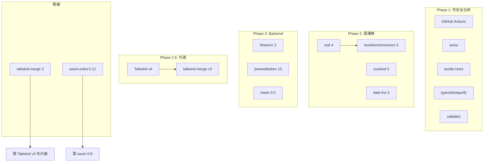

# Dependabot PR 遷移計畫

> 依「可安全合併 → 需遷移測試 → Backend」三階段執行。驗證腳本：`scripts/verify-deps.sh` / `scripts/verify-deps.ps1`

---

## 一、總覽與 PR 分類表

| 分類 | PR | 套件 | 狀態 |
|------|-----|------|------|
| 可安全合併 | #4–7 | GitHub Actions (checkout, setup-node, cache, upload-artifact) | Phase 1 ✅ |
| | #18 | validator 0.19→0.20 | Phase 1 ✅ |
| | #20 | lucide-react 0.323→0.575 | Phase 1 ✅ |
| | #22 | axios 1.13.5→1.13.6 | Phase 1 ✅ |
| | #26 | @types/dompurify 3.0.5→3.2.0 | Phase 1 ✅ |
| 需遷移 | #23, #27 | zod 4 + @hookform/resolvers 5 | Phase 2 ✅ |
| | #25 | zustand 5 | Phase 2 ✅ |
| | #21 | date-fns 4 | Phase 2 ✅ |
| | #19, #12 | react-ecosystem, dev-dependencies | Phase 2 |
| 暫緩 | #24 | tailwind-merge 3（需 Tailwind v4） | Phase 2.5 可選 |
| | #15 | axum-extra 0.12（需 axum 0.8） | 待 axum 升級 |
| Backend | #8–14, #16–17 | thiserror, jsonwebtoken, tower 等 | Phase 3 ✅ |
| Backend 暫緩 | #9, #10–11 | printpdf 0.9、utoipa 5（需 axum 0.8） | 待後續 |

---

## 二、各套件遷移細節

### Phase 1：可安全合併

| PR | 套件 | 變更 | 驗收 |
| --- | --- | --- | --- |
| #4 | actions/checkout v4→v6 | 官方 action 升級 | CI 通過 |
| #5 | actions/setup-node v4→v6 | 官方 action 升級 | CI 通過 |
| #6 | actions/cache v4→v5 | 官方 action 升級 | CI 通過 |
| #7 | actions/upload-artifact v4→v7 | 官方 action 升級 | E2E 失敗時報告可上傳 |
| #18 | validator 0.19→0.20 | minor bump | `cargo check` + `cargo test` |
| #20 | lucide-react 0.323→0.575 | 圖示庫 | `npm run build` |
| #22 | axios 1.13.5→1.13.6 | patch | `npm run build` |
| #26 | @types/dompurify 3.0.5→3.2.0 | 型別定義 | `npx tsc --noEmit` |

**validator 0.20 注意**：`field_errors()` 回傳 `Cow<str>` keys，match 時需用 `field.as_ref()` 而非 `*field`。

### Phase 2：需遷移項目

**批次 A：zod 4 + @hookform/resolvers 5（相依）**

- `ZodError.errors` → `ZodError.issues`
- `required_error`（enum）→ `message`
- 建議 codemod：`npx codemod jssg run zod-3-4`

**批次 B：zustand 5**

- `useShallow` 路徑維持 `zustand/react/shallow`
- `create`、`persist` 用法維持，確認 selector 回傳穩定 reference

**批次 C：date-fns 4**

- ESM-first，型別微調；專案已用 ESM，風險低
- 影響：`format`、`zhTW`、`enUS` 等 import

### Phase 3：Backend 遷移

| 順序 | 套件 | 遷移重點 |
| --- | --- | --- |
| 1 | metrics-exporter-prometheus 0.16→0.18 | 低風險 |
| 2 | validator 0.19→0.20 | 已在 Phase 1 |
| 3 | thiserror 1→2 | `#[error(...)]` 格式；tuple struct 需改具名參數 |
| 4 | jsonwebtoken 9→10 | Windows 建議 `rust_crypto` + `use_pem`（避免 aws_lc_rs NASM） |
| 5 | tower 0.4→0.5 | 確認 tower-http 相容性 |
| 6 | tokio-cron-scheduler 0.11→0.15 | 檢查 `Job`、`JobScheduler` API |

**暫緩**：printpdf 0.9（`PdfDocument::new` API 變更）、utoipa 5（需 axum 0.8）

---

## 三、相依關係圖

---

## 四、Phase 1 實作步驟（已完成）

1. 建立 branch `deps/phase1-safe-merges`
2. 修改 `.github/workflows/ci.yml`、`.github/workflows/cd.yml`、`backend/Cargo.toml`、`frontend/package.json`
3. 驗證：`scripts/verify-deps.sh` 或 `scripts/verify-deps.ps1`
4. Push 並以 CI 全綠為準

---

## 五、Phase 2 實作步驟（已完成）

1. 建立 branch `deps/phase2-frontend-migration`
2. 依序處理：zod+resolvers → zustand → date-fns
3. 每批驗證：`npm run build && npm run test:run`
4. 批次全完成後跑一次 E2E 或交給 CI

---

## 六、Phase 2.5：Tailwind v4 + tailwind-merge v3（可選）

若計畫升級 tailwind-merge 至 v3，需同時升級 Tailwind CSS 至 v4。

- 執行：`npx @tailwindcss/upgrade`
- 手動調整：PostCSS → Vite 插件、tailwindcss-animate 替換、Class 更名
- 詳見計畫原始檔或 `docs/TAILWIND_V4_MIGRATION_PLAN.md`（可選建立）

---

## 七、Phase 3 實作步驟（已完成）

1. 建立 branch `deps/phase3-backend-migration`
2. 依序升級：metrics-exporter-prometheus → thiserror → jsonwebtoken → tower → tokio-cron-scheduler
3. 每步驗證：`cargo check --release && cargo test`
4. Push 後以 CI 全綠為準

---

## 八、驗收總表與回滾建議

### 驗收速查

| 情境 | 指令 |
|------|------|
| Phase 1 全驗證 | `./scripts/verify-deps.sh` 或 `.\scripts\verify-deps.ps1` |
| Phase 2 單批完成 | `cd frontend && npm run build && npm run test:run` |
| Phase 3 單 crate 完成 | `cd backend && cargo check --release && cargo test` |
| 合併前完整 E2E | `cd frontend && npm run test:e2e` |

### 各 Phase 驗收條件

| 階段 | 最小驗收 | 完整驗收 |
|------|----------|----------|
| Phase 1 | CI 全綠 | 同上 |
| Phase 2 | CI 全綠 + E2E 通過 | + 表單/日期手動抽查 |
| Phase 3 | CI 全綠 | + Swagger、PDF 抽查 |

### 回滾建議

- 遷移前建立獨立 branch（如 `deps/phase1-safe-merges`）
- 若問題難以排除，可 `git revert` 或切回原 branch
