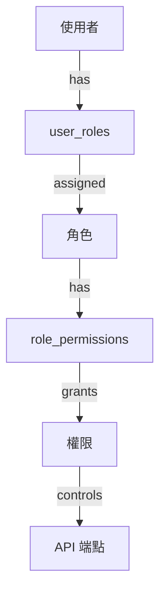
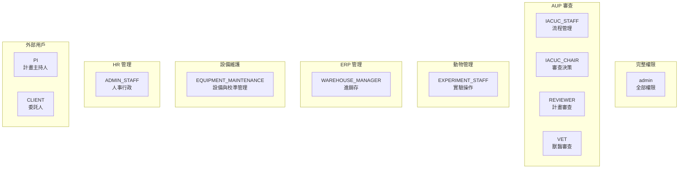

# 權限與 RBAC

> **版本**：7.0  
> **最後更新**：2026-03-08
> **對象**：系統管理員、開發人員

---

## 1. 概覽

iPig 使用角色權限控制（Role-Based Access Control, RBAC）來管理存取權限：

---

## 2. 角色定義

### 2.1 系統角色

| 角色代碼 | 名稱 | 說明 | 類型 |
|----------|------|------|------|
| admin | 系統管理員 | 全系統最高權限 | 內部 |
| ADMIN_STAFF | 行政人員 | 行政事務、HR 管理 | 內部 |
| WAREHOUSE_MANAGER | 倉庫管理員 | ERP 進銷存系統 | 內部 |
| PURCHASING | 採購人員 | 採購作業 | 內部 |
| EQUIPMENT_MAINTENANCE | 設備維護人員 | 設備維護、校準紀錄管理 | 內部 |
| PROGRAM_ADMIN | 程式管理員 | 系統程式層級管理 | 內部 |
| EXPERIMENT_STAFF | 試驗工作人員 | 實驗操作、數據記錄 | 內部 |
| VET | 獸醫師 | 計畫審查、動物健康管理 | 內部 |
| IACUC_STAFF | 執行秘書 | 行政流程、計畫管理 | 內部 |
| IACUC_CHAIR | IACUC 主席 | 主導審查決策 | 內部 |
| REVIEWER | 審查委員 | 計畫審查 | 內部 |
| PI | 計畫主持人 | 提交計畫、管理動物 | 外部 |
| CLIENT | 委託人 | 查看委託計畫 | 外部 |

### 2.2 角色權限矩陣

---

## 3. 權限清單

### 3.1 系統管理 (admin.*)

| 權限代碼 | 名稱 | 說明 |
|----------|------|------|
| admin.user.view | 查看使用者 | 可查看使用者列表 |
| admin.user.view_all | 查看所有使用者 | 可查看所有使用者資料 |
| admin.user.create | 建立使用者 | 可建立新使用者帳號 |
| admin.user.edit | 編輯使用者 | 可編輯使用者資料 |
| admin.user.delete | 停用使用者 | 可停用使用者帳號 |
| admin.user.reset_password | 重設密碼 | 可重設他人密碼 |
| admin.role.view | 查看角色 | 可查看角色列表 |
| admin.role.manage | 管理角色 | 可管理角色定義 |
| admin.permission.manage | 管理權限 | 可管理權限定義 |
| admin.audit.view | 查看稽核紀錄 | 可查看系統稽核紀錄 |

### 3.2 AUP 系統 (aup.*)

| 權限代碼 | 名稱 | 說明 |
|----------|------|------|
| aup.protocol.view_all | 查看所有計畫 | 可查看所有計畫 |
| aup.protocol.view_own | 查看自己的計畫 | 僅能查看自己相關的計畫 |
| aup.protocol.create | 建立計畫 | 可建立新計畫 |
| aup.protocol.edit | 編輯計畫 | 可編輯計畫草稿 |
| aup.protocol.submit | 提交計畫 | 可提交計畫送審 |
| aup.protocol.review | 審查計畫 | 可審查計畫並提供意見 |
| aup.protocol.approve | 核准/否決 | 可核准或否決計畫 |
| aup.protocol.change_status | 變更狀態 | 可變更計畫狀態 |
| aup.protocol.delete | 刪除計畫 | 可刪除計畫 |
| aup.review.view | 查看審查 | 可查看審查意見 |
| aup.review.assign | 指派審查 | 可指派審查人員 |
| aup.review.comment | 審查意見 | 可新增審查意見 |
| aup.attachment.view | 查看附件 | 可查看計畫附件 |
| aup.attachment.download | 下載附件 | 可下載計畫附件 |
| aup.version.view | 查看版本 | 可查看計畫版本歷史 |

### 3.3 變更申請 (amendment.*)

| 權限代碼 | 名稱 | 說明 |
|----------|------|------|
| amendment.create | 建立修正案 | 可建立計畫修正案 |
| amendment.submit | 提交修正案 | 可提交修正案送審 |
| amendment.read | 查看修正案 | 可查看修正案內容 |
| amendment.review | 審查修正案 | 可審查修正案 |

### 3.4 動物管理 (animal.*)

| 權限代碼 | 名稱 | 說明 |
|----------|------|------|
| animal.animal.view_all | 查看所有動物 | 可查看所有動物 |
| animal.animal.view_project | 查看計畫內動物 | 僅計畫內動物 |
| animal.animal.create | 新增動物 | 可新增動物 |
| animal.animal.edit | 編輯動物 | 可編輯動物資料 |
| animal.animal.assign | 分配至計畫 | 可將動物分配至計畫 |
| animal.animal.import | 匯入資料 | 可批次匯入 |
| animal.animal.delete | 刪除動物 | 可刪除動物 |
| animal.record.view | 查看紀錄 | 可查看動物紀錄 |
| animal.record.create | 新增紀錄 | 可新增紀錄 |
| animal.record.edit | 編輯紀錄 | 可編輯紀錄 |
| animal.record.delete | 刪除紀錄 | 可刪除紀錄 |
| animal.blood_test_template.manage | 血檢項目管理 | 可**編輯**血檢項目模板、組合、常用組合（/blood-test-templates 等）。list_all、血檢分析報表與 animal.record.view 綁定：能看到動物的範圍即能看到其血檢分析結果 |
| animal.record.observation | 觀察紀錄 | 可新增觀察紀錄 |
| animal.record.surgery | 手術紀錄 | 可新增手術紀錄 |
| animal.record.weight | 體重紀錄 | 可新增體重紀錄 |
| animal.record.vaccine | 疫苗紀錄 | 可新增疫苗紀錄 |
| animal.record.sacrifice | 犧牲紀錄 | 可新增犧牲紀錄 |
| animal.vet.recommend | 獸醫建議 | 可新增獸醫建議 |
| animal.vet.read | 獸醫已讀 | 可標記已讀 |
| animal.export.medical | 匯出病歷 | 可匯出動物病歷 |
| animal.export.observation | 匯出觀察 | 可匯出觀察紀錄 |
| animal.export.surgery | 匯出手術 | 可匯出手術紀錄 |
| animal.export.experiment | 匯出實驗 | 可匯出實驗紀錄 |
| animal.emergency.stop | 緊急停止 | 可緊急停止實驗 |
| animal.euthanasia.recommend | 安樂死建議 | 可建議安樂死 |
| animal.euthanasia.approve | 安樂死核准 | 可批准安樂死 |
| animal.transfer.initiate | 發起轉讓 | 可發起動物轉讓 |
| animal.transfer.approve | 轉讓核准 | 可核准轉讓 |
| animal.transfer.complete | 轉讓執行 | 可執行轉讓完成 |
| animal.sudden_death.register | 猝死登記 | 可登記猝死 |
| animal.animal.edit | 編輯動物 | 可建立動物欄位修正申請（耳號、出生日期、性別、品種；admin 批准後套用）|

> **資料隔離特權**：`admin`、`VET`、`IACUC_STAFF`、`IACUC_CHAIR` 可繞過轉讓資料隔離，查看動物完整歷史紀錄。

### 3.5 ERP 系統 (erp.*)

| 權限代碼 | 名稱 | 說明 |
|----------|------|------|
| erp.warehouse.view | 查看倉庫 | 倉庫唯讀 |
| erp.warehouse.create | 建立倉庫 | 可建立倉庫 |
| erp.warehouse.edit | 編輯倉庫 | 可編輯倉庫 |
| erp.product.view | 查看產品 | 產品唯讀 |
| erp.product.create | 建立產品 | 可建立產品 |
| erp.product.edit | 編輯產品 | 可編輯產品 |
| erp.partner.view | 查看夥伴 | 夥伴唯讀 |
| erp.partner.create | 建立夥伴 | 可建立夥伴 |
| erp.partner.edit | 編輯夥伴 | 可編輯夥伴 |
| erp.document.view | 查看單據 | 單據唯讀 |
| erp.document.create | 建立單據 | 可建立單據 |
| erp.document.edit | 編輯單據 | 可編輯單據 |
| erp.document.submit | 送審單據 | 可送審 |
| erp.document.approve | 核准單據 | 可核准 |
| erp.stock.view | 查看庫存 | 庫存唯讀（含現況、流水、低庫存警示） |
| erp.purchase.create | 建立採購單 | 可建立 PO |
| erp.purchase.approve | 核准採購單 | 可核准 PO |
| erp.grn.create | 建立進貨單 | 可建立 GRN |
| erp.pr.create | 建立退貨 | 可建立退貨 |
| erp.stock.in/out/view/adjust/transfer | 庫存操作 | 入庫/出庫/查看/調整/調撥 |
| erp.stocktake.create | 盤點 | 可盤點 |
| erp.report.view/export/download | 報表 | 查看/匯出/下載 |
| erp.storage.view/edit | 儲位 | 查看/編輯 |

### 3.6 HR 系統 (hr.*)

| 權限代碼 | 名稱 | 說明 |
|----------|------|------|
| hr.attendance.view | 查看出勤 | 自己的出勤 |
| hr.attendance.view_all | 查看所有出勤 | 所有人的出勤 |
| hr.attendance.clock | 打卡 | 上下班打卡 |
| hr.attendance.correct | 更正打卡 | 可更正打卡 |
| hr.overtime.view | 查看加班 | 自己的加班 |
| hr.overtime.create | 申請加班 | 可申請加班 |
| hr.overtime.approve | 審核加班 | 可審核 |
| hr.leave.view | 查看請假 | 自己的請假 |
| hr.leave.view_all | 查看所有請假 | 所有人的請假 |
| hr.leave.create | 申請請假 | 可申請請假 |
| hr.leave.approve | 審核請假 | 可審核 |
| hr.leave.manage | 管理假別 | 管理設定 |
| hr.balance.view | 查看餘額 | 自己的餘額 |
| hr.balance.view_all | 查看所有餘額 | 所有人的餘額 |
| hr.balance.manage | 管理餘額 | 管理餘額設定 |

### 3.7 稽核系統 (audit.*)

| 權限代碼 | 名稱 | 說明 |
|----------|------|------|
| audit.logs.view | 查看稽核日誌 | 可查看稽核日誌 |
| audit.logs.export | 匯出稽核日誌 | 可匯出稽核日誌 |
| audit.timeline.view | 活動時間軸 | 可查看使用者時間軸 |
| audit.alerts.view | 查看安全警報 | 可查看安全警報 |
| audit.alerts.manage | 管理安全警報 | 可處理安全警報 |

### 3.8 設備維護 (equipment.*)

| 權限代碼 | 名稱 | 說明 |
|----------|------|------|
| equipment.view | 查看設備 | 可查看設備與校準紀錄 |
| equipment.manage | 管理設備 | 可新增、編輯、刪除設備與校準紀錄 |

### 3.9 人員訓練 (training.*)

| 權限代碼 | 名稱 | 說明 |
|----------|------|------|
| training.view | 查看訓練紀錄 | 可查看人員訓練紀錄 |
| training.manage_own | 管理自己的訓練紀錄 | 可新增、編輯、刪除**自己的**訓練紀錄（EXPERIMENT_STAFF） |
| training.manage | 管理訓練紀錄 | 可新增、編輯、刪除**所有人**的訓練紀錄（ADMIN_STAFF 審批用） |

### 3.10 設施管理 (facility.*)

| 權限代碼 | 名稱 | 說明 |
|----------|------|------|
| facility.view | 查看設施 | 可查看設施、棟舍、區域、欄位 |
| facility.manage | 管理設施 | 可新增、編輯、刪除設施及相關配置 |

### 3.11 Google 行事曆 (hr.calendar.*)

| 權限代碼 | 名稱 | 說明 |
|----------|------|------|
| hr.calendar.view | 查看日曆 | 可查看同步狀態與日曆事件 |
| hr.calendar.manage | 管理日曆 | 可連接/斷開 Google 日曆、觸發同步、解決衝突 |

### 3.12 通知/報表 (notification.*, report.*)

| 權限代碼 | 名稱 | 說明 |
|----------|------|------|
| notification.view | 查看通知 | 自己的通知 |
| notification.manage | 管理通知設定 | 可管理設定 |
| notification.send | 發送通知 | 可發送系統通知 |
| report.schedule | 排程報表 | 可設定排程 |
| report.download | 下載報表 | 可下載報表 |

---

## 4. 角色預設權限摘要

| 角色 | admin | aup | amendment | animal | erp | equipment | facility | hr | audit | notification |
|------|-------|-----|-----------|--------|-----|-----------|----------|-----|-------|-------------|
| **admin** | ✅ 全部 | ✅ 全部 | ✅ 全部 | ✅ 全部 | ✅ 全部 | ✅ 全部 | ✅ 全部 | ✅ 全部 | ✅ 全部 | ✅ 全部 |
| **ADMIN_STAFF** | user.view/create/edit | — | — | — | — | view, manage | view, manage | ✅ 全部（含 training 審批/日曆） | — | view |
| **EQUIPMENT_MAINTENANCE** | — | — | — | — | — | view, manage | — | — | — | view |
| **WAREHOUSE_MANAGER** | — | — | — | — | ✅ 全部 | — | — | — | — | view |
| **EXPERIMENT_STAFF** | — | view_own | — | ✅ 動物 CRUD + 匯出 | inventory.view, product.view | — | view | 個人 HR + training 自己 | — | view |
| **VET** | — | view_all, review | read, review | view + vet功能 + 安樂死 | — | — | view | — | — | view |
| **IACUC_STAFF** | user.view | view_all, change_status, assign | read | view_all | — | — | view | — | — | view |
| **IACUC_CHAIR** | — | view_all, review, approve, change_status, assign | read, review | — | — | — | — | — | — | view |
| **REVIEWER** | — | view_all, review, comment | read, review | view_all, record.view | — | — | — | — | — | view |
| **PI** | — | view_own, create, edit, submit | create, submit, read | view_project | — | — | — | — | — | view |
| **CLIENT** | — | view_own, attachment.view | — | view_project | — | — | — | — | — | view |

---

## 5. 前端存取控制

### 5.1 Dashboard 存取

具備以下任一條件可存取 Dashboard：
- `admin` 角色
- `EXPERIMENT_STAFF`、`REVIEWER`、`VET`、`IACUC_CHAIR`、`EQUIPMENT_MAINTENANCE` 角色
- 任何 `erp.*` 或 `equipment.*` 權限

否則導向 `/my-projects`

### 5.2 Admin 路由

僅 `admin` 角色可存取 `/admin/*` 路由

### 5.3 HR 年度特休

需要 `hr.balance.manage` 權限或 `admin` 角色

---

*下一章：[安全與稽核](./07_SECURITY_AUDIT.md)*
