# 資料庫實體關係圖 (ERD)

> **版本**：7.0  
> **最後更新**：2026-03-01

---

## 1. 總覽

```mermaid
erDiagram
    %% ===== 核心架構 =====
    users ||--o{ user_roles : has
    roles ||--o{ user_roles : assigned
    roles ||--o{ role_permissions : has
    permissions ||--o{ role_permissions : granted
    users ||--o{ user_preferences : has
    users ||--o{ refresh_tokens : has

    %% ===== AUP 審查 =====
    users ||--o{ protocols : "owns (PI)"
    users ||--o{ user_protocols : participates
    protocols ||--o{ user_protocols : has_members
    protocols ||--o{ protocol_versions : versioned
    protocols ||--o{ review_assignments : reviewed
    protocols ||--o{ review_comments : has_comments
    protocols ||--o{ protocol_activities : tracked
    protocols ||--o{ amendments : amended

    %% ===== 動物管理 =====
    animal_sources ||--o{ animals : provides
    animals ||--o{ animal_observations : has
    animals ||--o{ animal_surgeries : undergoes
    animals ||--o{ animal_weights : measured
    animals ||--o{ animal_vaccinations : receives
    animals ||--o{ animal_blood_tests : tested
    animals ||--|| animal_sacrifices : "may have"
    animals ||--|| animal_pathology_reports : "may have"
    animals ||--o{ euthanasia_orders : "may have"
    animals ||--|| animal_sudden_deaths : "may have"
    animals ||--o{ animal_transfers : "may transfer"
    animal_transfers ||--o{ transfer_vet_evaluations : evaluated
    blood_test_templates ||--o{ animal_blood_test_items : used_in
    blood_test_panels ||--o{ blood_test_panel_items : contains

    %% ===== ERP =====
    warehouses ||--o{ storage_locations : has
    warehouses ||--o{ documents : stores
    partners ||--o{ documents : transacts
    products ||--o{ document_lines : referenced
    documents ||--o{ document_lines : contains
    documents ||--o{ stock_ledger : records

    %% ===== HR =====
    users ||--o{ attendance_records : has
    users ||--o{ leave_requests : applies
    users ||--o{ overtime_records : submits
    users ||--o{ leave_balances : has

    %% ===== 稽核 =====
    users ||--o{ user_activity_logs : generates
    users ||--o{ user_sessions : has
    users ||--o{ login_events : triggers
```

---

## 2. 核心架構 ERD

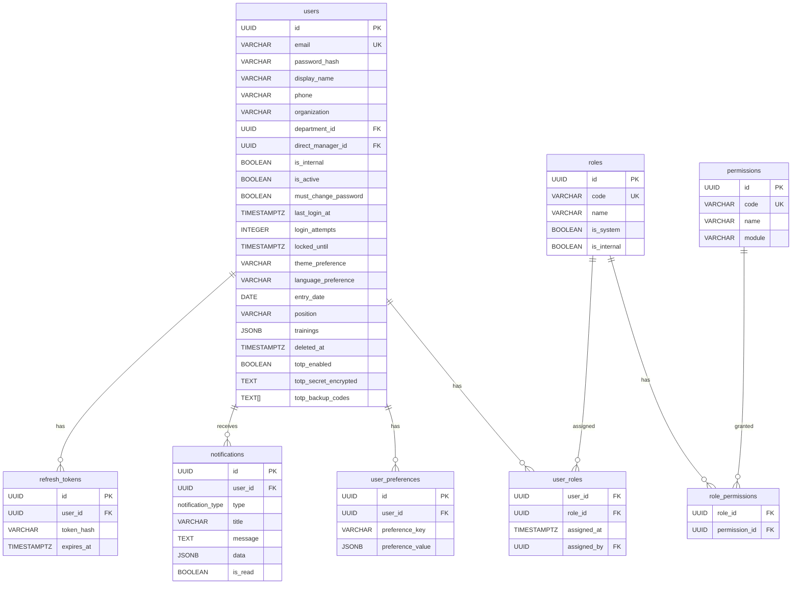

---

## 3. AUP 審查系統 ERD

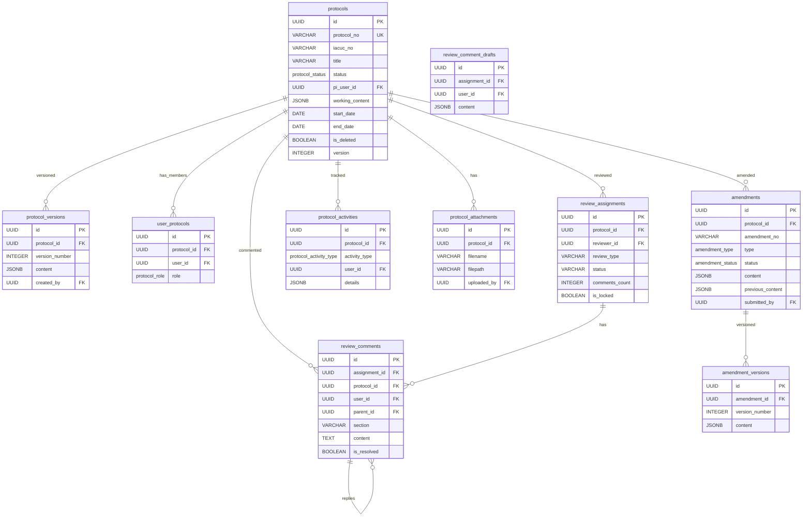

---

## 4. 動物管理 ERD

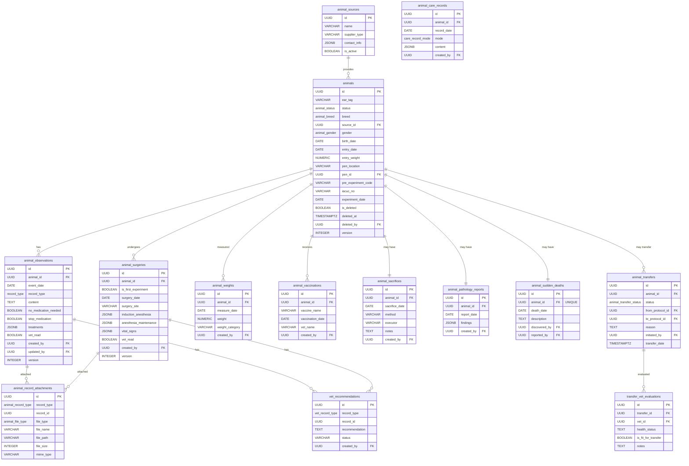

---

## 5. 血液檢查 ERD

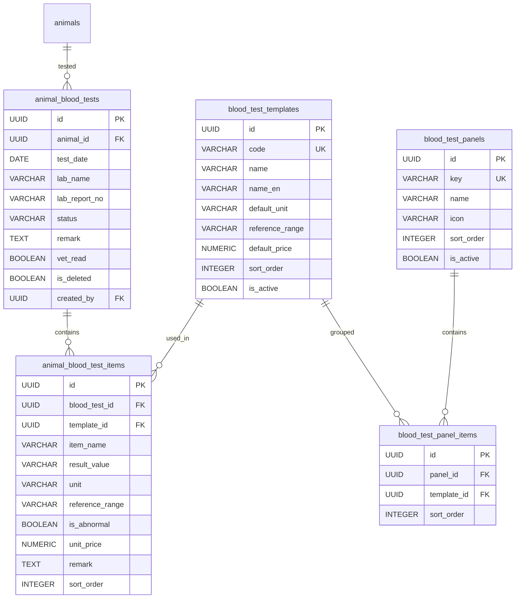

---

## 6. 安樂死管理 ERD

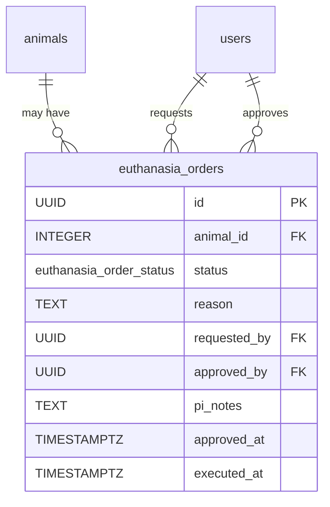

---

## 7. GLP 合規 ERD

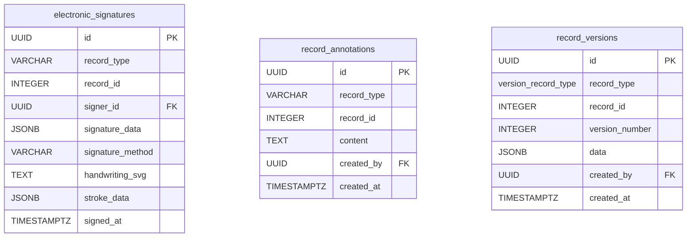

---

## 8. ERP 進銷存 ERD

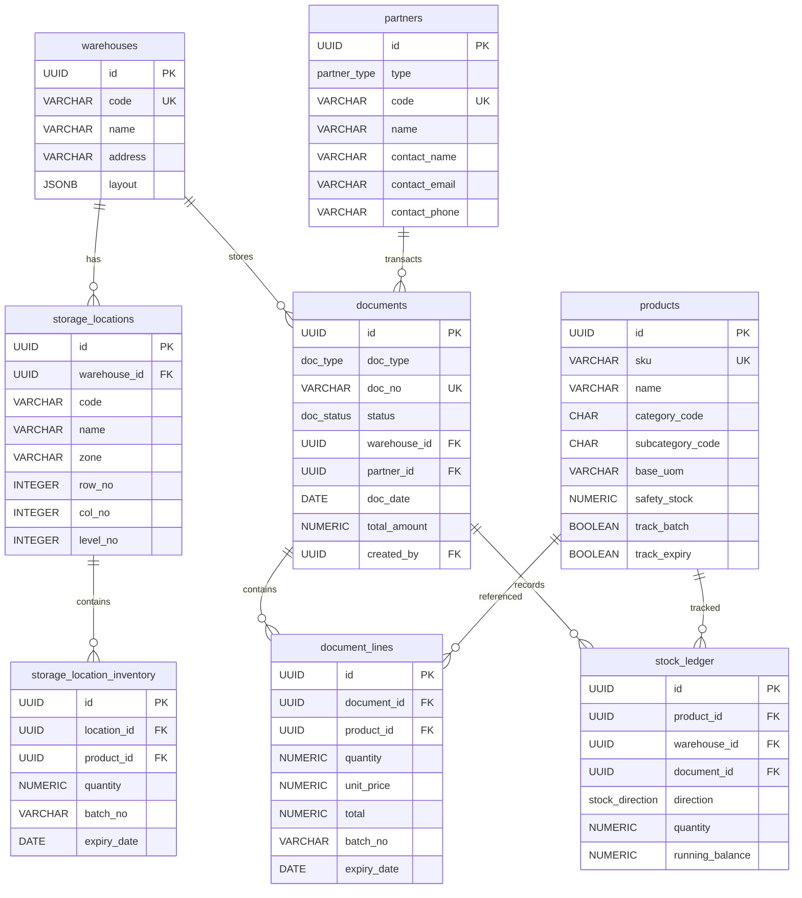

---

## 9. HR 人事管理 ERD

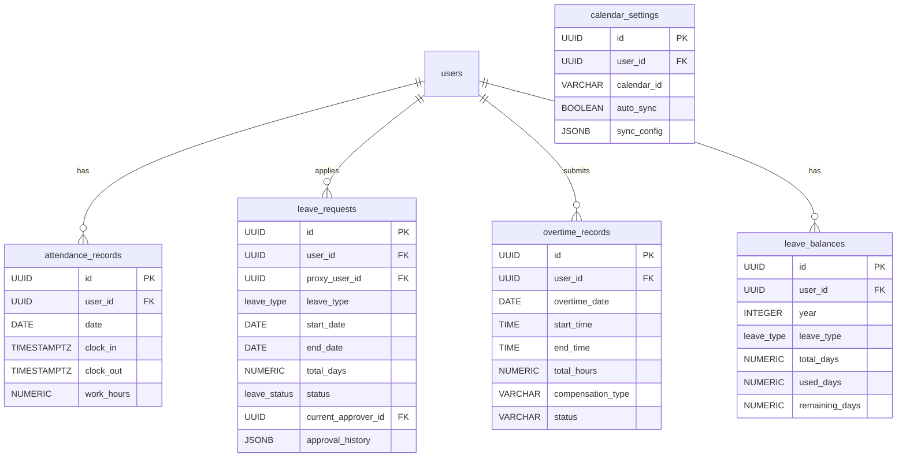

---

## 10. 稽核系統 ERD

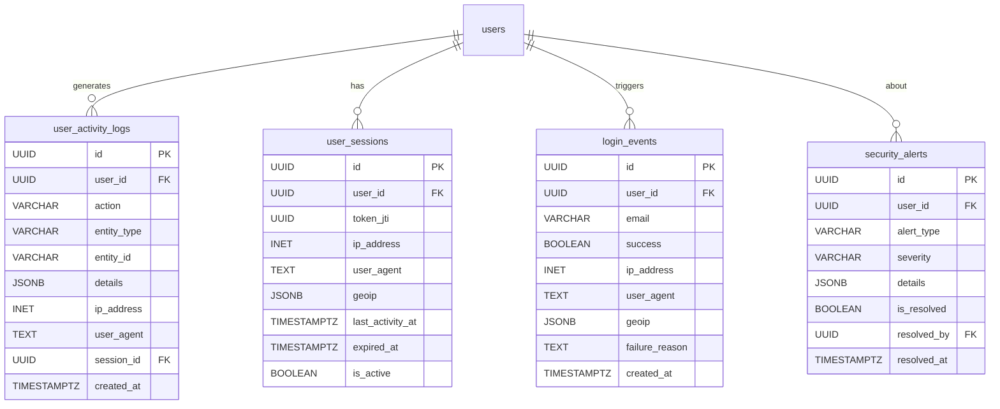

---

## 11. 設施管理 ERD

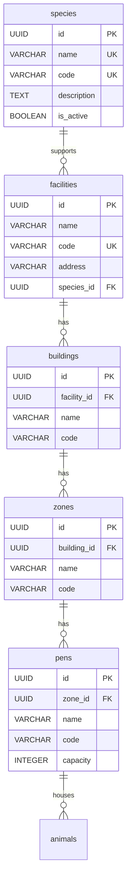

---

## 12. 系統設定與輔助表 ERD

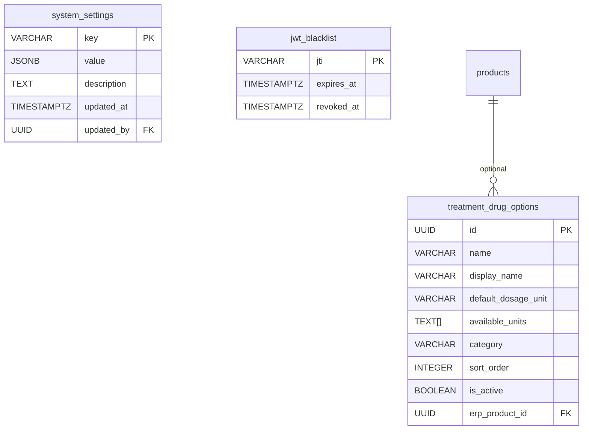

---

## 13. 資料表彙總

| 模組 | 資料表數量 | 主要表名 |
|------|------------|----------|
| 核心架構 | 9 | users, roles, permissions, notifications, attachments, refresh_tokens, user_preferences |
| 動物管理 | 15 | animals, animal_observations, animal_surgeries, animal_weights, animal_vaccinations, animal_sacrifices, animal_pathology_reports, animal_record_attachments, animal_care_records, animal_sudden_deaths, animal_transfers, transfer_vet_evaluations |
| 血液檢查 | 5 | animal_blood_tests, animal_blood_test_items, blood_test_templates, blood_test_panels, blood_test_panel_items |
| 安樂死 | 1 | euthanasia_orders |
| GLP 合規 | 3 | electronic_signatures, record_annotations, record_versions |
| AUP 系統 | 12 | protocols, protocol_versions, user_protocols, review_assignments, review_comments, amendments, system_settings |
| ERP 系統 | 14 | products, warehouses, storage_locations, partners, documents, stock_ledger, skus |
| HR 系統 | 8 | attendance_records, leave_requests, overtime_records, leave_balances, calendar_settings |
| 稽核系統 | 4 | user_activity_logs, user_sessions, login_events, security_alerts |
| 設施管理 | 5 | species, facilities, buildings, zones, pens |
| 輔助 | 3 | jwt_blacklist, treatment_drug_options, notification_routing |
| **合計** | **~73** | |

---

*回上層：[README](./README.md)*

*最後更新：2026-03-01*
