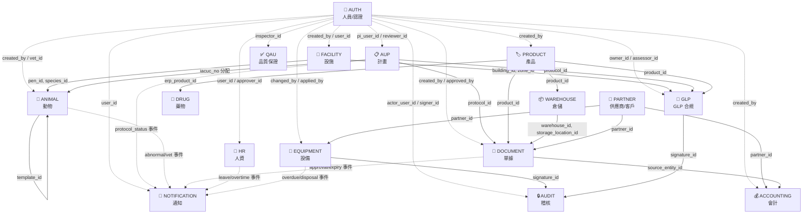

# iPig System 模組關聯與法規遵循總覽

> **版本**：1.0  
> **最後更新**：2026-04-05  
> **適用對象**：系統架構師、開發工程師、QAU 稽核員  
> **技術棧**：Rust (Axum) + React (Vite) + PostgreSQL 16

---

## 目錄

1. [文件概述](#1-文件概述)
2. [模組總覽](#2-模組總覽)
3. [系統關聯架構圖](#3-系統關聯架構圖)
4. [模組關聯矩陣](#4-模組關聯矩陣)
5. [各模組詳細關聯](#5-各模組詳細關聯)
6. [法規遵循對照表](#6-法規遵循對照表)
7. [變更影響分析](#7-變更影響分析)
8. [資料一致性維護要點](#8-資料一致性維護要點)

---

## 1. 文件概述

本文件記錄 iPig 系統所有業務模組之間的**資料依賴（FK）、事件觸發（EV）與業務邏輯耦合（BL）**關係，以及系統功能對應的**法規遵循要求**（GLP、ISO 9001、ISO/IEC 17025、勞基法）。

**用途**：
- 開發新功能或修改現有模組前，查閱影響範圍
- QAU 稽核時，確認法規要求與系統功能的對應
- 架構決策時，評估模組耦合度

---

## 2. 模組總覽

| 代碼 | 中文名 | English | 核心資料表 | 職責 | 主要依賴 |
|------|--------|---------|-----------|------|---------|
| **AUTH** | 人員/認證 | User & Auth | users, roles, permissions, user_roles, role_permissions | 身份認證、RBAC 權限控制、Session 管理 | — |
| **FACILITY** | 設施 | Facility | facilities, buildings, zones, pens, species, departments | 設施層級管理、物種分類、部門組織 | AUTH |
| **AUP** | 計畫 | Protocol/AUP | protocols, protocol_versions, review_assignments, amendments | 動物使用計畫書生命週期、審查流程、變更管理 | AUTH |
| **ANIMAL** | 動物 | Animal | animals, animal_observations, animal_surgeries, animal_blood_tests, euthanasia_orders | 動物生命週期、醫療紀錄、血檢、安樂死 | AUTH, FACILITY, AUP |
| **EQUIPMENT** | 設備 | Equipment | equipment, equipment_calibrations, equipment_maintenance_records, equipment_disposals | 設備校正、維修保養、報廢、年度計畫 | AUTH, PARTNER, AUDIT |
| **WAREHOUSE** | 倉儲 | Warehouse | warehouses, storage_locations, storage_location_inventory | 倉庫管理、儲位配置、儲位庫存 | PRODUCT |
| **PRODUCT** | 產品 | Product | products, product_categories, product_uom_conversions, sku_categories | 產品主檔、分類體系、SKU 編碼、單位換算 | AUTH |
| **DOCUMENT** | 單據 | Document | documents, document_lines, stock_ledger, inventory_snapshots | 11 種單據流程、庫存異動、帳務紀錄 | AUTH, WAREHOUSE, PRODUCT, PARTNER, AUP |
| **PARTNER** | 供應商/客戶 | Partner | partners | 供應商與客戶主檔管理 | — |
| **DRUG** | 藥物 | Treatment Drug | treatment_drug_options | 治療藥物選項、連結 ERP 產品 | PRODUCT, AUTH |
| **QAU** | 品質保證 | Quality Assurance | qa_inspections, qa_non_conformances, qa_capa, qa_sop_documents, qa_audit_schedules | QAU 稽查、NC/CAPA、SOP 管理、稽核排程 | AUTH |
| **HR** | 人資 | Human Resources | attendance_records, leave_requests, overtime_records, annual_leave_entitlements, comp_time_balances | 出勤、請假、加班、補休、Google Calendar 同步 | AUTH |
| **ACCOUNTING** | 會計 | Accounting | chart_of_accounts, journal_entries, journal_entry_lines, ap_payments, ar_receipts | 會計科目、分錄、應付/應收帳款 | AUTH, PARTNER, DOCUMENT |
| **NOTIFICATION** | 通知 | Notification | notifications, notification_settings, notification_routing | 跨模組事件通知、路由規則、使用者偏好 | AUTH |
| **AUDIT** | 稽核 | Audit & Security | user_activity_logs, login_events, user_sessions, security_alerts, electronic_signatures, audit_logs | 活動日誌、登入追蹤、電子簽章、安全警報 | AUTH |
| **GLP** | GLP 合規 | GLP Compliance | controlled_documents, reference_standards, management_reviews, risk_register, change_requests, environment_monitoring_points, competency_assessments, study_final_reports, formulation_records | 文件管控、參考標準、管理審查、風險登錄、環境監測、人員能力、最終報告 | AUTH, FACILITY, AUP, PRODUCT, AUDIT |

---

## 3. 系統關聯架構圖



### 3.1 設施層級結構

```
Facility（設施）
  └── Building（棟舍）
        └── Zone（區域）[含 color 屬性]
              └── Pen（欄位）[含 status, capacity]
                    └── Animal（動物）[pen_id FK]

Species（物種）[階層式，parent_id 自我參照]
  └── Animal（動物）[species_id FK]

Department（部門）[階層式，parent_id 自我參照]
  └── manager_id → users
```

### 3.2 單據流程鏈

```
PO（採購單）──→ GRN（進貨驗收單）──→ stock_ledger（入庫）
                                    └──→ journal_entry（應付帳款）

PR（請購單）──→ PO

SO（銷貨單）──→ DO（出貨單）──→ stock_ledger（出庫）
  └── protocol_id                └──→ journal_entry（應收帳款）

TR（調撥單）──→ stock_ledger（transfer_out + transfer_in）
ADJ（盤點調整）──→ stock_ledger（adjust_in / adjust_out）
STK（盤點單）、RM（退料單）、SR（銷退單）、RTN（進退單）
```

---

## 4. 模組關聯矩陣

> **FK** = Foreign Key 依賴　**EV** = 事件/通知觸發　**BL** = 業務邏輯依賴  
> 列 = 被依賴方（被引用），欄 = 依賴方（引用者）

| 被依賴 ↓ ＼ 依賴 → | AUTH | FACILITY | AUP | ANIMAL | EQUIP | WH | PRODUCT | DOC | PARTNER | DRUG | QAU | HR | ACCT | NOTIF | AUDIT | GLP |
|---|---|---|---|---|---|---|---|---|---|---|---|---|---|---|---|---|
| **AUTH** | — | FK | FK | FK | FK | | FK | FK | | FK | FK | FK | FK | FK | FK | FK |
| **FACILITY** | | — | | FK | | | | | | | | | | | | FK |
| **AUP** | | | — | BL | | | | FK | | | | | | EV | | FK |
| **ANIMAL** | | | | — | | | | | | BL | | | | EV | | |
| **EQUIP** | | | | | — | | | | | | BL | | | EV | FK | |
| **WH** | | | | | | — | | FK | | | | | | | | |
| **PRODUCT** | | | | | | FK | — | FK | | FK | | | | | | FK |
| **DOC** | | | | | | | | — | | | | | FK | EV | | |
| **PARTNER** | | | | | FK | | | FK | — | | | | FK | | | |
| **DRUG** | | | | BL | | | | | | — | | | | | | |
| **QAU** | | | | | | | | | | | — | | | | | |
| **HR** | | | | | | | | | | | | — | | EV | | |
| **ACCT** | | | | | | | | | | | | | — | | | |
| **NOTIF** | | | | | | | | | | | | | | — | | |
| **AUDIT** | | | | | FK | | | | | | | | | | — | FK |
| **GLP** | | | | | | | | | | | | | | | | — |

---

## 5. 各模組詳細關聯

### 5.1 AUTH — 人員/認證

**資料表**：users, roles, permissions, role_permissions, user_roles, refresh_tokens, password_reset_tokens, invitations

**對外 FK**：無（根模組）

**被引用（對內 FK）**：**系統中 50+ 張表** 透過以下欄位引用 `users(id)`：
| 欄位模式 | 用途 | 引用模組 |
|----------|------|---------|
| `created_by` | 建立者 | 全部模組 |
| `deleted_by` | 刪除者 | ANIMAL, AUP |
| `approved_by` | 核准者 | DOCUMENT, EQUIPMENT, GLP |
| `pi_user_id` | 計畫主持人 | AUP |
| `reviewer_id` | 審查委員 | AUP |
| `vet_id` / `vet_user_id` | 獸醫 | AUP, ANIMAL |
| `user_id` | 使用者本人 | HR, AUDIT, QAU, NOTIFICATION |
| `inspector_id` | 稽查員 | QAU |
| `signer_id` | 電子簽章者 | AUDIT |
| `manager_id` | 部門主管 | FACILITY |
| `assessor_id` | 能力評核者 | GLP |

**變更影響**：
- 停用使用者 (`is_active=false`) → 需終止 session、影響待審核 leave/protocol 流程
- 刪除角色 → CASCADE 刪除 role_permissions、user_roles
- 修改權限 → 影響所有功能的存取控制

---

### 5.2 FACILITY — 設施

**資料表**：facilities, buildings, zones, pens, species, departments

**對外 FK**：
| 來源表 | 欄位 | 引用 | ON DELETE |
|--------|------|------|----------|
| buildings | facility_id | facilities(id) | RESTRICT |
| zones | building_id | buildings(id) | RESTRICT |
| pens | zone_id | zones(id) | RESTRICT |
| species | parent_id | species(id) | — (自我參照) |
| departments | parent_id | departments(id) | — (自我參照) |
| departments | manager_id | users(id) | — |

**被引用（對內 FK）**：
| 引用表 | 欄位 | 本模組表 |
|--------|------|---------|
| animals | pen_id | pens |
| animals | species_id | species |
| environment_monitoring_points | building_id | buildings |
| environment_monitoring_points | zone_id | zones |

**變更影響**：
- 改 Zone 的 `color` → 動物列表 Pen Grid 的顏色標示需更新（前端 query key: `facility-zones`）
- 改 Pen 的 `name`/`code` → 動物列表的 `pen_location` 顯示需更新（前端 query key: `facility-pens`）
- 改 Building 的 `name` → 動物列表棟舍 Tab 標籤需更新（前端 query key: `facility-buildings`）
- 刪除 Pen → 被 `animals.pen_id` RESTRICT，需先移出動物
- 改 Species 層級 → 影響動物的物種分類顯示

---

### 5.3 AUP — 計畫

**資料表**：protocols, user_protocols, protocol_versions, protocol_status_history, review_assignments, review_comments, protocol_attachments, amendments, amendment_versions, amendment_review_assignments, amendment_status_history, vet_review_assignments, protocol_activities, review_round_history, protocol_ai_reviews, user_aup_profiles, scheduled_reports, report_history

**對外 FK**：
| 來源表 | 欄位 | 引用 | ON DELETE |
|--------|------|------|----------|
| protocols | pi_user_id | users(id) | — |
| protocols | created_by | users(id) | — |
| user_protocols | user_id | users(id) | CASCADE |
| user_protocols | protocol_id | protocols(id) | CASCADE |
| review_assignments | reviewer_id | users(id) | — |
| vet_review_assignments | vet_id | users(id) | — |
| amendments | protocol_id | protocols(id) | CASCADE |

**被引用（對內 FK）**：
| 引用表 | 欄位 | 本模組表 |
|--------|------|---------|
| documents | protocol_id | protocols |
| study_final_reports | protocol_id | protocols |
| formulation_records | protocol_id | protocols |
| animals | iacuc_no（邏輯關聯） | protocols.iacuc_no |

**變更影響**：
- Protocol 狀態變更 → 觸發 NOTIFICATION（protocol_status 事件）、寫入 protocol_activities
- Protocol 核准 → 動物可被分配至此計畫（iacuc_no 連結）
- Protocol 關閉/暫停 → 影響該計畫下所有動物的實驗狀態
- 刪除 Protocol → CASCADE 刪除所有 versions, comments, assignments, amendments, activities

---

### 5.4 ANIMAL — 動物

**資料表**：animals, animal_sources, animal_observations, animal_surgeries, animal_weights, animal_vaccinations, animal_sacrifices, animal_pathology_reports, animal_blood_tests, animal_blood_test_items, blood_test_templates, blood_test_panels, blood_test_panel_items, blood_test_presets, vet_recommendations, care_medication_records, record_versions, animal_sudden_deaths, animal_transfers, transfer_vet_evaluations, euthanasia_orders, euthanasia_appeals, animal_field_correction_requests, observation_vet_reads, surgery_vet_reads, import_jobs, export_jobs, animal_import_batches, change_reasons

**對外 FK**：
| 來源表 | 欄位 | 引用 | ON DELETE |
|--------|------|------|----------|
| animals | pen_id | pens(id) | — |
| animals | species_id | species(id) | — |
| animals | source_id | animal_sources(id) | — |
| animals | created_by | users(id) | — |
| animal_observations | animal_id | animals(id) | CASCADE |
| animal_surgeries | animal_id | animals(id) | CASCADE |
| animal_weights | animal_id | animals(id) | CASCADE |
| animal_vaccinations | animal_id | animals(id) | CASCADE |
| animal_sacrifices | animal_id | animals(id) | CASCADE (UNIQUE) |
| animal_blood_tests | animal_id | animals(id) | CASCADE |
| animal_blood_test_items | template_id | blood_test_templates(id) | — |
| euthanasia_orders | animal_id | animals(id) | CASCADE |
| euthanasia_orders | vet_user_id | users(id) | — |
| euthanasia_orders | pi_user_id | users(id) | — |
| animal_transfers | animal_id | animals(id) | — |
| transfer_vet_evaluations | vet_id | users(id) | — |

**被引用（對內 FK）**：本模組主要是末端消費者，較少被其他模組引用。

**變更影響**：
- 動物狀態變更（如 `completed`、`euthanized`）→ 觸發 NOTIFICATION
- 異常觀察紀錄 → 觸發 `vet_recommendation` 事件通知
- 刪除動物（軟刪除）→ 所有子紀錄保留（CASCADE 不影響軟刪除）
- `animal_sacrifices.is_locked = true` → GLP 要求，鎖定後不可修改（合規關鍵）

---

### 5.5 EQUIPMENT — 設備

**資料表**：equipment, equipment_calibrations, equipment_suppliers, equipment_status_logs, equipment_maintenance_records, equipment_disposals, equipment_idle_requests, equipment_annual_plans, training_records, reference_standards

**對外 FK**：
| 來源表 | 欄位 | 引用 | ON DELETE |
|--------|------|------|----------|
| equipment_calibrations | equipment_id | equipment(id) | CASCADE |
| equipment_calibrations | partner_id | partners(id) | — |
| equipment_calibrations | reference_standard_id | reference_standards(id) | — |
| equipment_suppliers | partner_id | partners(id) | CASCADE |
| equipment_maintenance_records | repair_partner_id | partners(id) | — |
| equipment_disposals | applicant_signature_id | electronic_signatures(id) | — |
| equipment_disposals | approver_signature_id | electronic_signatures(id) | — |
| equipment_idle_requests | applicant_signature_id | electronic_signatures(id) | — |
| training_records | user_id | users(id) | CASCADE |

**被引用**：被 QAU 稽查（qa_inspections 的 related_entity_id 多型關聯）引用。

**變更影響**：
- 設備狀態變更 → 寫入 equipment_status_logs、觸發 NOTIFICATION（overdue/unrepairable 事件）
- 校正到期 → 觸發 `equipment_overdue` 通知
- 報廢流程需電子簽章 → 依賴 AUDIT 模組
- 年度校正計畫 → 參照 equipment_annual_plans

---

### 5.6 WAREHOUSE — 倉儲

**資料表**：warehouses, storage_locations, storage_location_inventory

**對外 FK**：
| 來源表 | 欄位 | 引用 | ON DELETE |
|--------|------|------|----------|
| storage_locations | warehouse_id | warehouses(id) | CASCADE |
| storage_location_inventory | storage_location_id | storage_locations(id) | CASCADE |
| storage_location_inventory | product_id | products(id) | CASCADE |

**被引用（對內 FK）**：
| 引用表 | 欄位 | 本模組表 |
|--------|------|---------|
| documents | warehouse_id / warehouse_from_id / warehouse_to_id | warehouses |
| document_lines | storage_location_id | storage_locations |
| stock_ledger | warehouse_id | warehouses |
| inventory_snapshots | warehouse_id | warehouses |
| expiry_monthly_snapshots | warehouse_id | warehouses |

**變更影響**：
- 停用倉庫 → 影響所有關聯單據、庫存查詢、到期警報 View
- 刪除儲位 → CASCADE 刪除 storage_location_inventory
- 倉庫容量設定（0 = 無限制）→ 影響低庫存警報邏輯

---

### 5.7 PRODUCT — 產品

**資料表**：products, product_categories, product_uom_conversions, sku_categories, sku_subcategories, sku_sequences

**對外 FK**：
| 來源表 | 欄位 | 引用 | ON DELETE |
|--------|------|------|----------|
| products | category_id | product_categories(id) | — |
| products | created_by | users(id) | — |
| product_categories | parent_id | product_categories(id) | — (自我參照) |
| product_uom_conversions | product_id | products(id) | CASCADE |

**被引用（對內 FK）**：
| 引用表 | 欄位 | 本模組表 |
|--------|------|---------|
| document_lines | product_id | products |
| storage_location_inventory | product_id | products |
| stock_ledger | product_id | products |
| inventory_snapshots | product_id | products |
| treatment_drug_options | erp_product_id | products |
| expiry_monthly_snapshots | product_id | products |
| formulation_records | product_id | products |

**變更影響**：
- 改 `base_uom` → 影響 document_lines 單位計算、stock_ledger、inventory 顯示
- 改 `sku` → 影響所有引用此 SKU 的單據與報表
- 停用產品 → 影響新建單據時的選擇清單（不影響歷史單據）
- UOM 換算變更 → 影響所有含此產品的庫存數量顯示

---

### 5.8 DOCUMENT — 單據

**資料表**：documents, document_lines, stock_ledger, inventory_snapshots, expiry_notification_config, expiry_monthly_snapshots

**11 種單據類型**：

| 類型 | 中文 | 方向 | 關聯模組 |
|------|------|------|---------|
| PO | 採購單 | — | PARTNER, PRODUCT |
| GRN | 進貨驗收 | stock_in | WAREHOUSE, PRODUCT, ACCOUNTING |
| PR | 請購單 | — | PRODUCT |
| SO | 銷貨單 | — | PARTNER, PRODUCT, AUP (protocol_id) |
| DO | 出貨單 | stock_out | WAREHOUSE, PRODUCT, ACCOUNTING |
| SR | 銷退單 | stock_in | PARTNER |
| TR | 調撥單 | transfer | WAREHOUSE ×2 |
| STK | 盤點單 | — | WAREHOUSE |
| ADJ | 盤點調整 | adjust | WAREHOUSE |
| RM | 退料單 | stock_in | WAREHOUSE |
| RTN | 進退單 | stock_out | PARTNER |

**對外 FK**：
| 來源表 | 欄位 | 引用 | ON DELETE |
|--------|------|------|----------|
| documents | warehouse_id | warehouses(id) | — |
| documents | warehouse_from_id | warehouses(id) | — |
| documents | warehouse_to_id | warehouses(id) | — |
| documents | partner_id | partners(id) | — |
| documents | protocol_id | protocols(id) | SET NULL |
| documents | source_doc_id | documents(id) | — (自我參照) |
| documents | created_by | users(id) | — |
| documents | approved_by | users(id) | — |
| documents | manager_approved_by | users(id) | — |
| document_lines | document_id | documents(id) | CASCADE |
| document_lines | product_id | products(id) | — |
| document_lines | storage_location_id | storage_locations(id) | — |
| stock_ledger | doc_id | documents(id) | — |
| stock_ledger | line_id | document_lines(id) | — |

**被引用（對內 FK）**：
| 引用表 | 欄位 | 本模組表 |
|--------|------|---------|
| journal_entries | source_entity_id（邏輯） | documents |

**變更影響**：
- 單據核准 → 寫入 stock_ledger、更新 inventory_snapshots、可能建立 journal_entry
- 單據作廢 → 需考慮已入帳的庫存沖銷
- 到期品管理 → v_expiry_alerts VIEW、expiry_notification_config 觸發通知

---

### 5.9 PARTNER — 供應商/客戶

**資料表**：partners

**對外 FK**：無

**被引用（對內 FK）**：
| 引用表 | 欄位 | 說明 |
|--------|------|------|
| documents | partner_id | 單據的交易對象 |
| equipment_calibrations | partner_id | 校正服務商 |
| equipment_suppliers | partner_id | 設備供應商 |
| equipment_maintenance_records | repair_partner_id | 維修廠商 |
| ap_payments | partner_id | 應付帳款對象 |
| ar_receipts | partner_id | 應收帳款對象 |

**變更影響**：
- 停用供應商 → 影響新建 PO/GRN、設備校正指派
- 供應商分類變更 → 影響報表篩選（supplier_category enum）

---

### 5.10 DRUG — 藥物

**資料表**：treatment_drug_options

**對外 FK**：
| 來源表 | 欄位 | 引用 | ON DELETE |
|--------|------|------|----------|
| treatment_drug_options | erp_product_id | products(id) | — |
| treatment_drug_options | created_by | users(id) | — |

**業務邏輯關聯**：
- 動物觀察紀錄（animal_observations）的 `treatments` JSONB 欄位引用藥物名稱
- 動物手術紀錄的用藥欄位同樣引用

**變更影響**：
- 藥物名稱變更 → 不影響歷史 JSONB 紀錄（已存為快照），但影響新增紀錄時的選項
- 連結的 ERP 產品變更 → 影響庫存追蹤連結

---

### 5.11 QAU — 品質保證

**資料表**：qa_inspections, qa_inspection_items, qa_non_conformances, qa_capa, qa_sop_documents, qa_sop_acknowledgments, qa_audit_schedules, qa_schedule_items

**對外 FK**：
| 來源表 | 欄位 | 引用 | ON DELETE |
|--------|------|------|----------|
| qa_inspections | inspector_id | users(id) | — |
| qa_inspection_items | inspection_id | qa_inspections(id) | CASCADE |
| qa_non_conformances | related_inspection_id | qa_inspections(id) | — |
| qa_non_conformances | assignee_id | users(id) | — |
| qa_capa | nc_id | qa_non_conformances(id) | CASCADE |
| qa_sop_acknowledgments | sop_id | qa_sop_documents(id) | CASCADE |
| qa_sop_acknowledgments | user_id | users(id) | — |
| qa_schedule_items | responsible_person_id | users(id) | — |
| qa_schedule_items | related_inspection_id | qa_inspections(id) | — |

**多型關聯**：`qa_inspections.related_entity_type` + `related_entity_id` 可指向 protocol、equipment、facility 等。

**變更影響**：
- 稽查發現 NC → 建立 CAPA、追蹤改善
- SOP 更新 → 需重新簽收（qa_sop_acknowledgments）
- 排程稽核項目完成 → 可連結稽查報告

---

### 5.12 HR — 人資

**資料表**：attendance_records, overtime_records, overtime_approvals, annual_leave_entitlements, comp_time_balances, leave_requests, leave_approvals, leave_balance_usage, google_calendar_config, calendar_event_sync, calendar_sync_conflicts, calendar_sync_history

**對外 FK**：
| 來源表 | 欄位 | 引用 | ON DELETE |
|--------|------|------|----------|
| attendance_records | user_id | users(id) | CASCADE |
| overtime_records | user_id | users(id) | CASCADE |
| overtime_records | attendance_id | attendance_records(id) | — |
| leave_requests | user_id | users(id) | CASCADE |
| leave_requests | proxy_user_id | users(id) | — |
| leave_requests | current_approver_id | users(id) | — |
| leave_requests | annual_leave_source_id | annual_leave_entitlements(id) | — |
| comp_time_balances | overtime_record_id | overtime_records(id) | CASCADE |
| leave_balance_usage | annual_leave_entitlement_id | annual_leave_entitlements(id) | — |
| leave_balance_usage | comp_time_balance_id | comp_time_balances(id) | — |
| calendar_event_sync | leave_request_id | leave_requests(id) | CASCADE |

**DB Functions**：`get_annual_leave_balance()`, `get_comp_time_balance()`, `get_total_comp_time_hours()`

**變更影響**：
- 核准請假 → 扣除假期餘額（annual_leave 或 comp_time）、同步 Google Calendar
- 核准加班 → 產生 comp_time_balances 記錄
- 出勤紀錄更正 → 可能影響關聯的加班紀錄

---

### 5.13 ACCOUNTING — 會計

**資料表**：chart_of_accounts, journal_entries, journal_entry_lines, ap_payments, ar_receipts

**對外 FK**：
| 來源表 | 欄位 | 引用 | ON DELETE |
|--------|------|------|----------|
| chart_of_accounts | parent_id | chart_of_accounts(id) | — (自我參照) |
| journal_entry_lines | account_id | chart_of_accounts(id) | — |
| journal_entry_lines | journal_entry_id | journal_entries(id) | CASCADE |
| ap_payments | partner_id | partners(id) | — |
| ap_payments | journal_entry_id | journal_entries(id) | — |
| ar_receipts | partner_id | partners(id) | — |
| ar_receipts | journal_entry_id | journal_entries(id) | — |

**變更影響**：
- 單據核准自動建立 journal_entry → 影響試算表、損益表
- 修改會計科目層級 → 影響所有報表彙總
- AP 付款/AR 收款 → 影響帳齡報表

---

### 5.14 NOTIFICATION — 通知

**資料表**：notifications, notification_settings, notification_routing

**事件來源對照**：

| 事件類型 | 來源模組 | 觸發時機 |
|----------|---------|---------|
| `protocol_submitted` | AUP | 計畫提交審查 |
| `protocol_status` | AUP | 計畫狀態變更 |
| `review_assignment` | AUP | 指派審查委員 |
| `review_comment` | AUP | 新增審查意見 |
| `document_approval` | DOCUMENT | 單據待核准 |
| `low_stock` | DOCUMENT | 庫存低於安全量 |
| `expiry_warning` | DOCUMENT | 產品即將到期 |
| `vet_recommendation` | ANIMAL | 獸醫建議 |
| `leave_approval` | HR | 請假待核准 |
| `overtime_approval` | HR | 加班待核准 |
| `equipment_overdue` | EQUIPMENT | 設備校正逾期 |
| `equipment_unrepairable` | EQUIPMENT | 設備無法維修 |
| `equipment_disposal` | EQUIPMENT | 設備報廢審核 |
| `system_alert` | AUDIT | 安全警報 |
| `monthly_report` | DOCUMENT | 月報產出 |

---

### 5.15 AUDIT — 稽核

**資料表**：user_activity_logs（季度分區 2026-2029）, login_events, user_sessions, user_activity_aggregates, security_alerts, electronic_signatures, record_annotations, audit_logs, jwt_blacklist

**對外 FK**：
| 來源表 | 欄位 | 引用 | ON DELETE |
|--------|------|------|----------|
| user_activity_logs | actor_user_id | users(id) | — |
| login_events | user_id | users(id) | — |
| user_sessions | user_id | users(id) | — |
| security_alerts | user_id | users(id) | — |
| electronic_signatures | signer_id | users(id) | — |
| record_annotations | signature_id | electronic_signatures(id) | — |

**被引用（對內 FK）**：
| 引用表 | 欄位 | 本模組表 |
|--------|------|---------|
| equipment_disposals | applicant_signature_id / approver_signature_id | electronic_signatures |
| equipment_idle_requests | applicant_signature_id / approver_signature_id | electronic_signatures |
| study_final_reports | signature_id | electronic_signatures |

**重要特性**：
- `user_activity_logs` 採用 HMAC hash chain（`integrity_hash` + `previous_hash`）確保不可篡改
- 季度分區（2026 Q1 ~ 2029 Q4）
- `electronic_signatures` 支援多型（entity_type + entity_id）

---

### 5.16 GLP — GLP 合規

**資料表**：controlled_documents, document_revisions, document_acknowledgments, management_reviews, risk_register, change_requests, environment_monitoring_points, environment_readings, competency_assessments, role_training_requirements, study_final_reports, formulation_records, reference_standards

**對外 FK**：
| 來源表 | 欄位 | 引用 | ON DELETE |
|--------|------|------|----------|
| controlled_documents | owner_id / approved_by | users(id) | — |
| document_revisions | document_id | controlled_documents(id) | CASCADE |
| document_acknowledgments | document_id | controlled_documents(id) | CASCADE |
| document_acknowledgments | user_id | users(id) | — |
| management_reviews | chaired_by | users(id) | — |
| risk_register | owner_id | users(id) | — |
| change_requests | requested_by / reviewed_by / approved_by / verified_by | users(id) | — |
| environment_monitoring_points | building_id | buildings(id) | — |
| environment_monitoring_points | zone_id | zones(id) | — |
| environment_readings | monitoring_point_id | environment_monitoring_points(id) | CASCADE |
| competency_assessments | user_id / assessor_id | users(id) | — |
| study_final_reports | protocol_id | protocols(id) | — |
| study_final_reports | signature_id | electronic_signatures(id) | — |
| formulation_records | product_id | products(id) | — |
| formulation_records | protocol_id | protocols(id) | — |
| equipment_calibrations | reference_standard_id | reference_standards(id) | — |

**變更影響**：
- 受控文件更新版本 → 需重新簽收（document_acknowledgments）
- 風險等級變更 → 影響管理審查議程
- 環境監測點位置變更 → 影響讀數紀錄的關聯

---

## 6. 法規遵循對照表

### 6.1 GLP — 優良實驗室操作規範

| GLP 要求 | 系統功能 | 模組 | 資料表 | 狀態 |
|----------|---------|------|--------|------|
| **Study Director 指定** | 計畫主持人指派 | AUP | protocols.pi_user_id | ✅ |
| **計畫書版本控管** | Protocol 多版本快照（JSONB） | AUP | protocol_versions | ✅ |
| **計畫書審查流程** | 多層級審查（預審→獸醫→IACUC） | AUP | review_assignments, review_comments | ✅ |
| **變更管理** | Amendment 申請/分類/審查 | AUP | amendments, amendment_versions | ✅ |
| **原始數據不可篡改** | 犧牲紀錄鎖定機制 | ANIMAL | animal_sacrifices.is_locked | ✅ |
| **紀錄版本歷程** | 觀察/手術紀錄版本追蹤 | ANIMAL | record_versions | ✅ |
| **電子簽章** | 符合 21 CFR Part 11 精神 | AUDIT | electronic_signatures | ✅ |
| **稽核軌跡不可竄改** | HMAC hash chain 完整性 | AUDIT | user_activity_logs (integrity_hash) | ✅ |
| **設備校正溯源** | 校正紀錄 → 參考標準 → 溯源鏈 | EQUIPMENT | equipment_calibrations → reference_standards | ✅ |
| **校正週期管理** | 年度校正計畫 | EQUIPMENT | equipment_annual_plans | ✅ |
| **QAU 獨立稽查** | 獨立 QAU 角色與權限 | QAU | qa_inspections, roles(QAU) | ✅ |
| **不符合事項管理** | NC 記錄 + CAPA 追蹤 | QAU | qa_non_conformances, qa_capa | ✅ |
| **SOP 管理** | 受控文件 + 簽收追蹤 | QAU, GLP | qa_sop_documents, controlled_documents | ✅ |
| **試驗物質管理** | 產品 GLP 擴充欄位 | GLP, PRODUCT | products (test_article fields), formulation_records | ✅ |
| **環境監測** | 監測點位 + 讀數記錄 | GLP | environment_monitoring_points, environment_readings | ✅ |
| **最終報告簽署** | Study Director + QAU 雙重簽章 | GLP | study_final_reports (signed_by, qau_signed_by) | ✅ |
| **管理審查** | 定期管理審查紀錄 | GLP | management_reviews | ✅ |
| **風險管理** | 風險登錄與追蹤 | GLP | risk_register | ✅ |
| **變更請求管理** | 申請→審查→核准→驗證 | GLP | change_requests | ✅ |
| **人員能力評核** | 能力評估 + 訓練要求 | GLP | competency_assessments, role_training_requirements | ✅ |
| **人員訓練紀錄** | 訓練歷程 + 到期追蹤 | EQUIPMENT | training_records | ✅ |

---

### 6.2 ISO 9001 — 品質管理系統

| ISO 9001 條款 | 要求摘要 | 系統功能 | 模組 | 資料表 |
|---------------|---------|---------|------|--------|
| **4.4** | QMS 流程 | 計畫書審查流程、單據核准流程 | AUP, DOCUMENT | protocols, documents |
| **6.1** | 風險與機會的應對措施 | 風險登錄簿 | GLP | risk_register |
| **7.1.5** | 監控與量測資源 | 設備校正 + 參考標準溯源 | EQUIPMENT | equipment_calibrations, reference_standards |
| **7.1.6** | 組織知識 | SOP 管理 + 簽收 | QAU, GLP | qa_sop_documents, controlled_documents |
| **7.2** | 能力 | 人員訓練紀錄 + 能力評核 | EQUIPMENT, GLP | training_records, competency_assessments |
| **7.5** | 文件化資訊 | 受控文件管理（版本 + 核准 + 簽收） | GLP | controlled_documents, document_revisions, document_acknowledgments |
| **8.4** | 外部提供的過程、產品和服務 | 供應商管理 + 進貨驗收 | PARTNER, DOCUMENT | partners, documents(GRN) |
| **8.5.2** | 識別與追溯 | SKU 編碼 + 批號 + stock_ledger | PRODUCT, DOCUMENT | products.sku, stock_ledger.batch_no |
| **8.7** | 不符合輸出的管制 | NC 記錄 + 矯正措施 | QAU | qa_non_conformances, qa_capa |
| **9.1** | 監控、量測、分析和評估 | 庫存報表 + 血檢分析報表 | DOCUMENT, ANIMAL | inventory_snapshots, animal_blood_tests |
| **9.2** | 內部稽核 | 稽核排程 + 稽查紀錄 | QAU | qa_audit_schedules, qa_inspections |
| **9.3** | 管理審查 | 管理審查紀錄 | GLP | management_reviews |
| **10.2** | 不符合事項與矯正措施 | NC → CAPA 追蹤至關閉 | QAU | qa_non_conformances → qa_capa |
| **10.3** | 持續改進 | 變更請求管理 | GLP | change_requests |

---

### 6.3 ISO/IEC 17025 — 測試與校正實驗室能力

| ISO 17025 條款 | 要求摘要 | 系統功能 | 模組 | 資料表 |
|----------------|---------|---------|------|--------|
| **6.2** | 人員 | 能力評核 + 訓練紀錄 + 角色訓練要求 | GLP, EQUIPMENT | competency_assessments, training_records, role_training_requirements |
| **6.3** | 設施與環境條件 | 環境監測（溫/濕度） | GLP | environment_monitoring_points, environment_readings |
| **6.4** | 設備 | 設備主檔 + 狀態追蹤 + 維修紀錄 | EQUIPMENT | equipment, equipment_status_logs, equipment_maintenance_records |
| **6.4.6** | 校正 | 校正紀錄（含校正類型、合格範圍） | EQUIPMENT | equipment_calibrations (calibration_type, result, next_calibration_date) |
| **6.5** | 量測溯源性 | 參考標準 + 校正鏈 | EQUIPMENT, GLP | reference_standards → equipment_calibrations |
| **6.5.2** | 參考標準 | 標準品管理（證書號、溯源性） | GLP | reference_standards (certificate_no, traceability_info) |
| **7.2** | 方法的選擇、驗證和確認 | 設備驗證階段（IQ/OQ/PQ） | EQUIPMENT | equipment.validation_phase |
| **7.7** | 確保結果有效性 | 血檢模板 + 參考範圍 | ANIMAL | blood_test_templates (reference_min, reference_max) |
| **7.8** | 結果報告 | 最終報告簽署 | GLP | study_final_reports |
| **7.11** | 數據控制和資訊管理 | 稽核軌跡 + hash chain 完整性 | AUDIT | user_activity_logs (integrity_hash) |
| **8.2** | 管理系統文件 | 受控文件 + 版本管理 | GLP | controlled_documents, document_revisions |
| **8.7** | 管理審查 | 管理審查紀錄 | GLP | management_reviews |
| **8.8** | 內部稽核 | 稽核排程 + 執行 | QAU | qa_audit_schedules, qa_inspections |

---

### 6.4 勞基法（台灣勞動基準法）

| 條款 | 要求摘要 | 系統功能 | 模組 | 資料表/欄位 |
|------|---------|---------|------|------------|
| **§30** | 出勤紀錄保存五年 | 打卡紀錄（上/下班時間、GPS） | HR | attendance_records (clock_in, clock_out, clock_in_lat/lon) |
| **§32** | 加班每月上限 46 小時 | 加班時數記錄 + 核准流程 | HR | overtime_records (overtime_hours, status), overtime_approvals |
| **§32-1** | 加班補休 | 補休餘額管理（含到期清零） | HR | comp_time_balances (hours_earned, hours_used, expires_at) |
| **§38** | 特別休假（年資計算） | 年度特休額度 + 餘額扣除 | HR | annual_leave_entitlements (total_days, used_days, entitlement_year) |
| **§43** | 請假規則 | 10 種假別管理 | HR | leave_requests (leave_type enum: ANNUAL, PERSONAL, SICK, COMPENSATORY, MARRIAGE, BEREAVEMENT, MATERNITY, PATERNITY, MENSTRUAL, OFFICIAL) |
| **§43** | 病假 | 病假紀錄 | HR | leave_requests WHERE leave_type = 'SICK' |
| **§43** | 婚假 | 婚假紀錄 | HR | leave_requests WHERE leave_type = 'MARRIAGE' |
| **§43** | 喪假 | 喪假紀錄 | HR | leave_requests WHERE leave_type = 'BEREAVEMENT' |
| **§50** | 產假 | 產假紀錄 | HR | leave_requests WHERE leave_type = 'MATERNITY' |
| **性平法§15** | 陪產檢及陪產假 | 陪產假紀錄 | HR | leave_requests WHERE leave_type = 'PATERNITY' |
| **性平法§14** | 生理假 | 生理假紀錄 | HR | leave_requests WHERE leave_type = 'MENSTRUAL' |
| — | 公假 | 公假紀錄 | HR | leave_requests WHERE leave_type = 'OFFICIAL' |
| — | 請假核准流程 | 多層級簽核（L1→L2→HR→GM） | HR | leave_approvals (level, status), leave_status enum |
| — | 職務代理 | 請假代理人指定 | HR | leave_requests.proxy_user_id |
| — | 出勤更正 | 管理員更正打卡 | HR | attendance_records.corrected_by |

---

## 7. 變更影響分析

### 7.1 高風險變更場景

| # | 變更項目 | 直接影響 | 間接影響 | 前端 Query Key 需 Invalidate |
|---|---------|---------|---------|---------------------------|
| 1 | Zone 的 `color` | 動物列表 Pen Grid 顏色 | — | `facility-zones` |
| 2 | Zone / Pen 的 `name` | 動物列表欄位名稱顯示 | — | `facility-zones`, `facility-pens` |
| 3 | Building 的 `name` | 動物列表棟舍 Tab 標籤 | — | `facility-buildings` |
| 4 | Species 名稱 | 動物列表物種顯示 | 計畫書動物規格 | `facility-species` |
| 5 | Product 的 `base_uom` | document_lines 單位 | stock_ledger 數量、inventory 顯示 | `products`, `inventory` |
| 6 | Product 的 `sku` | 所有引用此 SKU 的單據 | 報表篩選 | `products`, `documents` |
| 7 | User 的 `is_active` | Session 強制終止 | 待審核 leave/protocol 卡住 | `users`, 各審核清單 |
| 8 | Partner 的 `is_active` | 新 PO 建立受阻 | 設備校正指派 | `partners` |
| 9 | Protocol 狀態 → APPROVED | 動物可被分配 | 觸發 notification | `protocols`, `animals` |
| 10 | Protocol 狀態 → CLOSED | 計畫下動物需結案 | 觸發 notification | `protocols`, `animals` |
| 11 | Equipment 狀態 → under_repair | status_log 新增 | 觸發 notification | `equipment` |
| 12 | Equipment 校正逾期 | annual_plan 標記逾期 | 觸發 equipment_overdue 通知 | `equipment`, `calibrations` |
| 13 | Warehouse 停用 | 所有關聯單據不可新建 | 庫存查詢、到期 View 受影響 | `warehouses`, `inventory` |
| 14 | 受控文件更新版本 | 需全員重新簽收 | — | `controlled-documents` |
| 15 | 加班核准 | 產生 comp_time_balance | 影響可用補休時數 | `overtime`, `comp-time` |
| 16 | 請假核准 | 扣除假期餘額 | Google Calendar 同步 | `leave-requests`, `leave-balance` |

### 7.2 刪除影響鏈（CASCADE / SET NULL / RESTRICT）

| 刪除目標 | ON DELETE 行為 | 被影響的子表 |
|----------|---------------|-------------|
| **protocols** | CASCADE | protocol_versions, protocol_status_history, review_assignments, review_comments, protocol_attachments, amendments (→ amendment_versions, amendment_review_assignments), protocol_activities, review_round_history, protocol_ai_reviews, vet_review_assignments, user_protocols |
| **animals** | CASCADE | animal_observations, animal_surgeries, animal_weights, animal_vaccinations, animal_sacrifices, animal_pathology_reports, animal_blood_tests (→ items), euthanasia_orders (→ appeals), animal_field_correction_requests |
| **equipment** | CASCADE | equipment_calibrations, equipment_suppliers, equipment_status_logs, equipment_maintenance_records, equipment_disposals, equipment_idle_requests, equipment_annual_plans |
| **documents** | CASCADE | document_lines |
| **warehouses** | CASCADE | storage_locations (→ storage_location_inventory) |
| **products** | CASCADE | product_uom_conversions |
| **users** | CASCADE | attendance_records, overtime_records, leave_requests, user_roles, refresh_tokens, password_reset_tokens, user_protocols, training_records, user_aup_profiles, comp_time_balances |
| **documents.protocol_id** | SET NULL | 刪除 protocol 時，單據保留但 protocol_id 清空 |
| **pens** | RESTRICT | 有動物 (animals.pen_id) 時無法刪除 |
| **species** | RESTRICT | 有動物 (animals.species_id) 時無法刪除 |

---

## 8. 資料一致性維護要點

### 8.1 樂觀鎖（Optimistic Locking）

以下資料表使用 `version` 欄位防止並行更新衝突：

| 資料表 | 說明 |
|--------|------|
| protocols | 計畫書編輯鎖 |
| animals | 動物資料更新鎖 |
| animal_observations | 觀察紀錄更新鎖 |
| animal_surgeries | 手術紀錄更新鎖 |

### 8.2 軟刪除（Soft Delete）

| 資料表 | 軟刪除欄位 | 說明 |
|--------|-----------|------|
| users | deleted_at | 帳號停用，保留歷史關聯 |
| animals | is_deleted + deleted_at + deleted_by | 動物資料保留完整醫療紀錄 |
| animal_observations | deleted_at + deleted_by | 觀察紀錄保留版本歷程 |
| animal_surgeries | deleted_at + deleted_by | 手術紀錄保留版本歷程 |
| animal_blood_tests | deleted_at + deleted_by | 血檢紀錄保留 |
| care_medication_records | deleted_at + deleted_by | 照護用藥紀錄保留 |

### 8.3 Partial Unique Index（條件式唯一約束）

| 資料表 | 唯一欄位 | 條件 | 意義 |
|--------|---------|------|------|
| facilities | code | WHERE is_active = true | 停用後 code 可重用 |
| buildings | (facility_id, code) | WHERE is_active = true | 同設施下代碼唯一 |
| zones | (building_id, code) | WHERE is_active = true | 同棟舍下代碼唯一 |
| pens | (zone_id, code) | WHERE is_active = true | 同區域下代碼唯一 |
| treatment_drug_options | (name, category) | WHERE is_active = true | 藥名+分類唯一 |

### 8.4 稽核軌跡完整性

- `user_activity_logs` 使用 **HMAC SHA-256 hash chain**
  - 每筆紀錄計算 `integrity_hash`，同時記錄 `previous_hash`
  - 形成不可斷裂的鏈結，任何竄改皆可偵測
  - 按季度分區（2026 Q1 ~ 2029 Q4）

### 8.5 GLP 紀錄不可變性

| 機制 | 資料表 | 說明 |
|------|--------|------|
| `is_locked` 鎖定 | animal_sacrifices | 犧牲紀錄鎖定後不可修改 |
| 電子簽章 | electronic_signatures | 設備報廢/閒置需雙方簽章 |
| 版本快照 | protocol_versions (JSONB) | 計畫書版本內容不可變 |
| 版本歷程 | record_versions | 動物紀錄修改留存完整差異 |

### 8.6 重要 Database Views

| View 名稱 | 用途 | 關聯模組 |
|-----------|------|---------|
| v_expiry_alerts | 到期品警報彙總 | PRODUCT, WAREHOUSE, DOCUMENT |
| v_low_stock_alerts | 低庫存警報 | PRODUCT, WAREHOUSE |
| v_inventory_summary | 庫存彙總 | PRODUCT, WAREHOUSE |
| v_purchase_order_receipt_status | PO 收貨狀態 | DOCUMENT, PRODUCT |
