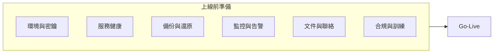

# iPig 系統上線前評估報告 — 第四輪（R4）

> **建立日期：** 2026-03-04  
> **文件性質：** 上線前評估報告（非實作任務清單）  
> **評估範圍：** 全專案正式上線準備度 (Production Readiness)  
> **前置條件：** 第一輪～第三輪改善已完成（R1–R3）、市場檢視改進計畫已完成、R6 第六輪改善多數已完成  
> **相關文件：** [PROGRESS.md](../PROGRESS.md)、[project/description.md](../project/description.md) §7–8

---

## 目錄

| 章節 | 說明 |
|------|------|
| 1 | [評估總覽](#1-評估總覽) |
| 2 | [分面向評估結果](#2-分面向評估結果) |
| 3 | [上線檢查表（Go-Live Checklist）](#3-上線檢查表go-live-checklist) |
| 4 | [已知風險與緩解](#4-已知風險與緩解) |
| 5 | [上線後建議（短期）](#5-上線後建議短期) |
| 6 | [參考文件清單](#6-參考文件清單) |

---

## 1. 評估總覽

### 1.1 結論

| 項目 | 說明 |
|------|------|
| **是否建議上線** | **是**。核心功能完整、測試與維運基礎已就緒，無 P0 阻擋項。 |
| **剩餘阻擋項** | **無**。description.md §7 中僅兩項為非綠（錯誤監控 🔴、GLP 驗證 🔶），均不列為上線阻擋，見 §2 與 §4。 |
| **上線後 1–3 個月建議補齊** | 錯誤監控（Sentry 或等效）、GLP 完整驗證報告（視機構要求）、首次 DR 演練執行與紀錄。 |

本評估與 [PROGRESS.md](../PROGRESS.md)「正式上線準備度」及 [description.md](../project/description.md) §7 正式上線準備 Checklist 對齊：**八面向中六項已達標 ✅，兩項為部分達標（可觀測性之錯誤監控、GLP 驗證文件），已採緩解或上線後補齊**。

### 1.2 與 R1–R3 之區隔

- **R1 / R2 / R3**：改善「實作計畫」— 列出 P0/P1/P2 任務、現況、實作步驟、影響檔案、驗證、工時。
- **R4（本文件）**：**上線前評估報告** — 彙整現況、缺口、可執行檢查表與風險緩解，供決策與維運使用，不新增一輪實作任務清單。

---

## 2. 分面向評估結果

以下對齊 [description.md](../project/description.md) §7 的八個子章節，每面向包含現況、缺口與建議。

### 2.1 測試覆蓋率 (Testing Coverage)

| 項目 | 現況 | 上線目標 | 狀態 |
|------|------|----------|------|
| Rust 單元測試 | 119 個通過 | 核心業務邏輯覆蓋率 ≥ 80% | ✅ |
| 後端 API 整合測試 | 25+ cases（6 檔案） | 關鍵流程覆蓋 | ✅ |
| 前端 E2E 測試 | Playwright 7 spec / 34 tests | 登入/AUP/動物/Admin 等關鍵流程 | ✅ |
| E2E CI 自動化 | docker-compose.test.yml + GitHub Actions | CI 整合 | ✅ |

**缺口：** 無。  
**建議：** 維持現狀；上線後可依需求增加關鍵流程 E2E 或 API 覆蓋率。執行方式見 [INTEGRATION_TESTS.md](INTEGRATION_TESTS.md)。

---

### 2.2 可觀測性 (Observability)

| 項目 | 現況 | 上線目標 | 狀態 |
|------|------|----------|------|
| 健康檢查 `/api/health` | ✅ 已實作（DB 連通性 + 延遲） | DB 連通性 + 延遲量測 | ✅ |
| 結構化日誌 (JSON) | ✅ 條件式 JSON + Request ID | 全鏈路追蹤 | ✅ |
| Metrics `/metrics` | ✅ Prometheus + DB Pool 指標 | HTTP 指標 + DB Pool 狀態 | ✅ |
| 錯誤監控 (Sentry 等) | 無 | 前後端錯誤即時通知 + 堆疊追蹤 | 🔴 |
| 啟動配置檢查 | ✅ 已實作 | — | ✅ |

**缺口：** 🔴 無專用錯誤監控（Sentry 或等效）；生產錯誤目前依賴日誌 + Grafana。  

**建議：**  

- **上線前**：不阻擋。確保 `RUST_LOG_FORMAT=json` 與 Request ID 已啟用，日誌可被 Promtail/Loki 聚合（見 docker-compose.logging.yml）。  
- **上線後 1–3 個月**：導入 Sentry（或等效）以取得前後端錯誤即時通知與堆疊追蹤，利於故障排除。

---

### 2.3 備份與災難復原 (Backup & DR)

| 項目 | 現況 | 上線目標 | 狀態 |
|------|------|----------|------|
| 資料庫自動備份 | pg_dump + cron + rsync | — | ✅ |
| 備份加密 | GPG 透過 BACKUP_GPG_RECIPIENT | 選配啟用 | ✅ |
| 復原演練文件 | DR_RUNBOOK.md、DR_DRILL_CHECKLIST.md | RPO < 1h、RTO < 4h | ✅ |
| 上傳檔案備份 | db-backup 容器同步 /uploads | — | ✅ |
| 備份驗證 | pg_backup.sh 含 gzip + pg_restore --list + SHA256 | 完整性驗證 | ✅ |

**缺口：** 無。  
**建議：** 上線前確認備份排程與異地/離線保留已設定；上線後 1 個月內執行一次 DR 演練並填寫 [DR_DRILL_CHECKLIST.md](../runbooks/DR_DRILL_CHECKLIST.md)。

---

### 2.4 安全性補強 (Security Hardening)

| 項目 | 現況 | 上線目標 | 狀態 |
|------|------|----------|------|
| Rust 依賴掃描 (cargo audit) | CI 已整合 | — | ✅ |
| npm 依賴掃描 (npm audit) | CI 已整合 | — | ✅ |
| 容器安全掃描 (Trivy) | CI 已整合 | — | ✅ |
| Session 逾時預警 | 前端 60s 倒數 Dialog + 續期 | 使用者友善 | ✅ |
| TOTP 2FA | 全端實作 | 管理員可選 | ✅ |
| WAF overlay | ModSecurity + OWASP CRS | 選用部署 | ✅ |
| Named Tunnel 腳本 | 已提供 | Cloudflare Named Tunnel | ✅ |

**缺口：** 無。R1–R3 已涵蓋 Docker 網路隔離、DB 埠口、Secrets、XSS、Rate Limiting、SQL 注入、IDOR、.expect() 清理、容器非 root 等。  
**建議：** 正式環境務必設定 `COOKIE_SECURE=true`、`SEED_DEV_USERS=false`、`CORS_ALLOWED_ORIGINS` 為實際域名；必要時啟用 WAF overlay。

---

### 2.5 GLP 合規文件 (Regulatory Compliance)

| 項目 | 現況 | 上線目標 | 狀態 |
|------|------|----------|------|
| 電子簽章合規 (21 CFR Part 11) | 審查文件已產出 | 法規合規審查 | ✅ |
| 稽核紀錄不可刪改 | HMAC 驗證 + 無 delete API | — | ✅ |
| 資料保留政策 | DATA_RETENTION_POLICY.md | 各類紀錄法定保留年限 | ✅ |
| GLP 驗證文件 | IQ/OQ/PQ 框架已建立 | 完整驗證報告 | 🔶 |

**缺口：** 🔶 GLP 完整驗證報告（IQ/OQ/PQ 執行紀錄與簽核）視機構與稽核要求補齊。  

**建議：**  

- **上線前**：不阻擋。框架與電子簽章、資料保留政策已就緒。  
- **上線後**：依機構 QAU/稽核要求完成驗證執行與報告歸檔；可參考 [ELECTRONIC_SIGNATURE_COMPLIANCE.md](../security-compliance/ELECTRONIC_SIGNATURE_COMPLIANCE.md) 與既有 GLP 驗證文件 v1.0。

---

### 2.6 效能基準 (Performance Baseline)

| 項目 | 現況 | 上線目標 | 狀態 |
|------|------|----------|------|
| API 回應時間 | k6 基準 P95: 1.76~2.31ms | P95 < 500ms | ✅ |
| 壓力測試 | k6 50 VU、正式基準報告 | 效能基準文件化 | ✅ |
| Nginx Brotli 壓縮 | 壓縮等級 6 + Vary | font/svg 類型 | ✅ |
| 前端 Bundle | 主 chunk 優化、jsPDF 動態導入 | — | ✅ |

**缺口：** 無。  
**建議：** 上線後可定期重跑 k6 對照 [PERFORMANCE_BENCHMARK.md](../assessments/PERFORMANCE_BENCHMARK.md)，偵測效能退化。

---

### 2.7 使用者文件與教育訓練 (Documentation & Training)

| 項目 | 現況 | 上線目標 | 狀態 |
|------|------|----------|------|
| API 文件 (OpenAPI/Swagger) | ≥ 90% 端點文件化 | 認證/AUP/動物/電子簽章等 | ✅ |
| 使用者操作手冊 | USER_GUIDE.md v2.0（9 章節） | 各模組操作指南 | ✅ |
| 管理員部署/維運手冊 | DEPLOYMENT.md、OPERATIONS.md | 完整部署、備份、復原、監控 | ✅ |

**缺口：** 無。  
**建議：** 上線前確認維運與 on-call 人員已閱讀 OPERATIONS.md、DR_RUNBOOK；必要時安排教育訓練並紀錄。

---

### 2.8 UX / 相容性 (User Experience)

| 項目 | 現況 | 上線目標 | 狀態 |
|------|------|----------|------|
| 響應式設計 | 基本行動端適配 | — | ✅ |
| 錯誤處理 UX | 統一 API 錯誤處理、toast 提示 | 友善化 + 操作指引 | ✅ |
| Loading 狀態 | Skeleton、TableSkeleton、LoadingOverlay | 非同步操作回饋 | ✅ |
| 瀏覽器相容性 | Playwright Chromium 驗證 | 跨瀏覽器 opt-in | ✅ |

**缺口：** 無。  
**建議：** 維持現狀；若有特定瀏覽器需求可擴充 E2E 或手動驗證清單。

---

## 3. 上線檢查表（Go-Live Checklist）

以下為可執行之一日/一週前檢查項，供維運與專案經理使用。內容彙整自 [DEPLOYMENT.md](../DEPLOYMENT.md)、[OPERATIONS.md](../operations/OPERATIONS.md)、[DR_RUNBOOK.md](../runbooks/DR_RUNBOOK.md)、[DR_DRILL_CHECKLIST.md](../runbooks/DR_DRILL_CHECKLIST.md)。

### 3.1 環境與密鑰

| # | 檢查項目 | 完成 | 備註 |
|---|----------|------|------|
| 1 | `.env` 已從 `.env.example` 複製並填入正式值 | ☐ | |
| 2 | `POSTGRES_PASSWORD`、`JWT_SECRET`、`ADMIN_INITIAL_PASSWORD` 為強密碼且未提交版控 | ☐ | |
| 3 | `COOKIE_SECURE=true`、`SEED_DEV_USERS=false` | ☐ | 正式環境必填 |
| 4 | `CORS_ALLOWED_ORIGINS` 為實際對外域名 | ☐ | |
| 5 | 若有 GPG 備份，`BACKUP_GPG_RECIPIENT` 已設定且公鑰已匯入備份容器 | ☐ | |
| 6 | `scripts/validate-env.sh` 執行通過（必填變數、HMAC key 長度等） | ☐ | |

### 3.2 服務健康

| # | 檢查項目 | 完成 | 備註 |
|---|----------|------|------|
| 1 | `docker compose ps` 所有服務為 Up | ☐ | |
| 2 | `curl http://localhost:8080/api/health` 回傳 200 且 `status: "healthy"` | ☐ | |
| 3 | `checks.database.status` 為 `"up"` | ☐ | |
| 4 | 管理員帳號可登入、首頁與關鍵選單可存取 | ☐ | |
| 5 | Graceful shutdown 已啟用（SIGTERM/Ctrl+C 可優雅關閉） | ☐ | 見 backend main.rs |

### 3.3 備份與還原

| # | 檢查項目 | 完成 | 備註 |
|---|----------|------|------|
| 1 | db-backup 排程已設定（預設每日 02:00） | ☐ | |
| 2 | 至少一次手動備份成功：`docker compose exec db-backup /usr/local/bin/pg_backup.sh` | ☐ | |
| 3 | 備份檔可列出且最近一筆存在 | ☐ | `ls -lah /backups/`（在備份容器內） |
| 4 | 若有 GPG，解密與還原流程已演練或文件已閱讀 | ☐ | 見 DEPLOYMENT §3.2、DR_RUNBOOK §3.1 |
| 5 | 上傳檔案備份（rsync /uploads）已設定或已確認 | ☐ | |

### 3.4 監控與告警

| # | 檢查項目 | 完成 | 備註 |
|---|----------|------|------|
| 1 | Prometheus 可 scrape `/metrics`（若已部署 monitoring overlay） | ☐ | docker-compose.monitoring.yml |
| 2 | Grafana 可連線 Prometheus 且 Dashboard 可開啟 | ☐ | |
| 3 | Alertmanager 規則與通知管道已設定（或確認暫不啟用） | ☐ | OPERATIONS §2.3 |
| 4 | 外部 Uptime 監控（如 UptimeRobot）已指向 `/api/health`（可選） | ☐ | |

### 3.5 文件與聯絡

| # | 檢查項目 | 完成 | 備註 |
|---|----------|------|------|
| 1 | [OPERATIONS.md](../operations/OPERATIONS.md) 服務擁有者、技術負責人、DBA 聯絡方式已填入 | ☐ | |
| 2 | [DR_RUNBOOK.md](../runbooks/DR_RUNBOOK.md) 緊急聯絡表已填入 | ☐ | |
| 3 | On-call 輪值表已建立或排程（見 OPERATIONS §2） | ☐ | |
| 4 | 維運人員已閱讀 DEPLOYMENT、OPERATIONS、DR_RUNBOOK 關鍵章節 | ☐ | |

### 3.6 合規與訓練

| # | 檢查項目 | 完成 | 備註 |
|---|----------|------|------|
| 1 | 電子簽章合規審查文件已備查（ELECTRONIC_SIGNATURE_COMPLIANCE.md） | ☐ | |
| 2 | 資料保留政策已公告或可取得（DATA_RETENTION_POLICY.md） | ☐ | |
| 3 | 使用者操作手冊（USER_GUIDE.md）已提供給端使用者 | ☐ | |
| 4 | 若機構要求 GLP 驗證報告，已排程上線後補齊 | ☐ | |

---

## 4. 已知風險與緩解

以下為**仍殘留或營運面**之風險，不重複 R1–R3 已修補項目。緩解措施供上線決策與上線後追蹤使用。

| 風險 | 說明 | 緩解 | 優先級 |
|------|------|------|--------|
| **無專用錯誤監控** | 未導入 Sentry（或等效），生產錯誤依賴日誌 + Grafana | 確保 JSON 日誌與 Request ID 啟用；可選啟用 docker-compose.logging.yml（Loki + Promtail）；上線後 1–3 個月內導入 Sentry 或等效 | P1 |
| **GLP 驗證報告未完整** | IQ/OQ/PQ 框架已有，完整驗證報告視機構要求 | 上線不阻擋；上線後依 QAU/稽核時程完成執行與報告歸檔 | P2 |
| **前端 CVE-2026-25646（libpng）** | 前端映像基礎層 libpng 1.6.54，修復需 1.6.55；因 Brotli 模組 ABI 限制暫無法僅升級 libpng | 已記錄於 [security.md](../security-compliance/security.md) 與 .trivyignore；評估為低風險（前端不解析使用者上傳 PNG）；採「圖片處理分離」原則；Q2 再檢視基礎映像是否有新 tag | P2 |
| **DR 演練未執行** | 有 Runbook 與演練檢查表，但首次正式演練可能未做 | 上線後 1 個月內執行一次 [DR_DRILL_CHECKLIST.md](../runbooks/DR_DRILL_CHECKLIST.md) 情境 A 或 B，並填寫演練紀錄 | P1 |

---

## 5. 上線後建議（短期）

- **監控與告警**：確認 Prometheus / Grafana / Alertmanager 已依 [infrastructure.md](../operations/infrastructure.md) 與 [DEPLOYMENT.md](../DEPLOYMENT.md) 部署；若有資源限制，可先上 Prometheus + Grafana，Alertmanager 與日誌聚合分階段啟用。
- **錯誤可觀測**：若未上 Sentry，至少確保結構化日誌（`RUST_LOG_FORMAT=json`）與 Request ID 全鏈路可追蹤；已提供 [docker-compose.logging.yml](../../docker-compose.logging.yml)（Loki + Promtail）可選啟用。
- **首次 DR 演練**：建議上線後 1 個月內執行一次 [DR_DRILL_CHECKLIST.md](../runbooks/DR_DRILL_CHECKLIST.md)，並紀錄 RTO/RPO 達成與改善建議。
- **待辦對齊**：本評估中「建議上線後補齊」的項目（錯誤監控、GLP 驗證報告、DR 演練）可視需要加入 [TODO.md](../TODO.md) 或於 PROGRESS.md §9 追蹤；完成時依專案慣例更新 PROGRESS 與待辦統計。

---

## 6. 參考文件清單

| 文件 | 用途 |
|------|------|
| [PROGRESS.md](../PROGRESS.md) | 總體進度、正式上線準備度八面向、最新變更動態 |
| [project/description.md](../project/description.md) §7–8 | 正式上線準備 Checklist 細項、上線策略 (Go-Live Strategy) |
| [DEPLOYMENT.md](../DEPLOYMENT.md) | 系統需求、首次部署、備份還原、監控、GHCR/Watchtower |
| [operations/OPERATIONS.md](../operations/OPERATIONS.md) | 服務擁有者、on-call、升級流程、故障排除 |
| [operations/COMPOSE.md](../operations/COMPOSE.md) | Docker Compose 總覽與使用情境 |
| [operations/SSL_SETUP.md](../operations/SSL_SETUP.md) | SSL/TLS（Cloudflare Tunnel / Let's Encrypt） |
| [runbooks/DR_RUNBOOK.md](../runbooks/DR_RUNBOOK.md) | 災難復原手冊、緊急聯絡、情境還原步驟 |
| [runbooks/DR_DRILL_CHECKLIST.md](../runbooks/DR_DRILL_CHECKLIST.md) | DR 演練檢查表與紀錄表 |
| [assessments/PERFORMANCE_BENCHMARK.md](../assessments/PERFORMANCE_BENCHMARK.md) | 效能基準報告（k6、P95、閾值） |
| [security-compliance/SOC2_READINESS.md](../security-compliance/SOC2_READINESS.md) | SOC2 Trust Services Criteria 對照 |
| [security-compliance/ELECTRONIC_SIGNATURE_COMPLIANCE.md](../security-compliance/ELECTRONIC_SIGNATURE_COMPLIANCE.md) | 電子簽章 21 CFR Part 11 合規審查 |
| [security-compliance/security.md](../security-compliance/security.md) | 依賴與 CVE 處置紀錄（含 CVE-2026-25646） |
| [INTEGRATION_TESTS.md](INTEGRATION_TESTS.md) | 後端 API 整合測試執行方式 |
| [IMPROVEMENT_PLAN_R1.md](IMPROVEMENT_PLAN_R1.md)～[IMPROVEMENT_PLAN_R3.md](IMPROVEMENT_PLAN_R3.md) | 第一～三輪改善計畫（實作任務清單） |

---

*本文件為上線前評估報告，不新增實作任務；若後續將「上線後補齊」項目標註為待辦，完成時請依 CLAUDE.md 規則同步更新 TODO.md 與 PROGRESS.md §9。*
