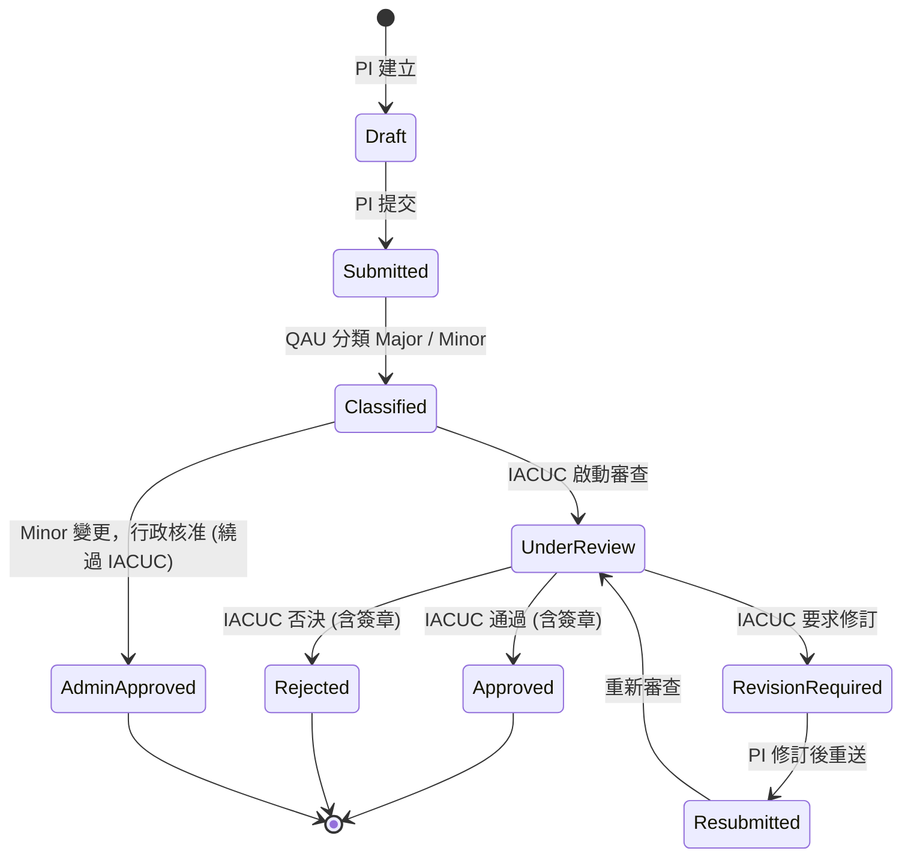

# Amendment（試驗計畫變更）狀態機 SOP

> **用途**：說明 IACUC 計畫變更（amendment）申請從草稿到核准的完整狀態流轉、簽章要求與權限門檻。
> **適用範圍**：`backend/src/services/amendment/workflow.rs` 對應之所有 amendment lifecycle 操作。
> **維護者**：QAU + 系統管理員。狀態機 enum 變動須同步本文件。
> **語言備註**：條款引用保留英文原文；其他敘述為繁體中文。

---

## 1. 狀態枚舉（AmendmentStatus）

來源：`backend/src/models/amendment.rs::AmendmentStatus`（9 個變體）。

| 狀態（enum） | DB 字串 | 中文 | 是否終態 |
|---|---|---|---|
| `Draft` | `DRAFT` | 草稿 | ❌ |
| `Submitted` | `SUBMITTED` | 已提交 | ❌ |
| `Classified` | `CLASSIFIED` | 已分類 | ❌ |
| `UnderReview` | `UNDER_REVIEW` | 審查中 | ❌ |
| `RevisionRequired` | `REVISION_REQUIRED` | 需修訂 | ❌ |
| `Resubmitted` | `RESUBMITTED` | 已重送 | ❌ |
| `Approved` | `APPROVED` | 已核准 | ✅ (但無 EFFECTIVE 終態，見 §6) |
| `Rejected` | `REJECTED` | 已否決 | ✅ |
| `AdminApproved` | `ADMIN_APPROVED` | 行政核准 | ✅ |

---

## 2. 狀態流程圖

---

## 3. 各狀態觸發條件 / actor / 簽章要求

| 從 → 到 | 觸發 actor | 必要條件 | 簽章要求 | 權限 |
|---|---|---|---|---|
| `[*] → Draft` | PI | 建立 amendment record | — | `amendment.create` |
| `Draft → Submitted` | PI | 必填欄位完整、檢附附件 | — | `amendment.submit` |
| `Submitted → Classified` | QAU | 標記 `MAJOR` / `MINOR` 並指派 reviewer | — | `amendment.classify` |
| `Classified → UnderReview` | IACUC chair | 指派 ≥1 名 reviewer | — | `amendment.review.start` |
| `UnderReview → Approved` | IACUC chair | 所有 reviewer 投票完成、無未解決 comment | ✅ Electronic signature（§11.200，雙因素 — R30-8 後）| `amendment.approve` |
| `UnderReview → Rejected` | IACUC chair | reviewer 多數否決 | ✅ Electronic signature | `amendment.approve` |
| `UnderReview → RevisionRequired` | IACUC reviewer | reviewer 提出修訂意見 | — | `amendment.review.comment` |
| `RevisionRequired → Resubmitted` | PI | 回應所有 comment | — | `amendment.submit` |
| `Resubmitted → UnderReview` | IACUC chair | 確認修訂內容 | — | `amendment.review.start` |
| `Classified (Minor) → AdminApproved` | 系統管理員 / QAU | 僅限 `MINOR` 類型，且 risk score 低 | ✅ Electronic signature (single factor 容許) | `amendment.admin_approve` |

---

## 4. 簽章存證（21 CFR §11.50, §11.70）

- 進入終態（Approved / Rejected / AdminApproved）必觸發 `electronic_signatures` 寫入。
- 簽章內容：
  - `signer_id`：actor user id
  - `entity_type`：`"amendment"`
  - `entity_id`：amendment id
  - `meaning`：`"approve"` / `"reject"` / `"admin_approve"`（**TODO[使用者]**：R30-10 補 `meaning` 欄後啟用）
  - `signed_at`：DB `NOW()` 時間戳
  - HMAC chain：與 audit log 共用 chain，由 `audit_chain_verify` daily 驗證
- 簽章後 amendment row 寫入 `approved_signature_id` FK；UPDATE handler 檢查此欄非 NULL → 回 409（C2 修補後行為）。

---

## 5. 對應 IACUC SOP 條目

> **TODO[使用者]**：以下對照需與機構內現行 IACUC SOP 文件編號比對。先列暫定對應，待使用者確認後鎖定。

| Amendment 階段 | 暫定 IACUC SOP 條目 | 備註 |
|---|---|---|
| 提交 (Submitted) | TODO[使用者] | 對應「計畫變更申請表」流程 |
| 分類 (Classified) | TODO[使用者] | Major / Minor 判定準則 |
| 審查 (UnderReview) | TODO[使用者] | reviewer 指派、quorum、投票機制 |
| 核准 (Approved) | TODO[使用者] | chair 簽章、生效日認定 |
| 行政核准 (AdminApproved) | TODO[使用者] | Minor fast-track 適用範圍 |

---

## 6. 已知缺口與 R30 後續

- **R30-25：補 `EFFECTIVE` 終態 + `effective_from` 註記**
  - 目前 `Approved` 即視同生效，但 GLP 實務常見「核准後 N 日生效」、「指定生效日」。
  - 規劃新增 `Effective` 狀態 + `effective_from TIMESTAMPTZ` 欄；在 `effective_from <= NOW()` 後由 cron 自動推進。
  - 此狀態前計畫執行不得依新 amendment 內容操作。

---

## 7. 反向引用

- Traceability：[`traceability-matrix.md`](traceability-matrix.md) §11.10(f) / §11.50 / §11.70
- 簽章規範：[`../security/ELECTRONIC_SIGNATURE_COMPLIANCE.md`](../security/ELECTRONIC_SIGNATURE_COMPLIANCE.md)
- 程式入口：`backend/src/services/amendment/workflow.rs`
- 缺口來源：[`../audit/system-review-2026-04-25.md`](../audit/system-review-2026-04-25.md) §1 [C2]
