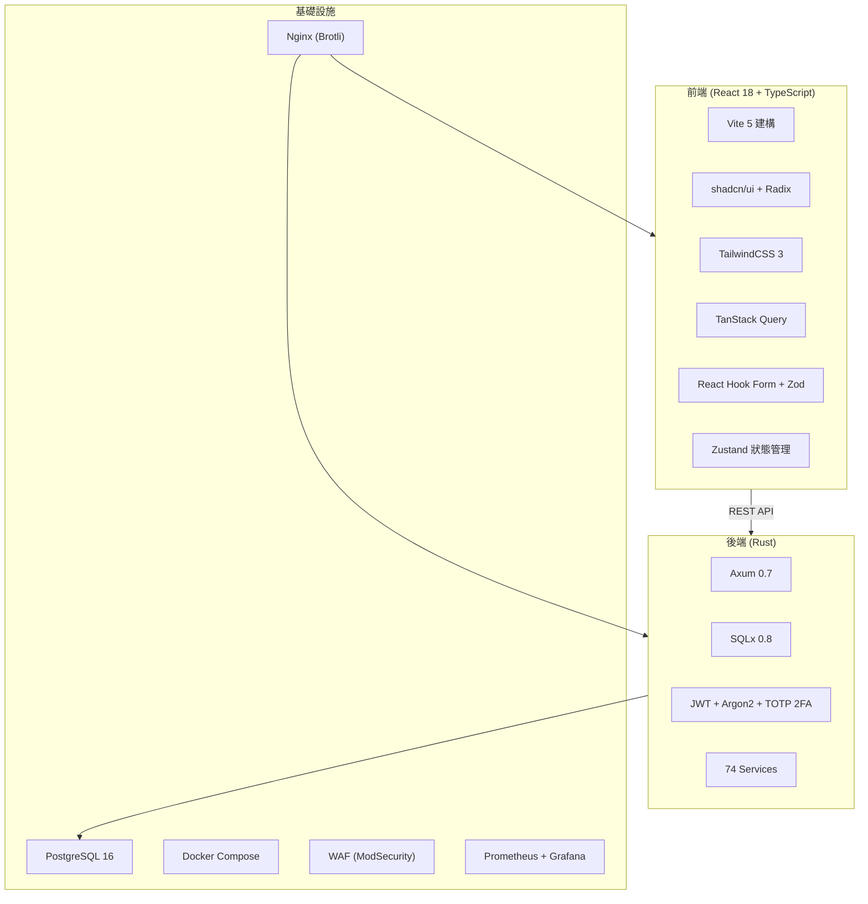

# 豬博士 iPig 系統 — 專案全面分析與評估報告

> **評估日期：** 2026-03-01  
> **專案位置：** `d:\Coding\ipig_system`  
> **狀態：** 功能完整，上線準備中

---

## 1. 專案總覽

**豬博士 iPig 系統**是一套針對實驗動物管理機構的整合型平台，涵蓋六大子系統：

| 子系統 | 用途 |
|--------|------|
| **共用基礎架構** | JWT (HttpOnly Cookie)、TOTP 2FA、RBAC 權限、稽核日誌、Email 服務 |
| **AUP 審查系統** | IACUC 動物使用計畫書 — 全 9 節撰寫、12 種狀態機、審查流程、變更申請 |
| **iPig ERP** | 進銷存管理（採購/銷售/庫存/報表、單據流程） |
| **實驗動物管理** | 動物管理、觀察/手術紀錄、血液檢查、安樂死、轉讓、PDF 匯出、GLP 合規 |
| **通知系統** | Email 通知、站內通知、可配置路由、排程任務 |
| **HR 人事管理** | 特休管理、考勤（IP+GPS）、Google Calendar 同步 |

---

## 2. 技術架構

| 層級 | 技術選型 | 版本 |
|------|----------|------|
| 前端 | React + TypeScript + Vite | r18 / TS 5.3 / Vite 5.1 |
| UI 庫 | shadcn/ui (Radix) + TailwindCSS | ^3.4 |
| 後端 | Rust + Axum + SQLx | Rust 1.92 / Axum 0.7 |
| 資料庫 | PostgreSQL | 16-alpine |
| 容器化 | Docker Compose + Nginx | georgjung/nginx-brotli:1.29.5-alpine |
| 測試 | Rust 單元 + API 整合 + Playwright E2E | 119+ / 25+ / 34 |

> [!TIP]
> 技術選型相當現代且合理。Rust 後端確保高效能與記憶體安全性，React + shadcn/ui 提供良好的開發效率與使用者體驗。

---

## 3. 程式碼規模統計

| 區域 | 語言 | 說明 |
|------|------|------|
| **後端** | Rust (.rs) | 42 handlers、74 services、23 models、7 middleware |
| **前端** | TypeScript/CSS | 62+ 頁面、67+ 元件、14 types |
| **資料庫** | SQL migrations | 19 個遷移檔 (001_ ~ 019_) |
| **測試** | Rust + Python + Playwright | 119+ 單元、25+ API 整合、34 E2E |

### 後端結構

| 目錄 | 檔案數 | 說明 |
|------|-------:|------|
| `handlers/` | 42 | API 請求處理（按模組分：animal/、protocol/、hr/） |
| `models/` | 23 | 資料模型 |
| `services/` | 74 | 業務邏輯（含子模組拆分） |
| `middleware/` | 7 | Auth、CSRF、Rate Limiter、Real IP、Activity Logger |

### 前端結構

| 目錄 | 說明 |
|------|------|
| `pages/` | 14 頁面目錄、62+ 頁面 |
| `components/` | 67+ 元件（含 animal/、protocol/、admin/ 子目錄） |
| `stores/` | Zustand 狀態管理 |
| `locales/` | i18n（zh-TW、en） |
| `types/` | 14 型別檔 |
| `hooks/` | useDebounce、useConfirmDialog、useUnsavedChangesGuard 等 |

---

## 4. 功能完成度評估

| 子系統 | 後端 | 前端 | DB | 測試 | 整體 |
|--------|:----:|:----:|:--:|:----:|:----:|
| 共用基礎架構 | ✅ 100% | ✅ 100% | ✅ | ✅ | **100%** |
| AUP 審查系統 | ✅ 100% | ✅ 100% | ✅ | ✅ 14/14 | **100%** |
| iPig ERP | ✅ 100% | ✅ 100% | ✅ | ✅ 9/9 | **100%** |
| 實驗動物管理 | ✅ 100% | ✅ 100% | ✅ | ✅ 21/21 | **100%** |
| 通知系統 | ✅ 100% | ✅ 100% | ✅ | — | **100%** |
| HR 人事管理 | ✅ 100% | ✅ 100% | ✅ | ✅ | **100%** |
| **資料分析模組** | 🔴 0% | 🔴 0% | 🔴 | 🔴 | **未啟動** |

整體功能完成度約 **100%**（核心六大子系統已完整，資料分析為選配）。

---

## 5. 測試覆蓋分析

### 測試套件總覽

| 類型 | 數量 | 說明 |
|------|------|------|
| Rust 單元測試 | 119+ | 核心業務邏輯 |
| 後端 API 整合測試 | 25+ cases | 6 檔案（auth、health、animals、protocols、users、reports） |
| Playwright E2E | 7 spec / 34 tests | 登入、Dashboard、動物、計畫書、Admin、個人資料 |
| Python 整合測試 | 8 模組 | AUP、ERP、動物、變更、血檢、HR、稽核 |

### E2E 測試涵蓋

- 登入（含 2FA 流程）、Dashboard、動物列表、計畫書、使用者管理、個人設定
- CI 整合 `docker-compose.test.yml`，storageState 免重複登入，34/34 連續通過

> [!TIP]
> 測試覆蓋已補齊：Rust 單元、API 整合、Playwright E2E 全數到位。

---

## 6. 安全性評估

### 已完成的安全強化

| 等級 | 項目 | 狀態 |
|------|------|:----:|
| P0 嚴重 | Refresh Token SHA-256 雜湊 | ✅ |
| P0 嚴重 | 移除硬編碼密碼、開發帳號強制改密 | ✅ |
| P1 高 | Token 儲存 HttpOnly Cookie (SEC-02) | ✅ |
| P1 高 | API Rate Limiting 分級（auth 100、寫入 120、上傳 30、一般 600/min） | ✅ |
| P1 高 | Nginx 安全標頭、Docker 非 root、密碼強度 | ✅ |
| P1 高 | CSRF Token 中間件 | ✅ |
| P2 中 | JWT 6h 有效期（可配置） | ✅ |
| P2 中 | TOTP 2FA 全端實作 (SEC-39) | ✅ |
| P2 中 | 敏感操作二級認證 (SEC-33) | ✅ |
| P5 | WAF overlay (SEC-40) ModSecurity + OWASP CRS | ✅ |
| P5 | Named Tunnel 腳本 | ✅ |
| — | 稽核完整性 HMAC 驗證 | ✅ |

### 選配項目

| 項目 | 說明 |
|------|------|
| 檔案上傳 Magic Number | 可選強化 |
| WAF 生產啟用 | `docker-compose.waf.yml` overlay |

---

## 7. 架構優缺點分析

### ✅ 優點

1. **技術選型現代**：Rust 後端（高效能、記憶體安全），React + shadcn/ui 前端
2. **完整子系統覆蓋**：六大子系統功能齊全，AUP 表單涵蓋完整 9 個章節
3. **GLP 合規設計**：電子簽章、附註、變更原因記錄、記錄鎖定、稽核日誌、HMAC 完整性
4. **安全性到位**：HttpOnly Cookie、TOTP 2FA、CSRF、分級 Rate Limiting、WAF overlay
5. **測試覆蓋完整**：Rust 單元、API 整合、Playwright E2E 全數到位
6. **文件完善**：Profiling Spec 涵蓋架構、模型、API、權限、guides 等
7. **容器化部署**：Docker Compose 一鍵部署，prod/waf/monitoring overlay
8. **i18n 支援**：前端國際化（中/英）
9. **11 個角色**：細粒度 RBAC 權限控制
10. **可觀測性**：Prometheus、Grafana、健康檢查、DB Pool 指標

### ⚠️ 可持續優化

1. **程式碼結構**：Service/Handler 已按模組拆分，持續重構巨型元件
2. **Migration 編號**：19 個遷移檔已整合，編號連續 (001~019)
3. **Git commit 品質**：可持續提升 commit message 一致性

---

## 8. 開發活動分析

| 指標 | 數值 |
|------|------|
| 近期 commits | 持續活躍 |
| 測試結果記錄 | tests/results/、k6 效能基準 |
| 待辦完成度 | 全部 P0~P5 待辦已完成 |
| 最近部署 | Docker Compose、prod overlay、WAF、monitoring |

---

## 9. 後續可選改善事項

### 已完成（原短期/中期）

| 項目 | 狀態 |
|------|------|
| Token → HttpOnly Cookie | ✅ 已完成 |
| Named Tunnel 腳本 | ✅ 已提供 |
| 拆分 main.rs / lib.rs | ✅ 已重構 |
| 拆分超大 Service | ✅ animal、protocol 已模組化 |
| Rust 單元測試 | ✅ 119+ |
| 前端 E2E 測試 | ✅ Playwright 34 tests |

### 可選後續

| # | 項目 | 說明 |
|---|------|------|
| 1 | 資料分析模組 | 血液檢查結果統計與視覺化 |
| 2 | 行動端適配 | 響應式設計持續優化 |
| 3 | 檔案 Magic Number 驗證 | 上傳安全強化 |

---

## 10. 結論

**豬博士 iPig 系統是一個功能完整、架構成熟的實驗動物管理平台。** 實作了 6 大子系統，從 AUP 計畫書審查到 ERP 進銷存管理、從動物紀錄到 HR 人事系統，功能覆蓋全面，上線準備完成。

**核心評分：**

| 面向 | 評分 | 說明 |
|------|:----:|------|
| 功能完整度 | ⭐⭐⭐⭐⭐ | 100% 核心功能已上線 |
| 架構設計 | ⭐⭐⭐⭐⭐ | 分層架構、模組化、lib/main 拆分 |
| 安全性 | ⭐⭐⭐⭐⭐ | HttpOnly Cookie、2FA、CSRF、WAF、二級認證 |
| 測試覆蓋 | ⭐⭐⭐⭐⭐ | Rust 單元、API 整合、Playwright E2E 全數到位 |
| 文件品質 | ⭐⭐⭐⭐⭐ | Profiling Spec、guides、部署手冊完整 |
| 部署與營運 | ⭐⭐⭐⭐⭐ | Docker、prod/waf/monitoring overlay、Prometheus/Grafana |

**整體而言，這是一個已達上線標準的高品質專案，原規劃的改善項目（HttpOnly Cookie、程式碼拆分、測試覆蓋）均已完成。**

---

*最後更新：2026-03-01*
