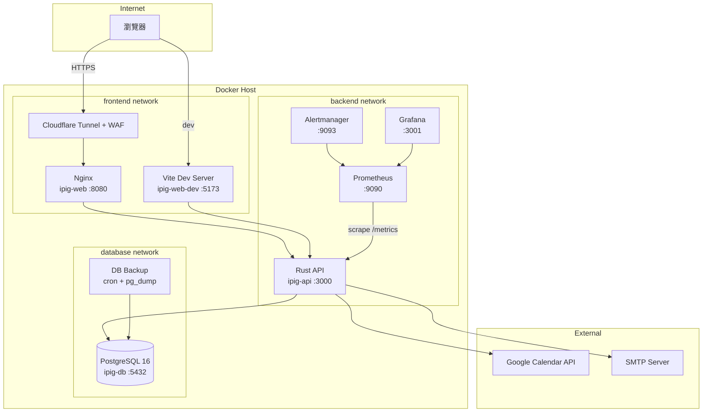
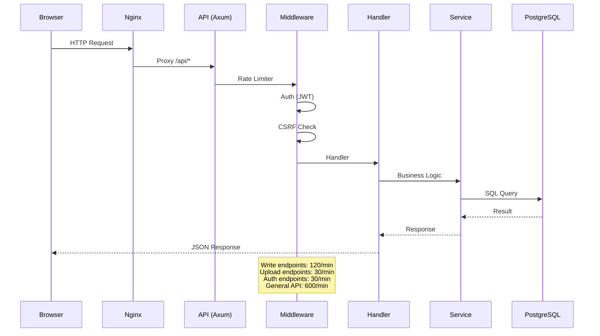
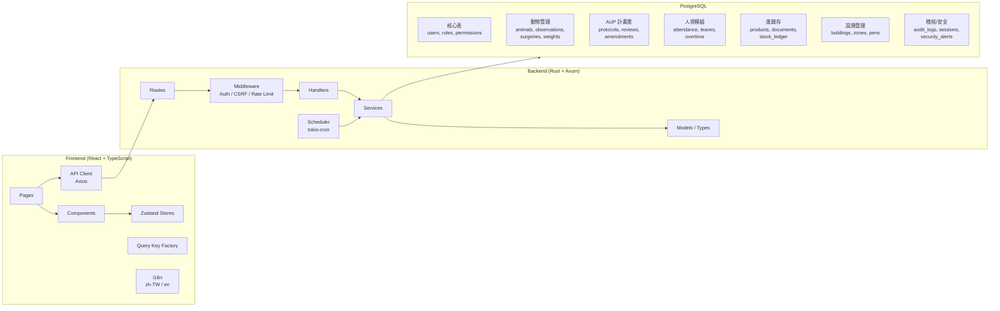
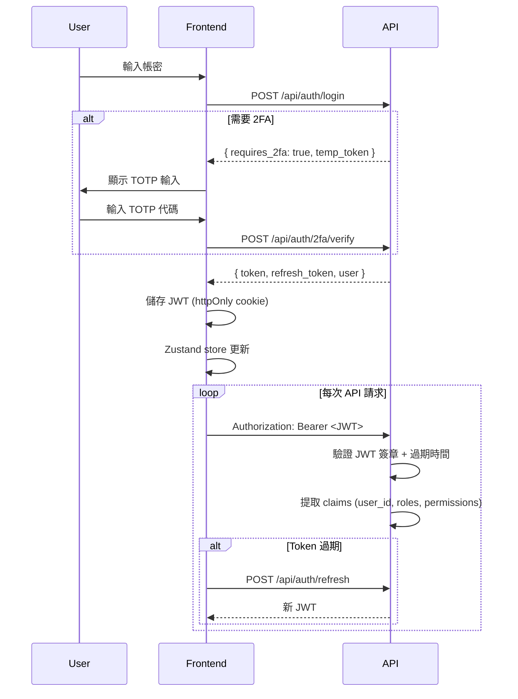

# iPig System 架構文件

## 1. 部署架構



## 2. 資料流



## 3. 模組架構



## 4. 認證流程



## 5. 技術堆疊

| 層級 | 技術 |
|------|------|
| **前端** | React 19, TypeScript, Vite, TailwindCSS, shadcn/ui |
| **狀態管理** | Zustand (auth/UI), TanStack Query (server state) |
| **動畫/圖表** | Framer Motion, Recharts |
| **圖示** | Lucide React |
| **後端** | Rust, Axum, SQLx, Tokio |
| **後端輔助** | lettre (Email), utoipa (OpenAPI), totp-rs (2FA), tower-http (CORS/壓縮) |
| **資料庫** | PostgreSQL 16, Redis 7, pg_stat_statements |
| **認證** | JWT + Refresh Token + TOTP 2FA (admin) |
| **安全** | CSRF tokens, Rate limiting, DOMPurify, Argon2 hashing |
| **容器** | Docker Compose, 三層網路隔離, Docker Secrets |
| **監控** | Prometheus, Grafana, Alertmanager |
| **WAF** | Cloudflare WAF（經 Cloudflare Tunnel） |
| **CI/CD** | GitHub Actions, Dependabot, cargo-chef 快取 |

## 6. 目錄結構

```
ipig_system/
├── backend/
│   ├── src/
│   │   ├── config.rs            # 環境變數 + Docker Secrets
│   │   ├── constants.rs         # 應用常數 (ETAG_VERSION, APP_NAME 等)
│   │   ├── error.rs             # AppError 統一錯誤
│   │   ├── routes.rs            # 路由定義
│   │   ├── handlers/            # HTTP 處理器（按模組分資料夾）
│   │   ├── services/            # 業務邏輯
│   │   ├── middleware/          # Auth, CSRF, ETag, Rate Limiter
│   │   ├── models/              # DB 型別 + Request/Response
│   │   └── bin/                 # CLI 工具 (create_admin)
│   ├── migrations/              # SQL 遷移腳本 (001–010)
│   └── Dockerfile               # 多階段 cargo-chef 建置
├── frontend/
│   ├── src/
│   │   ├── pages/               # 路由頁面
│   │   ├── components/          # 共用/模組元件
│   │   ├── lib/                 # api, sanitize, queryKeys, validations
│   │   ├── stores/              # Zustand stores
│   │   ├── types/               # TypeScript 型別
│   │   └── locales/             # i18n (zh-TW, en)
│   └── Dockerfile
├── monitoring/
│   ├── prometheus/              # 告警規則 + 抓取設定
│   └── alertmanager/            # 告警路由設定
├── .github/
│   └── workflows/               # CI/CD (GitHub Actions)
├── docs/
│   ├── ARCHITECTURE.md          # 本文件
│   ├── TODO.md / PROGRESS.md    # 待辦與進度追蹤
│   ├── spec/          # 系統規格書（API/DB/RBAC/模組）
│   ├── development/             # 改善計劃 (R1–R7)
│   ├── ops/              # 運維手冊
│   ├── security/     # 安全合規文件
│   ├── db/                # DB 匯入匯出與回滾
│   └── runbooks/                # DR 演練與回滾流程
├── docker-compose.yml           # 核心服務
├── docker-compose.prod.yml      # 生產環境覆蓋
└── docker-compose.monitoring.yml # 監控堆疊
```
