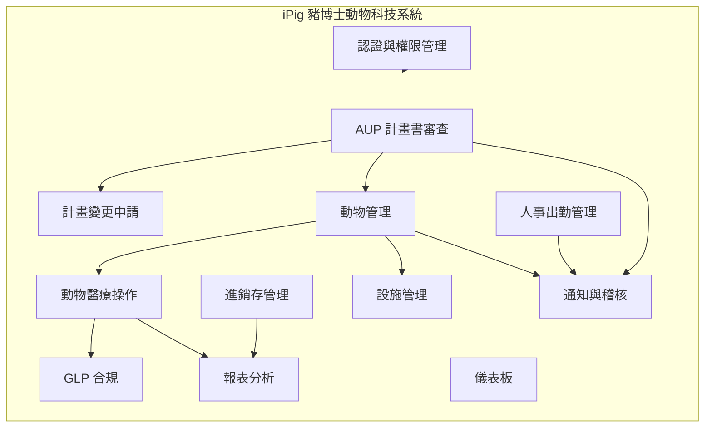
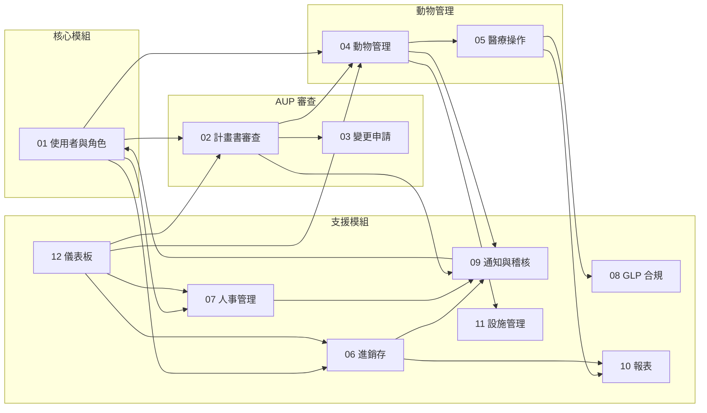

# iPig 豬博士動物科技系統 — 軟體需求規格書

> **文件編號**：iPig-SRS-2026  
> **版本**：1.0  
> **日期**：2026-03-16  
> **狀態**：草稿  
> **機密等級**：限閱——僅供合約雙方及經授權之開發人員閱覽

---

## 1. 文件目的與適用範圍

### 1.1 文件目的

本軟體需求規格書（Software Requirements Specification, SRS）定義「iPig 豬博士動物科技系統」以 **Laravel + Livewire** 框架改寫之完整功能需求。本文件作為開發合約之附件，具約束力地規範系統應交付之功能範圍、業務規則、資料模型、角色權限及非功能性需求。

### 1.2 適用範圍

本 SRS 涵蓋以下系統邊界內的所有功能：

- 使用者認證與角色權限管理（RBAC）
- IACUC 動物使用計畫書（AUP）審查流程
- 計畫書變更申請（Amendment）流程
- 實驗動物生命週期管理
- 動物醫療操作紀錄（觀察、手術、血檢、犧牲、轉讓、安樂死）
- 進銷存管理（ERP）
- 人事出勤管理（HR）
- GLP 合規機制（電子簽章、訓練紀錄、設備校準）
- 通知與稽核系統
- 報表與數據分析
- 設施階層管理
- 儀表板與使用者體驗

### 1.3 文件不涵蓋

- 框架實作細節（Laravel Migration、Eloquent Model、Livewire Component 等實作層規格另案撰寫）
- 基礎設施部署架構（伺服器規格、容器編排、CI/CD Pipeline）
- 第三方服務的 SLA（如 Google Calendar API、SMTP 服務商）

### 1.4 讀者對象

| 讀者 | 關注重點 |
|------|----------|
| 甲方（業主） | 功能範圍、驗收條件、優先等級 |
| 乙方（開發團隊） | 功能需求、業務規則、資料模型、狀態機 |
| 專案經理 | 模組依賴、優先等級、畫面清單 |
| QA 人員 | 驗收條件、業務規則、狀態轉換 |

---

## 2. 系統概覽

### 2.1 系統簡介

iPig 系統是一套整合型實驗動物管理平台，專為遵循 GLP（Good Laboratory Practice）規範的實驗動物機構設計。系統以單一入口門戶整合六大業務領域：

### 2.2 核心業務目標

| 編號 | 業務目標 | 說明 |
|------|----------|------|
| BG-01 | 實驗動物全生命週期管控 | 從動物進場、分配至計畫、實驗追蹤，到犧牲、安樂死或轉讓，所有階段均留有完整紀錄 |
| BG-02 | IACUC 計畫書線上審查 | 取代紙本流程，實現計畫書提交、多層審查、意見交換、版本控管的全數位化作業 |
| BG-03 | GLP 法規合規 | 符合 21 CFR Part 11 電子簽章要求，提供不可竄改的稽核追蹤與紀錄版本控制 |
| BG-04 | 進銷存一體化管理 | 整合實驗室耗材、藥品、飼料等物資的採購、入庫、出庫、盤點、成本追蹤 |
| BG-05 | 人事行政自動化 | 出勤打卡、多級請假審核、加班管理、Google 行事曆同步 |
| BG-06 | 安全與合規稽核 | 所有操作留有完整活動日誌，支援安全警報偵測與工作階段管理 |

### 2.3 使用者規模

本系統預計服務之使用者規模：

| 項目 | 規模 |
|------|------|
| 並行使用者數 | 20–50 人 |
| 註冊帳號總數 | 50–150 人 |
| 管理動物數量 | 100–500 隻 |
| 每日新增醫療紀錄 | 100–300 筆 |
| 每日上傳照片/附件 | 50–200 個 |

---

## 3. 模組索引

本 SRS 由以下模組文件組成。各模組文件遵循統一結構（詳見第 5 節）。

| 編號 | 文件名稱 | 模組範圍 | 優先等級 |
|------|----------|----------|----------|
| 01 | [01_User_and_Roles_Module.md](./01_User_and_Roles_Module.md) | 使用者管理、認證機制、RBAC 角色權限 | P0 |
| 02 | [02_AUP_Protocol_Review_Module.md](./02_AUP_Protocol_Review_Module.md) | 計畫書管理、多層審查流程、版本控管、PDF 匯出 | P0 |
| 03 | [03_Study_Amendment_Module.md](./03_Study_Amendment_Module.md) | 計畫書核准後之變更申請流程 | P0 |
| 04 | [04_Animal_Management_Module.md](./04_Animal_Management_Module.md) | 動物生命週期、基本操作、批次匯入匯出 | P0 |
| 05 | [05_Animal_Medical_Operations_Module.md](./05_Animal_Medical_Operations_Module.md) | 觀察、手術、血檢、犧牲、轉讓、安樂死、疼痛評估 | P0 |
| 06 | [06_ERP_Inventory_Module.md](./06_ERP_Inventory_Module.md) | 產品/SKU、倉庫/儲位、單據流程、庫存追蹤 | P1 |
| 07 | [07_HR_Attendance_Module.md](./07_HR_Attendance_Module.md) | 出勤打卡、請假審核、加班管理、行事曆同步 | P1 |
| 08 | [08_GLP_Compliance_Module.md](./08_GLP_Compliance_Module.md) | 電子簽章、訓練紀錄、設備校準 | P0 |
| 09 | [09_Notification_and_Audit_Module.md](./09_Notification_and_Audit_Module.md) | 通知路由、站內/Email 通知、稽核日誌、安全警報、系統設定 | P1 |
| 10 | [10_Reports_Module.md](./10_Reports_Module.md) | 庫存報表、血檢分析、成本報表、排程報表 | P2 |
| 11 | [11_Facility_Management_Module.md](./11_Facility_Management_Module.md) | 物種、設施、棟舍、區域、欄位、部門 | P1 |
| 12 | [12_Dashboard_and_UX_Module.md](./12_Dashboard_and_UX_Module.md) | 儀表板 Widget、側邊欄、國際化、響應式設計 | P2 |

**優先等級定義**：

| 等級 | 意義 | 交付時程 |
|------|------|----------|
| P0 | 核心功能，系統無此功能無法運作 | 第一階段交付 |
| P1 | 重要功能，影響日常作業效率 | 第二階段交付 |
| P2 | 增強功能，提升使用者體驗 | 第三階段交付 |

---

## 4. 術語表

| 術語 | 英文全稱 | 定義 |
|------|----------|------|
| AUP | Animal Use Protocol | 動物使用計畫書，描述實驗目的、方法、動物數量與福利措施 |
| IACUC | Institutional Animal Care and Use Committee | 機構動物照護及使用委員會，負責審查動物實驗計畫 |
| PI | Principal Investigator | 計畫主持人，負責提交與執行動物使用計畫 |
| GLP | Good Laboratory Practice | 優良實驗室操作規範，確保實驗數據之完整性與可追溯性 |
| 21 CFR Part 11 | Title 21 Code of Federal Regulations Part 11 | 美國 FDA 電子紀錄與電子簽章法規 |
| RBAC | Role-Based Access Control | 角色型存取控制，依角色授予操作權限 |
| ERP | Enterprise Resource Planning | 企業資源規劃，此處特指進銷存管理模組 |
| SKU | Stock Keeping Unit | 庫存管理單位，產品唯一識別編號 |
| PO | Purchase Order | 採購單 |
| GRN | Goods Receipt Note | 入庫驗收單 |
| SO | Sales Order | 銷貨單 |
| DO | Delivery Order | 出貨單 |
| TR | Transfer | 調撥單 |
| STK | Stock Take | 盤點單 |
| ADJ | Adjustment | 庫存調整單 |
| Amendment | Study Amendment | 計畫變更申請，用於修改已核准的 AUP 計畫書 |
| 電子簽章 | Electronic Signature | 以密碼驗證或手寫簽名方式完成的數位簽章，符合 GLP 要求 |
| 軟刪除 | Soft Delete | 不實際刪除資料庫紀錄，僅標記為已刪除，保留完整追蹤紀錄 |
| 稽核追蹤 | Audit Trail | 系統自動記錄所有使用者操作的完整歷史紀錄 |
| TOTP | Time-based One-Time Password | 基於時間的一次性密碼，用於雙因素認證 |
| 2FA | Two-Factor Authentication | 雙因素認證，登入時需提供密碼以外的第二項驗證 |
| Reauth | Re-authentication | 二級認證，執行敏感操作時需重新輸入密碼 |
| QAU | Quality Assurance Unit | 品質保證單位，負責 GLP 合規稽核 |
| 資料隔離 | Data Boundary | 動物轉讓後，新計畫使用者預設僅能查看轉讓時間之後的資料 |

---

## 5. 各模組 SRS 統一結構

所有模組文件依循以下章節結構，確保合約雙方可一致對照：

### 第 1 節：模組概述
- 模組用途與業務價值
- 與其他模組的關係與依賴
- 模組範圍邊界

### 第 2 節：角色與權限
- 此模組涉及的角色（引用第 01 號文件的 RBAC 定義）
- 各角色在此模組的操作權限
- 特殊權限規則（如資料隔離、特權繞過）

### 第 3 節：功能需求
- 以表格列出每項功能需求
- 欄位：需求編號、名稱、描述、優先等級（P0/P1/P2）、驗收條件

### 第 4 節：使用案例
- 關鍵流程的 Use Case 描述
- 包含：前置條件、主要流程（步驟）、替代流程、後置條件、例外處理

### 第 5 節：資料模型
- 邏輯層級的 Entity-Relationship Diagram（Mermaid ERD）
- 實體屬性表（欄位名稱、類型說明、約束條件）
- 列舉值定義

### 第 6 節：業務規則
- 驗證規則（必填、格式、範圍）
- 狀態轉換規則
- 計算邏輯
- 權限約束

### 第 7 節：狀態機（如適用）
- 狀態流轉圖（Mermaid state diagram）
- 各狀態的進入條件與允許操作
- 狀態轉換觸發的副作用（如通知、紀錄）

### 第 8 節：畫面清單
- 列出所有頁面、表單、對話框
- 欄位：畫面名稱、用途說明、所需權限、備註

### 第 9 節：外部介面與整合需求（如適用）
- 與外部系統的整合點（如 Google Calendar、SMTP）
- 資料匯入匯出規格（檔案格式、欄位對應）
- 排程任務需求

---

## 6. 系統角色總覽

以下為系統定義的所有角色。各模組文件中的權限定義均引用此角色清單。

| 角色代碼 | 角色名稱 | 類型 | 說明 |
|----------|----------|------|------|
| admin | 系統管理員 | 內部 | 全系統最高權限，可存取所有功能與資料 |
| ADMIN_STAFF | 行政人員 | 內部 | 行政事務處理、HR 管理、設施管理、設備管理 |
| WAREHOUSE_MANAGER | 倉庫管理員 | 內部 | ERP 進銷存全功能操作 |
| PURCHASING | 採購人員 | 內部 | 採購單建立與相關操作 |
| EQUIPMENT_MAINTENANCE | 設備維護人員 | 內部 | 設備與校準紀錄管理 |
| PROGRAM_ADMIN | 程式管理員 | 內部 | 系統程式層級管理 |
| EXPERIMENT_STAFF | 試驗工作人員 | 內部 | 實驗操作、數據紀錄、動物管理 |
| VET | 獸醫師 | 內部 | 計畫審查、動物健康評估、安樂死建議 |
| IACUC_STAFF | 執行秘書 | 內部 | IACUC 行政流程、計畫管理、審查指派 |
| IACUC_CHAIR | IACUC 主席 | 內部 | 審查決策（核准/否決）、安樂死申訴仲裁 |
| REVIEWER | 審查委員 | 內部 | IACUC 計畫書審查與意見 |
| PI | 計畫主持人 | 外部 | 提交動物使用計畫、管理計畫內動物 |
| CLIENT | 委託人 | 外部 | 查看受委託計畫與動物紀錄（唯讀） |

**角色型別說明**：

- **內部**：機構內部員工，可使用 HR 模組（依權限）
- **外部**：外部合作者，僅能存取與其相關的計畫書及動物資料

---

## 7. 非功能性需求

### 7.1 效能需求

| 編號 | 需求 | 指標 |
|------|------|------|
| NFR-P01 | 頁面載入時間 | 首次載入 ≤ 3 秒，後續導覽 ≤ 1 秒（一般頁面） |
| NFR-P02 | 表單提交回應 | 單筆 CRUD 操作 ≤ 500ms |
| NFR-P03 | 列表查詢回應 | 含分頁查詢 ≤ 1 秒（資料量 ≤ 10,000 筆） |
| NFR-P04 | 檔案上傳 | 10MB 檔案上傳 ≤ 5 秒（不含網路傳輸） |
| NFR-P05 | 報表產生 | 一般報表 ≤ 5 秒，複雜分析報表 ≤ 15 秒 |
| NFR-P06 | 並行使用者 | 系統應支援 50 名並行使用者正常操作 |

### 7.2 安全需求

| 編號 | 需求 | 說明 |
|------|------|------|
| NFR-S01 | 認證機制 | 支援帳號密碼登入，密碼以安全雜湊演算法（如 Bcrypt/Argon2）儲存 |
| NFR-S02 | 雙因素認證 | 支援 TOTP 2FA，管理員可選擇啟用 |
| NFR-S03 | 密碼政策 | 至少 8 字元，需包含大寫、小寫與數字；首次登入強制變更 |
| NFR-S04 | 帳號鎖定 | 連續登入失敗 5 次後鎖定帳號 15 分鐘 |
| NFR-S05 | 工作階段管理 | 支援逾時自動登出、管理員可強制終止他人工作階段 |
| NFR-S06 | 敏感操作保護 | 刪除使用者、重設密碼、模擬登入等操作需二級認證（重新輸入密碼） |
| NFR-S07 | CSRF 防護 | 所有寫入操作需驗證 CSRF Token |
| NFR-S08 | 速率限制 | 認證端點 ≤ 100 次/分鐘，一般操作 ≤ 600 次/分鐘，檔案上傳 ≤ 30 次/分鐘 |
| NFR-S09 | 輸入驗證 | 前端與後端均需驗證使用者輸入，防止注入攻擊 |
| NFR-S10 | 權限控制 | 所有功能操作均需通過 RBAC 權限檢查 |

### 7.3 GLP 合規需求

| 編號 | 需求 | 說明 |
|------|------|------|
| NFR-G01 | 電子簽章 | 符合 21 CFR Part 11，支援密碼驗證與手寫簽名兩種方式 |
| NFR-G02 | 稽核追蹤 | 所有操作自動記錄至稽核日誌，含操作者、時間、IP、變更內容 |
| NFR-G03 | 紀錄不可竄改 | 稽核日誌支援完整性驗證（HMAC），無刪除 API |
| NFR-G04 | 紀錄版本控制 | 醫療紀錄修改時保留歷史版本 JSON 快照 |
| NFR-G05 | 簽章後鎖定 | 已簽章的紀錄不可再修改 |
| NFR-G06 | 紀錄標註 | 已鎖定的紀錄可新增標註（Annotation），但不可修改原始內容 |
| NFR-G07 | 軟刪除 | 重要實體不實體刪除，僅標記刪除並記錄原因與操作者 |

### 7.4 可用性與使用者體驗需求

| 編號 | 需求 | 說明 |
|------|------|------|
| NFR-U01 | 響應式設計 | 系統應在桌面（1280px+）與平板（768px+）裝置上正常運作 |
| NFR-U02 | 多語系 | 支援繁體中文（zh-TW）與英文（en）介面切換 |
| NFR-U03 | 操作回饋 | 所有操作應有明確的成功/失敗提示（Toast 通知） |
| NFR-U04 | Loading 狀態 | 非同步操作應顯示載入狀態（Skeleton、Spinner） |
| NFR-U05 | 未儲存變更警示 | 表單填寫中離開頁面時應提示使用者 |
| NFR-U06 | 錯誤處理 | 錯誤頁面應提供友善訊息與操作建議，非技術性堆疊追蹤 |
| NFR-U07 | 鍵盤操作 | 表單應支援 Tab 鍵順序導覽 |

### 7.5 資料管理需求

| 編號 | 需求 | 說明 |
|------|------|------|
| NFR-D01 | 資料備份 | 資料庫應支援自動排程備份（建議每日至少一次） |
| NFR-D02 | 資料保留 | 稽核日誌至少保留 6 個月，醫療紀錄依法規永久保留 |
| NFR-D03 | 檔案儲存 | 上傳檔案應與資料庫分開儲存，支援備份與還原 |
| NFR-D04 | 資料匯出 | 關鍵報表應支援 Excel/PDF 匯出 |
| NFR-D05 | 資料匯入 | 動物基本資料與體重紀錄應支援 CSV/Excel 批次匯入 |
| NFR-D06 | 時區處理 | 所有時間紀錄以 UTC 儲存，前端依使用者時區顯示 |

### 7.6 瀏覽器相容性

| 瀏覽器 | 最低版本 |
|--------|----------|
| Google Chrome | 最新 2 個主要版本 |
| Microsoft Edge | 最新 2 個主要版本 |
| Safari | 最新 2 個主要版本 |
| Firefox | 最新 2 個主要版本 |

---

## 8. 系統模組關係圖

以下圖示各模組間的資料依賴關係：

**依賴說明**：

- **01 使用者與角色** 是所有模組的基礎依賴——所有功能操作均需通過認證與權限檢查
- **02 計畫書** 與 **04 動物管理** 雙向關聯——動物分配至計畫、計畫統計動物數量
- **05 醫療操作** 依賴 **08 GLP 合規**——醫療紀錄的電子簽章與版本控制
- **09 通知與稽核** 為橫切關注點——所有模組的操作均記錄稽核日誌、觸發通知
- **12 儀表板** 為聚合展示層——整合各模組的摘要資訊

---

## 9. 交付階段規劃

| 階段 | 交付模組 | 說明 |
|------|----------|------|
| 第一階段 | 01、02、03、04、05、08 | 核心業務流程：認證、AUP 審查、動物管理、GLP 合規 |
| 第二階段 | 06、07、09、11 | 營運支援：進銷存、人事、通知稽核、設施管理 |
| 第三階段 | 10、12 | 體驗增強：報表分析、儀表板 |

各階段的具體交付時程與里程碑由合約另行約定。

---

## 10. 驗收標準總則

### 10.1 功能驗收

- 各模組文件第 3 節所列之「驗收條件」逐項通過
- 各模組文件第 4 節所列之使用案例可完整執行
- 各模組文件第 7 節所列之狀態轉換均正確實現

### 10.2 非功能性驗收

- 第 7 節所列之所有非功能性需求均達標
- 安全測試通過（無已知高風險漏洞）
- GLP 合規項目通過稽核驗證

### 10.3 資料遷移驗收

- 現有系統資料完整遷移至新系統
- 遷移後資料一致性校驗通過
- 遷移流程文件化

---

## 11. 文件版本歷程

| 版本 | 日期 | 修改摘要 | 作者 |
|------|------|----------|------|
| 1.0 | 2026-03-16 | 初版建立 | — |

---

## 12. 參考文件

本 SRS 系基於現有 iPig 系統（Rust/Axum + React + PostgreSQL, v7.0）之功能規格轉化而成。以下為主要參考來源：

| 文件 | 說明 |
|------|------|
| Profiling_Spec v7.0 | 現有系統技術規格（架構、領域模型、模組邊界、DB Schema、API、RBAC、安全稽核） |
| USER_GUIDE.md v2.0 | 使用者操作手冊 |
| 現有系統原始碼 | Backend (Rust/Axum) + Frontend (React/TypeScript) |
| 現有資料庫 Migration | PostgreSQL 遷移檔案（001_ ~ 019_） |
