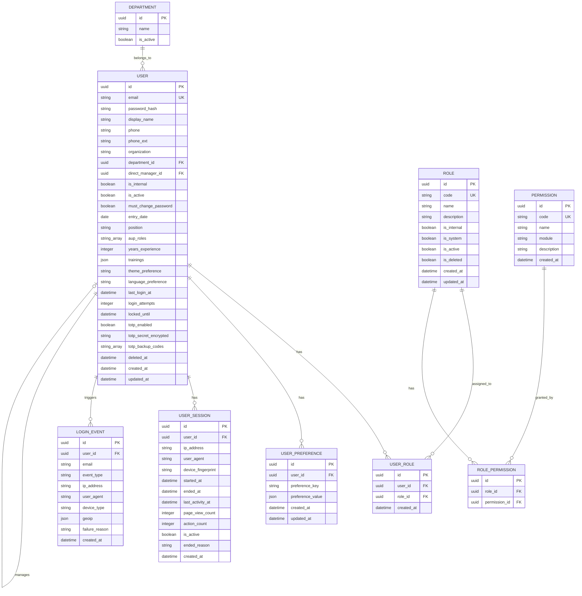
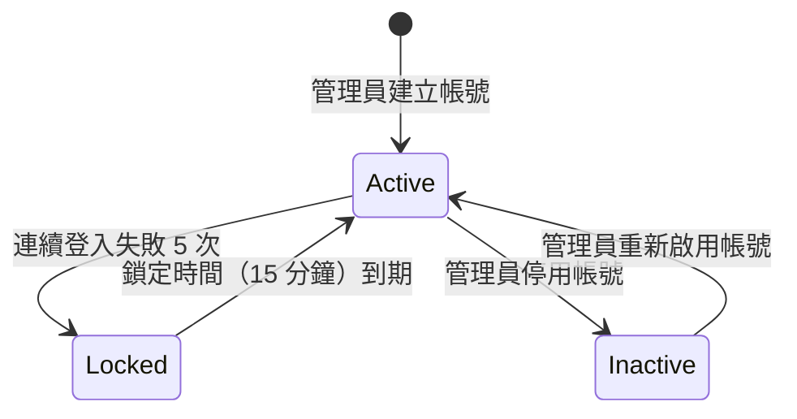
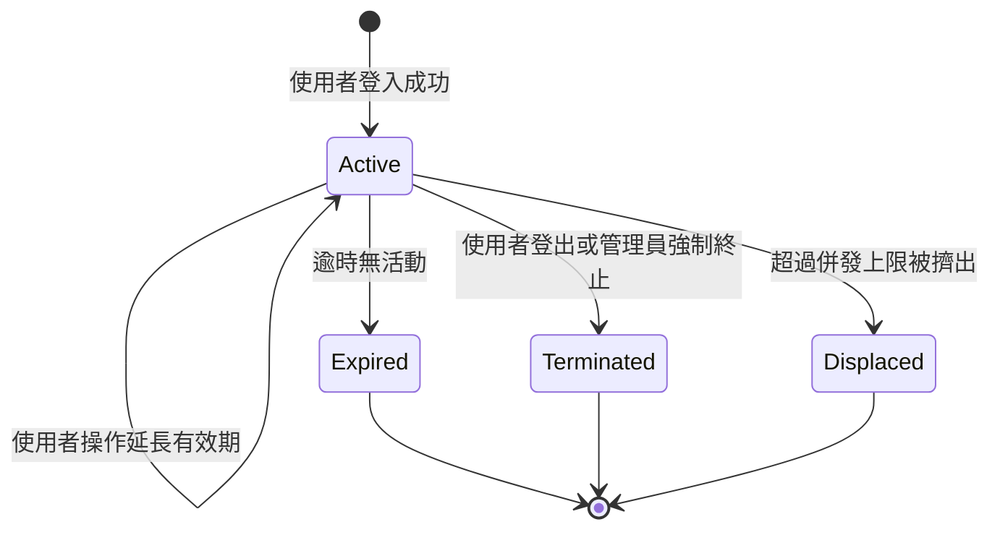

# 使用者與角色模組 — 軟體需求規格書

> **文件編號**：iPig-SRS-2026-01  
> **版本**：1.2  
> **日期**：2026-03-16  
> **所屬**：iPig 豬博士動物科技系統 — 通用軟體需求規格書

---

## 1. 模組概述

使用者與角色模組是 iPig 系統的基礎核心模組，負責管理所有使用者帳號的生命週期、身分認證流程，以及角色型存取控制（RBAC）機制。系統內所有功能操作均須通過本模組的認證與授權檢查，因此本模組是其餘所有模組的前置依賴。

本模組涵蓋以下業務能力：使用者帳號的建立、編輯、停用與查詢；密碼管理（含首次強制變更、忘記密碼、管理員重設）；雙因素認證（TOTP 2FA）；工作階段管理（含心跳回報、逾時自動登出、管理員強制終止）；角色與權限的定義及指派；模擬登入；以及個人偏好設定。

**與其他模組的關係**：

- 本模組為所有模組（02–12）的基礎依賴，提供認證與授權服務
- **09 通知與稽核模組**依賴本模組之使用者資料以記錄活動日誌與發送通知
- **07 人事管理模組**依賴本模組之使用者帳號、部門歸屬、直屬主管欄位

**模組邊界**：

- **包含**：使用者帳號 CRUD、認證流程（登入/登出/工作階段）、TOTP 雙因素認證、密碼管理、角色與權限管理、工作階段管理、模擬登入、個人設定與偏好
- **不包含**：稽核日誌記錄機制（屬 09 通知與稽核模組）、安全警報偵測（屬 09 通知與稽核模組）、登入事件之 GeoIP 定位服務（屬系統基礎設施）

---

## 2. 角色與權限

本模組涉及的角色引用自 [00_Index.md](./00_Index.md) 第 6 節之系統角色定義。

### 2.1 模組涉及角色與權限

| 角色 | 權限代碼 | 允許操作 |
|------|----------|----------|
| admin（系統管理員） | admin.user.view, admin.user.view_all, admin.user.create, admin.user.edit, admin.user.delete, admin.user.reset_password, admin.permission.manage, admin.audit.view, dev.role.* | 全部使用者管理操作、角色與權限管理、模擬登入、強制終止工作階段 |
| ADMIN_STAFF（行政人員） | admin.user.view, admin.user.create, admin.user.edit | 查看使用者列表、建立與編輯使用者帳號 |
| IACUC_STAFF（執行秘書） | admin.user.view | 查看使用者列表（唯讀） |
| 所有已認證使用者 | —（無需特定權限） | 登入/登出、變更自身密碼、管理個人設定與偏好、設定/停用自身 2FA |

### 2.2 特殊權限規則

- **敏感操作保護**：以下操作須通過二級認證，即操作者須重新輸入密碼確認身分（確認有效期 5 分鐘）：
  - 停用使用者帳號
  - 重設他人密碼
  - 模擬登入
  - 刪除角色
- **模擬登入限制**：僅 `admin` 角色可執行模擬登入，模擬期間畫面上方須顯示明確提示橫幅
- **角色管理權限**：角色與權限的建立、編輯、刪除僅限 `admin` 角色（`dev.role.*` 權限）

---

## 3. 功能需求

| 需求編號 | 名稱 | 描述 | 優先等級 | 驗收條件 |
|----------|------|------|----------|----------|
| FR-AUTH-001 | 使用者帳號密碼登入 | 系統應允許使用者以 Email 與密碼登入，驗證成功後建立認證工作階段 | P0 | 輸入正確帳密後，系統建立工作階段並重導至首頁；輸入錯誤帳密時顯示錯誤訊息 |
| FR-AUTH-002 | TOTP 雙因素認證登入 | 若使用者已啟用 2FA，帳密驗證通過後須額外輸入 TOTP 驗證碼或備用碼方可完成登入 | P0 | 啟用 2FA 的使用者輸入正確帳密後，系統要求輸入 TOTP 碼；輸入正確碼後完成登入；輸入備用碼可替代 TOTP 碼 |
| FR-AUTH-003 | 使用者登出 | 系統應允許使用者主動登出，終止工作階段並清除認證憑證 | P0 | 登出後無法存取受保護資源，須重新登入 |
| FR-AUTH-004 | 工作階段自動延長 | 使用者持續操作期間，系統應自動延長工作階段有效期，避免使用者在操作中被強制登出 | P0 | 使用者持續操作時不會被登出；工作階段延長對使用者透明無感知 |
| FR-AUTH-005 | 首次登入強制變更密碼 | 新建立的使用者帳號首次登入時，系統應強制導向變更密碼畫面 | P0 | 標記 `must_change_password` 的帳號登入後，系統重導至強制變更密碼頁面，變更完成前無法存取其他功能 |
| FR-AUTH-006 | 使用者自行變更密碼 | 已登入使用者應可透過個人設定變更自身密碼，須輸入目前密碼驗證 | P0 | 輸入正確的目前密碼與符合規則的新密碼後，密碼更新成功；新密碼須符合密碼政策 |
| FR-AUTH-007 | 忘記密碼 | 使用者可於登入頁面申請密碼重設，系統寄送含重設連結之 Email | P1 | 輸入已註冊之 Email 後，系統寄出密碼重設信件，連結有效期為 1 小時；使用有效連結可設定新密碼 |
| FR-AUTH-008 | 管理員重設使用者密碼 | 具備 `admin.user.reset_password` 權限之使用者可為他人重設密碼 | P0 | 管理員完成二級認證後可重設指定使用者密碼；被重設者下次登入須強制變更密碼 |
| FR-AUTH-009 | 帳號鎖定 | 同一帳號連續登入失敗達 5 次後，系統應自動鎖定該帳號 15 分鐘 | P0 | 連續 5 次輸入錯誤密碼後帳號被鎖定；鎖定期間任何登入嘗試均回傳鎖定提示；15 分鐘後自動解鎖 |
| FR-AUTH-010 | TOTP 2FA 設定 | 使用者應可於個人設定中啟用 TOTP 雙因素認證，系統產生 Secret 與 QR Code | P1 | 啟用流程：產生 Secret → 顯示 QR Code → 使用者輸入第一次驗證碼確認 → 啟用成功並發放 10 組備用碼 |
| FR-AUTH-011 | TOTP 2FA 停用 | 使用者應可停用自身 TOTP 2FA，須同時輸入密碼與 TOTP 碼 | P1 | 輸入正確密碼與 TOTP 碼後，2FA 停用成功 |
| FR-AUTH-012 | 建立使用者帳號 | 具備 `admin.user.create` 權限之使用者可建立新帳號，指定 Email、顯示名稱、角色等基本資料 | P0 | 填入必填欄位後建立成功；系統產生初始密碼並標記首次登入須變更；Email 不可重複 |
| FR-AUTH-013 | 編輯使用者帳號 | 具備 `admin.user.edit` 權限之使用者可修改帳號資料（顯示名稱、電話、機構、部門、主管、內部/外部等） | P0 | 修改後資料即時更新；Email 為唯一識別，不可修改為已存在之 Email |
| FR-AUTH-014 | 停用使用者帳號 | 具備 `admin.user.delete` 權限之使用者可停用帳號，須通過二級認證 | P0 | 停用後使用者無法登入；停用操作以軟刪除方式實作，保留歷史紀錄 |
| FR-AUTH-015 | 查看使用者列表 | 具備 `admin.user.view` 權限之使用者可查看使用者列表，支援搜尋與分頁 | P0 | 列表顯示 Email、顯示名稱、角色、狀態等欄位；支援文字搜尋與分頁 |
| FR-AUTH-016 | 查看使用者詳情 | 具備 `admin.user.view` 或 `admin.user.view_all` 權限之使用者可查看特定使用者的完整資料 | P1 | 詳情頁顯示帳號所有欄位、所屬角色、最後登入時間、帳號狀態 |
| FR-AUTH-017 | 指派使用者角色 | 具備 `admin.user.edit` 權限之使用者可為帳號指派一個或多個角色 | P0 | 角色指派後立即生效；使用者下次請求即依新角色權限驗證 |
| FR-AUTH-018 | 建立角色 | 具備 `dev.role.create` 權限之使用者可建立新角色並配置權限集合 | P1 | 建立角色並勾選權限後儲存成功；角色代碼不可重複 |
| FR-AUTH-019 | 編輯角色權限 | 具備 `dev.role.edit` 權限之使用者可修改角色的權限集合 | P1 | 修改角色權限後，所有具該角色之使用者立即套用新權限 |
| FR-AUTH-020 | 刪除角色 | 具備 `dev.role.delete` 權限之使用者可刪除角色，須通過二級認證 | P2 | 已指派給使用者之角色不可刪除，須先解除指派 |
| FR-AUTH-021 | 查看權限列表 | 具備 `dev.role.view` 權限之使用者可查看系統所有可用權限代碼與說明 | P1 | 列表顯示權限代碼、名稱、說明，按模組分類 |
| FR-AUTH-022 | 模擬登入 | admin 角色可暫時以其他使用者身分登入系統，用於問題排查 | P1 | 模擬登入須通過二級認證；模擬期間畫面上方顯示藍色提示橫幅；可隨時結束模擬回到管理員身分 |
| FR-AUTH-023 | 工作階段管理 | 系統應追蹤每位使用者的活躍工作階段，支援管理員查看與強制終止 | P0 | 管理員可查看所有活躍工作階段（含 IP、地理位置、最後活動時間）；可強制終止指定工作階段 |
| FR-AUTH-024 | 工作階段逾時自動登出 | 使用者在可設定的時間內無任何活動，系統應自動終止工作階段 | P0 | 逾時時間可於系統設定調整（預設值由管理員設定）；逾時後使用者重新操作時導向登入頁面 |
| FR-AUTH-025 | 使用者活動偵測 | 系統應偵測使用者操作活動（頁面互動、表單操作等），據以維持或延長工作階段 | P1 | 使用者有操作活動時工作階段持續有效；無活動時依逾時設定自動終止 |
| FR-AUTH-026 | 個人資訊管理 | 已登入使用者應可查看與修改自身的顯示名稱、電話等個人資訊 | P1 | 修改後資料即時更新，不影響帳號認證功能 |
| FR-AUTH-027 | 使用者偏好設定 | 已登入使用者應可管理個人偏好設定（如語言、介面偏好等），以鍵值對方式儲存 | P2 | 偏好設定支援新增、更新、刪除；設定值於下次載入頁面時自動套用 |
| FR-AUTH-028 | 敏感操作二級認證 | 執行敏感操作前，系統應要求操作者重新輸入密碼確認身分，密碼確認有效期為 5 分鐘 | P0 | 超過 5 分鐘未執行敏感操作或尚未確認密碼時，系統要求重新輸入密碼；輸入正確密碼後 5 分鐘內可執行敏感操作 |
| FR-AUTH-029 | 速率限制 | 系統應對認證相關端點實施速率限制，防止暴力攻擊 | P0 | 認證端點限制 30 次/分鐘；超過限制時回傳 HTTP 429 狀態碼與 Retry-After 標頭；回應標頭須包含剩餘配額資訊 |
| FR-AUTH-030 | 語言切換 | 系統應支援繁體中文（zh-TW）與英文（en）介面切換 | P2 | 切換語言後介面文字即時更新；語言偏好持久化儲存 |
| FR-AUTH-031 | 工作階段併發上限 | 系統應限制每位使用者同時存在的工作階段數量（預設上限 5 個），超過時自動終止最舊的工作階段 | P0 | 使用者已有 5 個活躍工作階段時再登入，最舊的工作階段被自動終止；新工作階段正常建立 |
| FR-AUTH-032 | 工作階段逾時預警 | 工作階段即將逾時前，系統應顯示警告對話框，提供「繼續使用」或「登出」選項 | P1 | 距逾時 60 秒前顯示警告對話框；點擊「繼續使用」延長工作階段；點擊「登出」或未操作至逾時則自動登出 |
| FR-AUTH-033 | 建立使用者歡迎通知 | 系統建立新使用者帳號後，應自動發送歡迎 Email 至該使用者信箱 | P2 | 建立帳號後非同步寄送歡迎 Email；Email 發送失敗不影響帳號建立結果 |
| FR-AUTH-034 | 使用者自行停用帳號 | 已登入使用者應可申請停用自身帳號（GDPR 合規），須通過二級認證 | P2 | 停用後自動登出；停用為軟刪除，保留歷史紀錄；管理員可重新啟用 |
| FR-AUTH-035 | 主題切換 | 系統應支援淺色（Light）、深色（Dark）與跟隨系統（System）三種主題模式切換 | P2 | 切換主題後介面即時更新；主題偏好持久化儲存 |
| FR-AUTH-036 | 角色變更安全稽核 | 使用者角色變更、帳號狀態變更、管理員重設密碼、模擬登入等敏感操作，系統應自動記錄安全稽核事件 | P0 | 稽核事件包含：操作者、操作類型、目標使用者、變更內容、時間；稽核紀錄不可刪除 |
| FR-AUTH-037 | 側邊欄順序自訂 | 使用者應可自訂側邊欄導航選單的項目順序 | P2 | 拖曳調整順序後持久化儲存；不同角色有不同的預設順序 |
| FR-AUTH-038 | 儀表板 Widget 自訂 | 使用者應可自訂儀表板的 Widget 佈局，系統依角色提供不同的預設佈局 | P2 | 佈局支援拖曳調整；不同角色（如試驗工作人員）有不同的預設 Widget 組合 |

---

## 4. 使用案例

### UC-AUTH-01：使用者登入（含 2FA）

**前置條件**：使用者已擁有有效帳號，帳號未被鎖定。

**主要流程**：

1. 使用者開啟登入頁面。
2. 使用者輸入 Email 與密碼，點擊「登入」。
3. 系統驗證帳號密碼正確性。
4. 系統檢查帳號是否啟用 2FA：
   - **未啟用 2FA**：系統建立認證工作階段，重導至首頁。
   - **已啟用 2FA**：系統將工作階段標記為「待二步驟驗證」，導向 2FA 驗證頁面（見替代流程 A）。
5. 系統檢查 `must_change_password` 標記：
   - 若為 `true`，重導至強制變更密碼頁面。
   - 若為 `false`，重導至首頁（或 Dashboard）。

**替代流程 A — 2FA 驗證**：

1. 使用者輸入 TOTP 驗證碼（或備用碼）。
2. 系統驗證碼正確，完成認證工作階段建立。
3. 回到主要流程第 5 步。

**替代流程 B — 密碼錯誤**：

1. 系統顯示「帳號或密碼錯誤」訊息。
2. 系統遞增該帳號之 `login_attempts`。
3. 若 `login_attempts` 達到 5 次，系統鎖定帳號 15 分鐘。

**後置條件**：使用者成功登入，系統建立工作階段並記錄登入事件。

**例外處理**：

- 帳號已被停用：系統顯示「帳號已停用，請聯繫管理員」。
- 帳號鎖定中：系統顯示「帳號已鎖定，請於 X 分鐘後重試」。
- 2FA 驗證碼錯誤：系統顯示錯誤訊息，允許重試。

---

### UC-AUTH-02：管理員建立使用者帳號

**前置條件**：操作者已登入且具備 `admin.user.create` 權限。

**主要流程**：

1. 操作者進入使用者管理頁面，點擊「新增使用者」。
2. 操作者填寫帳號資訊：Email（必填）、顯示名稱（必填）、電話、所屬機構、部門、直屬主管、內部/外部類型。
3. 操作者選擇一個或多個角色指派。
4. 操作者點擊「儲存」。
5. 系統驗證 Email 唯一性與所有必填欄位。
6. 系統建立帳號，產生初始密碼，設定 `must_change_password = true`。
7. 系統顯示成功訊息與初始密碼。

**替代流程 A — Email 已存在**：

1. 系統顯示「此 Email 已被使用」錯誤訊息。
2. 操作者修改 Email 後重新提交。

**後置條件**：新帳號建立完成，首次登入時將被導向強制變更密碼頁面。

**例外處理**：

- 必填欄位未填：系統標示未填欄位並顯示提示。

---

### UC-AUTH-03：忘記密碼重設

**前置條件**：使用者無法登入。

**主要流程**：

1. 使用者於登入頁面點擊「忘記密碼」。
2. 使用者輸入註冊用的 Email。
3. 系統產生一次性密碼重設連結（有效期 1 小時），寄送至該 Email。
4. 使用者透過信件中的連結進入重設密碼頁面。
5. 使用者輸入新密碼（須符合密碼政策）。
6. 系統更新密碼，使重設連結失效。

**替代流程 A — Email 未註冊**：

1. 系統仍顯示「若此 Email 已註冊，將收到重設信件」訊息（避免帳號探測）。

**後置條件**：密碼更新完成，使用者可使用新密碼登入。

**例外處理**：

- 重設連結已過期：系統顯示「連結已失效，請重新申請」。
- 新密碼不符合政策：系統顯示密碼規則要求。

---

### UC-AUTH-04：設定 TOTP 雙因素認證

**前置條件**：使用者已登入，尚未啟用 2FA。

**主要流程**：

1. 使用者進入個人設定頁面，點擊「啟用雙因素認證」。
2. 系統產生 TOTP Secret 並顯示 QR Code。
3. 使用者以驗證器 App 掃描 QR Code。
4. 使用者輸入驗證器 App 顯示的驗證碼。
5. 系統驗證碼正確，啟用 2FA，產生 10 組一次性備用碼。
6. 系統顯示備用碼，提醒使用者安全保存。

**替代流程 A — 驗證碼錯誤**：

1. 系統顯示「驗證碼錯誤，請重試」。
2. 使用者重新輸入驗證碼。

**後置條件**：2FA 啟用成功，下次登入時須提供 TOTP 碼。

**例外處理**：無。

---

### UC-AUTH-05：管理員模擬登入

**前置條件**：操作者已登入且為 `admin` 角色。

**主要流程**：

1. 操作者進入使用者管理頁面，在目標使用者列中點擊「模擬登入」。
2. 系統要求二級認證，操作者重新輸入密碼。
3. 系統驗證密碼正確，記錄密碼確認時間。
4. 系統以目標使用者身分建立新工作階段。
5. 畫面上方顯示藍色提示橫幅，標示「目前以 [使用者名稱] 身分操作」。
6. 操作者完成問題排查後，點擊橫幅上的「結束模擬」按鈕。
7. 系統恢復為管理員工作階段。

**後置條件**：管理員回到自身身分，模擬工作階段記錄於稽核日誌。

**例外處理**：

- 二級認證失敗：系統顯示「密碼錯誤」，不執行模擬登入。
- 目標帳號已停用：系統顯示「無法模擬已停用之帳號」。

---

### UC-AUTH-06：管理員強制終止工作階段

**前置條件**：操作者已登入且具備 `admin` 角色。

**主要流程**：

1. 操作者進入安全審計頁面之工作階段列表。
2. 操作者查看所有活躍工作階段（含使用者、IP、地理位置、最後活動時間）。
3. 操作者選定目標工作階段，點擊「強制登出」。
4. 系統終止該工作階段，使該使用者的認證憑證失效。
5. 該使用者下次操作時被導向登入頁面。

**後置條件**：目標工作階段已終止，操作記錄於稽核日誌。

**例外處理**：無。

---

## 5. 資料模型

### 5.1 邏輯 ERD

### 5.2 實體屬性表

#### USER（使用者）

| 屬性 | 類型說明 | 必填 | 約束條件 |
|------|----------|------|----------|
| id | UUID | 是 | 主鍵，系統自動產生 |
| email | 文字（最長 255 字元） | 是 | 唯一，格式須為有效 Email |
| password_hash | 文字（最長 255 字元） | 是 | 以安全雜湊演算法（Argon2）儲存 |
| display_name | 文字（最長 100 字元） | 是 | — |
| phone | 文字（最長 20 字元） | 否 | — |
| phone_ext | 文字（最長 20 字元） | 否 | 分機號碼 |
| organization | 文字（最長 200 字元） | 否 | — |
| department_id | UUID | 否 | 外鍵，參照 DEPARTMENT |
| direct_manager_id | UUID | 否 | 外鍵，自參照 USER |
| entry_date | 日期 | 否 | 到職日期 |
| position | 文字（最長 100 字元） | 否 | 職稱 |
| aup_roles | 文字陣列 | 否 | 預設空陣列；AUP 計畫書相關角色標籤 |
| years_experience | 整數 | 是 | 預設 0；相關領域年資 |
| trainings | JSON 物件 | 是 | 預設空陣列；訓練紀錄摘要 |
| theme_preference | 文字（最長 20 字元） | 是 | 預設 `light`；可選值：`light`、`dark`、`system` |
| language_preference | 文字（最長 10 字元） | 是 | 預設 `zh-TW`；可選值：`zh-TW`、`en` |
| is_internal | 布林 | 是 | 預設 `true`；`true` 為內部使用者，`false` 為外部使用者 |
| is_active | 布林 | 是 | 預設 `true`；`false` 表示帳號已停用 |
| must_change_password | 布林 | 是 | 預設 `true`；首次登入須強制變更密碼 |
| last_login_at | 日期時間 | 否 | 最後成功登入時間 |
| login_attempts | 整數 | 是 | 預設 0；連續登入失敗次數 |
| locked_until | 日期時間 | 否 | 帳號鎖定截止時間；為空或已過期表示未鎖定 |
| totp_enabled | 布林 | 是 | 預設 `false`；是否啟用 TOTP 2FA |
| totp_secret_encrypted | 文字 | 否 | 加密儲存之 TOTP Secret |
| totp_backup_codes | 文字陣列 | 否 | 10 組一次性備用碼 |
| deleted_at | 日期時間 | 否 | 軟刪除時間戳記；為空表示帳號有效 |
| created_at | 日期時間 | 是 | 建立時間 |
| updated_at | 日期時間 | 是 | 最後更新時間 |

#### ROLE（角色）

| 屬性 | 類型說明 | 必填 | 約束條件 |
|------|----------|------|----------|
| id | UUID | 是 | 主鍵 |
| code | 文字（最長 50 字元） | 是 | 唯一；僅允許英文字母、數字與底線 |
| name | 文字（最長 100 字元） | 是 | 角色顯示名稱 |
| description | 文字 | 否 | 角色說明 |
| is_internal | 布林 | 是 | 預設 `true`；是否為內部角色 |
| is_system | 布林 | 是 | 預設 `false`；系統預設角色標記，系統角色不可硬刪除 |
| is_active | 布林 | 是 | 預設 `true`；角色啟用狀態 |
| is_deleted | 布林 | 是 | 預設 `false`；軟刪除標記 |
| created_at | 日期時間 | 是 | 建立時間 |
| updated_at | 日期時間 | 是 | 最後更新時間 |

#### PERMISSION（權限）

| 屬性 | 類型說明 | 必填 | 約束條件 |
|------|----------|------|----------|
| id | UUID | 是 | 主鍵 |
| code | 文字（最長 100 字元） | 是 | 唯一，權限識別代碼（如 `admin.user.view`） |
| name | 文字（最長 200 字元） | 是 | 權限顯示名稱 |
| module | 文字（最長 50 字元） | 否 | 所屬模組分類（如 `admin`、`aup`、`animal`） |
| description | 文字 | 否 | 權限說明 |
| created_at | 日期時間 | 是 | 建立時間 |

#### USER_ROLE（使用者角色關聯）

| 屬性 | 類型說明 | 必填 | 約束條件 |
|------|----------|------|----------|
| id | UUID | 是 | 主鍵 |
| user_id | UUID | 是 | 外鍵，參照 USER |
| role_id | UUID | 是 | 外鍵，參照 ROLE |
| created_at | 日期時間 | 是 | 指派時間 |

約束：`(user_id, role_id)` 組合唯一。

#### ROLE_PERMISSION（角色權限關聯）

| 屬性 | 類型說明 | 必填 | 約束條件 |
|------|----------|------|----------|
| id | UUID | 是 | 主鍵 |
| role_id | UUID | 是 | 外鍵，參照 ROLE |
| permission_id | UUID | 是 | 外鍵，參照 PERMISSION |

約束：`(role_id, permission_id)` 組合唯一。

#### USER_PREFERENCE（使用者偏好設定）

| 屬性 | 類型說明 | 必填 | 約束條件 |
|------|----------|------|----------|
| id | UUID | 是 | 主鍵 |
| user_id | UUID | 是 | 外鍵，參照 USER |
| preference_key | 文字（最長 100 字元） | 是 | 偏好鍵名 |
| preference_value | JSON 物件 | 是 | 偏好值 |
| created_at | 日期時間 | 是 | 建立時間 |
| updated_at | 日期時間 | 是 | 最後更新時間 |

約束：`(user_id, preference_key)` 組合唯一。

#### USER_SESSION（使用者工作階段）

| 屬性 | 類型說明 | 必填 | 約束條件 |
|------|----------|------|----------|
| id | UUID | 是 | 主鍵 |
| user_id | UUID | 是 | 外鍵，參照 USER |
| ip_address | 文字 | 否 | 建立工作階段之 IP 位址 |
| user_agent | 文字 | 否 | 瀏覽器 User-Agent |
| device_fingerprint | 文字（最長 255 字元） | 否 | 裝置指紋識別碼 |
| started_at | 日期時間 | 是 | 工作階段開始時間 |
| ended_at | 日期時間 | 否 | 工作階段結束時間 |
| last_activity_at | 日期時間 | 是 | 最後活動時間 |
| page_view_count | 整數 | 否 | 預設 0；頁面瀏覽次數統計 |
| action_count | 整數 | 否 | 預設 0；操作次數統計 |
| is_active | 布林 | 是 | 預設 `true`；`false` 表示已終止 |
| ended_reason | 文字（最長 50 字元） | 否 | 工作階段終止原因 |
| created_at | 日期時間 | 是 | 建立時間 |

#### LOGIN_EVENT（登入事件）

| 屬性 | 類型說明 | 必填 | 約束條件 |
|------|----------|------|----------|
| id | UUID | 是 | 主鍵 |
| user_id | UUID | 否 | 外鍵，參照 USER；匿名嘗試時可為空 |
| email | 文字（最長 255 字元） | 是 | 嘗試登入之 Email |
| event_type | 文字（最長 20 字元） | 是 | 事件類型（`login_success`、`login_failure`、`logout` 等） |
| ip_address | 文字 | 否 | 來源 IP 位址 |
| user_agent | 文字 | 否 | 瀏覽器 User-Agent |
| device_type | 文字（最長 50 字元） | 否 | 裝置類型（如 `desktop`、`mobile`、`tablet`） |
| geoip | JSON 物件 | 否 | IP 地理位置資訊（國家、城市、經緯度） |
| failure_reason | 文字（最長 100 字元） | 否 | 失敗原因 |
| created_at | 日期時間 | 是 | 事件時間 |

### 5.3 列舉值定義

#### 使用者角色類型

| 值 | 名稱 | 說明 |
|----|------|------|
| internal | 內部使用者 | 機構內部員工，可使用 HR 模組 |
| external | 外部使用者 | 外部合作者，僅能存取與其相關的計畫書及動物資料 |

#### 預設角色代碼

| 值 | 名稱 | 說明 |
|----|------|------|
| admin | 系統管理員 | 全系統最高權限 |
| ADMIN_STAFF | 行政人員 | 行政事務、HR 管理、設施管理、設備管理 |
| WAREHOUSE_MANAGER | 倉庫管理員 | ERP 進銷存全功能操作 |
| PURCHASING | 採購人員 | 採購作業 |
| EQUIPMENT_MAINTENANCE | 設備維護人員 | 設備維護、校準紀錄管理 |
| PROGRAM_ADMIN | 程式管理員 | 系統程式層級管理 |
| EXPERIMENT_STAFF | 試驗工作人員 | 實驗操作、數據記錄、動物管理 |
| VET | 獸醫師 | 計畫審查、動物健康管理 |
| IACUC_STAFF | 執行秘書 | IACUC 行政流程、計畫管理 |
| IACUC_CHAIR | IACUC 主席 | 主導審查決策 |
| REVIEWER | 審查委員 | IACUC 計畫審查 |
| PI | 計畫主持人 | 提交計畫、管理計畫內動物 |
| CLIENT | 委託人 | 查看委託計畫與動物紀錄（唯讀） |

#### 主題偏好 (theme_preference)

| 值 | 名稱 | 說明 |
|----|------|------|
| light | 淺色模式 | 預設值 |
| dark | 深色模式 | — |
| system | 跟隨系統 | 依作業系統設定自動切換 |

#### 語言偏好 (language_preference)

| 值 | 名稱 | 說明 |
|----|------|------|
| zh-TW | 繁體中文 | 預設值 |
| en | English | — |

#### 登入事件類型 (event_type)

| 值 | 名稱 | 說明 |
|----|------|------|
| login_success | 登入成功 | 帳密（及 2FA）驗證通過 |
| login_failure | 登入失敗 | 帳密或 2FA 驗證未通過 |
| logout | 登出 | 使用者主動登出 |

#### 登入失敗原因 (failure_reason)

| 值 | 名稱 | 說明 |
|----|------|------|
| invalid_password | 密碼錯誤 | 輸入的密碼與帳號不符 |
| account_locked | 帳號鎖定 | 帳號因連續失敗已被鎖定 |
| account_disabled | 帳號停用 | 帳號已被管理員停用 |
| totp_required | 需要 2FA | 帳密正確但尚未完成 TOTP 驗證 |
| totp_invalid | 2FA 驗證失敗 | TOTP 碼錯誤 |

#### 工作階段終止原因 (ended_reason)

| 值 | 名稱 | 說明 |
|----|------|------|
| logout | 使用者登出 | 使用者主動登出 |
| forced_logout | 管理員強制登出 | 管理員透過工作階段管理強制終止 |
| timeout | 逾時 | 超過逾時時間無活動，系統自動終止 |
| session_limit | 併發上限 | 超過同時工作階段上限，最舊的工作階段被自動終止 |

#### 安全稽核事件類型

| 值 | 名稱 | 說明 |
|----|------|------|
| ROLE_CHANGE | 角色變更 | 使用者被指派或移除角色 |
| ACCOUNT_STATUS_CHANGE | 帳號狀態變更 | 帳號啟用或停用 |
| PASSWORD_ADMIN_RESET | 管理員重設密碼 | 管理員為他人重設密碼 |
| IMPERSONATE_START | 模擬登入開始 | 管理員開始模擬其他使用者 |
| ROLE_CREATE | 角色建立 | 建立新角色 |
| ROLE_UPDATE | 角色更新 | 修改角色名稱或權限 |
| ROLE_DELETE | 角色刪除 | 刪除角色 |
| force_logout | 強制登出 | 管理員強制終止他人工作階段 |

---

## 6. 業務規則

| 規則編號 | 規則名稱 | 規則描述 |
|----------|----------|----------|
| BR-AUTH-01 | 密碼政策 | 密碼長度至少 8 字元，須包含至少一個大寫字母、一個小寫字母與一個數字 |
| BR-AUTH-02 | 帳號鎖定閾值 | 同一帳號連續登入失敗 5 次後，系統自動鎖定該帳號 15 分鐘；鎖定期間所有登入嘗試均拒絕 |
| BR-AUTH-03 | 登入成功重置計數 | 登入成功後，系統須將 `login_attempts` 重置為 0 |
| BR-AUTH-04 | 首次登入強制變更 | `must_change_password` 為 `true` 之帳號，登入後須強制導向變更密碼頁面，變更完成前不可存取其他功能 |
| BR-AUTH-05 | Email 唯一性 | 系統內不可存在兩個相同 Email 的帳號，Email 作為登入唯一識別 |
| BR-AUTH-06 | 工作階段有效期 | 工作階段預設有效期可由管理員於系統設定調整；使用者持續操作時自動延長 |
| BR-AUTH-07 | 二級認證有效期 | 敏感操作之密碼確認有效期固定為 5 分鐘，逾期須重新確認 |
| BR-AUTH-08 | 2FA 驗證時限 | 帳密驗證通過後進入 2FA 驗證階段，使用者須於 5 分鐘內完成驗證，逾期須重新登入 |
| BR-AUTH-09 | 工作階段 Cookie 安全 | 工作階段識別憑證須以 HttpOnly、Secure 屬性之 Cookie 傳遞，防止 XSS 攻擊竊取 |
| BR-AUTH-10 | 密碼雜湊 | 密碼須以安全雜湊演算法（如 Bcrypt 或 Argon2）儲存，禁止明文儲存 |
| BR-AUTH-11 | 忘記密碼連結有效期 | 密碼重設連結有效期為 1 小時，使用後或過期後失效 |
| BR-AUTH-12 | 角色多重指派 | 一個使用者可同時擁有多個角色，權限取所有角色權限之聯集 |
| BR-AUTH-13 | admin 特權 | `admin` 角色自動具備全系統所有權限，不受個別權限檢查限制 |
| BR-AUTH-14 | 停用帳號不可登入 | `is_active` 為 `false` 之帳號，任何登入嘗試均拒絕 |
| BR-AUTH-15 | 角色刪除保護 | 已指派給至少一位使用者之角色不可刪除，須先解除所有使用者之指派 |
| BR-AUTH-16 | TOTP 備用碼 | 2FA 啟用時產生 10 組備用碼，每組備用碼僅可使用一次，使用後即作廢 |
| BR-AUTH-17 | 速率限制分級 | 認證端點 ≤ 30 次/分鐘；寫入操作 ≤ 120 次/分鐘；檔案上傳 ≤ 30 次/分鐘；一般請求 ≤ 600 次/分鐘 |
| BR-AUTH-18 | CSRF 防護 | 所有寫入操作須驗證 CSRF Token |
| BR-AUTH-19 | 帳號停用為軟刪除 | 停用帳號不實際刪除資料，僅將 `is_active` 設為 `false`，保留完整歷史紀錄 |
| BR-AUTH-20 | 工作階段逾時 | 使用者在系統設定之逾時時間內無活動，工作階段自動終止 |
| BR-AUTH-21 | 密碼重設後強制變更 | 管理員重設使用者密碼後，系統須將該帳號 `must_change_password` 設為 `true` |
| BR-AUTH-22 | 忘記密碼防探測 | 無論輸入之 Email 是否存在，系統一律回傳「若此 Email 已註冊，將收到重設信件」訊息 |
| BR-AUTH-23 | TOTP Secret 加密儲存 | TOTP Secret 須以加密方式儲存於資料庫，不可明文保存 |
| BR-AUTH-24 | 工作階段併發上限 | 每位使用者同時存在之工作階段上限為 5 個（可設定）；超過時系統自動終止最舊的工作階段，終止原因記錄為 `session_limit` |
| BR-AUTH-25 | 角色代碼格式 | 角色代碼僅允許英文字母、數字與底線，長度 1–50 字元 |
| BR-AUTH-26 | 系統角色保護 | 標記為系統角色（`is_system = true`）之角色不可硬刪除，僅可軟刪除（設為停用） |
| BR-AUTH-27 | 管理員自我限制 — 密碼 | 管理員不可透過管理端點重設自身密碼，須使用個人密碼變更功能 |
| BR-AUTH-28 | 管理員自我限制 — 模擬 | 管理員不可模擬自身帳號登入 |
| BR-AUTH-29 | 建立使用者歡迎通知 | 建立新使用者帳號後，系統應非同步發送歡迎 Email；Email 發送失敗不影響帳號建立 |
| BR-AUTH-30 | 密碼重設連結唯一性 | 新申請密碼重設時，系統須先使該使用者之既有重設連結失效，確保同時僅有一個有效連結 |
| BR-AUTH-31 | 變更密碼後清除工作階段 | 使用者自行變更密碼後，系統須撤銷其既有認證憑證，強制重新登入 |
| BR-AUTH-32 | 登入事件完整記錄 | 每次登入嘗試（無論成功或失敗）均須記錄至登入事件表，含 Email、IP、User-Agent、裝置類型、失敗原因 |
| BR-AUTH-33 | 登入異常偵測 | 系統應偵測以下登入異常並產生安全警報：(1) 同一帳號 15 分鐘內失敗 ≥ 5 次；(2) 30 天內未使用過的裝置登入；(3) 30 天內未出現過的地理位置登入；(4) 同一帳號 15 分鐘內成功登入 ≥ 4 次；(5) 5 分鐘內 ≥ 10 個不同帳號成功登入（全域大量登入） |
| BR-AUTH-34 | 非工作時間登入標記 | 系統應將台灣時區（UTC+8）18:00–08:00 之間的登入標記為非工作時間登入，供安全稽核參考 |
| BR-AUTH-35 | 逾時預警時間 | 工作階段逾時前 60 秒應觸發前端預警提示 |
| BR-AUTH-36 | 敏感操作稽核事件類型 | 須記錄之安全稽核事件類型包含：`ROLE_CHANGE`（角色變更）、`ACCOUNT_STATUS_CHANGE`（帳號狀態變更）、`PASSWORD_ADMIN_RESET`（管理員重設密碼）、`IMPERSONATE_START`（模擬登入開始）、`ROLE_CREATE`（角色建立）、`ROLE_UPDATE`（角色更新）、`ROLE_DELETE`（角色刪除）、`force_logout`（強制登出） |
| BR-AUTH-37 | 預設偏好依角色區分 | 儀表板 Widget 佈局依使用者角色提供不同預設值（如試驗工作人員有專屬預設佈局） |
| BR-AUTH-38 | TOTP 參數 | TOTP 驗證碼為 6 位數字、演算法 SHA-1、步長 30 秒；備用碼為 8 位數字、共 10 組 |

---

## 7. 狀態機

### 7.1 使用者帳號狀態

| 狀態 | 說明 | 允許操作 | 可轉換至 |
|------|------|----------|----------|
| Active（啟用） | 帳號正常運作，可登入與執行操作 | 登入、所有授權操作 | Locked、Inactive |
| Locked（鎖定） | 因連續登入失敗而暫時鎖定 | 無（所有登入嘗試均拒絕） | Active（自動解鎖） |
| Inactive（停用） | 帳號已被管理員停用 | 無（無法登入） | Active（管理員手動重新啟用） |

**狀態轉換副作用**：

- **Active → Locked**：系統記錄安全警報（多次登入失敗）
- **Active → Inactive**：系統終止該使用者之所有活躍工作階段
- **Inactive → Active**：系統重置 `login_attempts` 為 0、清除 `locked_until`

### 7.2 工作階段狀態

| 狀態 | 說明 | 允許操作 | 可轉換至 |
|------|------|----------|----------|
| Active（活躍） | 工作階段有效，使用者可正常操作 | 頁面操作、所有授權操作 | Expired、Terminated、Displaced |
| Expired（逾時） | 超過逾時時間無活動，工作階段失效（`ended_reason = timeout`） | 無 | — |
| Terminated（已終止） | 使用者主動登出（`ended_reason = logout`）或管理員強制終止（`ended_reason = forced_logout`） | 無 | — |
| Displaced（被擠出） | 使用者超過工作階段併發上限，最舊的工作階段被自動終止（`ended_reason = session_limit`） | 無 | — |

---

## 8. 畫面清單

| 畫面名稱 | 用途說明 | 所需權限 | 備註 |
|----------|----------|----------|------|
| 登入頁面 | 使用者輸入帳號密碼進行登入 | 無（公開） | 路徑：`/login` |
| 2FA 驗證頁面 | 輸入 TOTP 驗證碼或備用碼 | 無（帳密驗證通過之工作階段） | 帳密驗證通過後進入 |
| 忘記密碼頁面 | 輸入 Email 申請密碼重設 | 無（公開） | 路徑：`/forgot-password` |
| 重設密碼頁面 | 透過重設連結設定新密碼 | 無（持有有效重設連結） | 路徑：`/reset-password` |
| 強制變更密碼頁面 | 首次登入或重設後的強制變更密碼 | 已認證（`must_change_password`） | 路徑：`/force-change-password` |
| 個人設定頁面 | 查看與修改個人資訊、變更密碼、管理 2FA | 已認證 | 路徑：`/profile/settings` |
| 使用者管理列表 | 查看所有使用者帳號，支援搜尋與分頁 | `admin.user.view` | 路徑：`/admin/users` |
| 新增使用者表單 | 填寫新使用者資料與角色指派 | `admin.user.create` | 使用者管理列表頁面之對話框或子頁面 |
| 編輯使用者表單 | 修改使用者資料與角色 | `admin.user.edit` | 使用者管理列表頁面之對話框或子頁面 |
| 角色管理列表 | 查看所有角色與其權限 | `dev.role.view` | 路徑：`/admin/roles` |
| 角色編輯表單 | 建立或修改角色及配置權限 | `dev.role.create` 或 `dev.role.edit` | 角色管理列表之對話框或子頁面 |
| 二級認證對話框 | 執行敏感操作前重新輸入密碼 | 已認證 | 彈出式對話框 |
| 工作階段逾時預警對話框 | 工作階段即將逾時前顯示，提供「繼續使用」或「登出」選項 | 已認證 | 距逾時 60 秒前自動彈出 |
| 模擬登入提示橫幅 | 提示目前以他人身分操作，可結束模擬 | admin（模擬中） | 固定於畫面頂部之藍色橫幅 |

---

## 9. 外部介面與整合需求

### 9.1 Email 通知（SMTP）

本模組之密碼重設功能須透過 SMTP 發送包含重設連結之 Email。SMTP 連線參數（伺服器位址、連接埠、帳號、密碼、加密方式）由系統設定模組管理。

| 整合項目 | 說明 |
|----------|------|
| 觸發情境 | (1) 使用者於忘記密碼頁面提交 Email；(2) 管理員建立新使用者帳號 |
| Email 內容 — 密碼重設 | 包含一次性密碼重設連結、有效期提示 |
| Email 內容 — 歡迎通知 | 包含帳號資訊、初始密碼、系統登入連結 |
| 失敗處理 | Email 發送失敗時，系統應記錄錯誤但不影響主要操作結果（帳號建立不因 Email 失敗而回滾；密碼重設不揭露發送狀態以防帳號探測） |

### 9.2 GeoIP 定位服務

本模組之登入事件與工作階段記錄使用者 IP 之地理位置資訊，用於安全稽核與異常偵測。

| 整合項目 | 說明 |
|----------|------|
| 資料來源 | MaxMind GeoLite2-City 離線資料庫 |
| 回傳資料 | 國家、城市、緯度、經度 |
| 使用場景 | 登入事件記錄、工作階段顯示、安全警報之異地登入偵測（由 09 通知與稽核模組處理） |

---

*文件版本歷程*

| 版本 | 日期 | 修改摘要 | 作者 |
|------|------|----------|------|
| 1.0 | 2026-03-16 | 初版建立 | — |
| 1.1 | 2026-03-16 | 移除前後端分離架構之 Token 機制描述，改為框架無關之工作階段描述 | — |
| 1.2 | 2026-03-16 | 依據程式碼審查補充：新增 FR-AUTH-031~038、BR-AUTH-24~38；修正速率限制為 30 次/分鐘；補充資料模型缺漏欄位（USER 12 欄、ROLE 4 欄、PERMISSION 2 欄、SESSION 6 欄、LOGIN_EVENT 2 欄）；新增列舉值定義（ended_reason、event_type、theme、language、稽核事件類型） | — |
