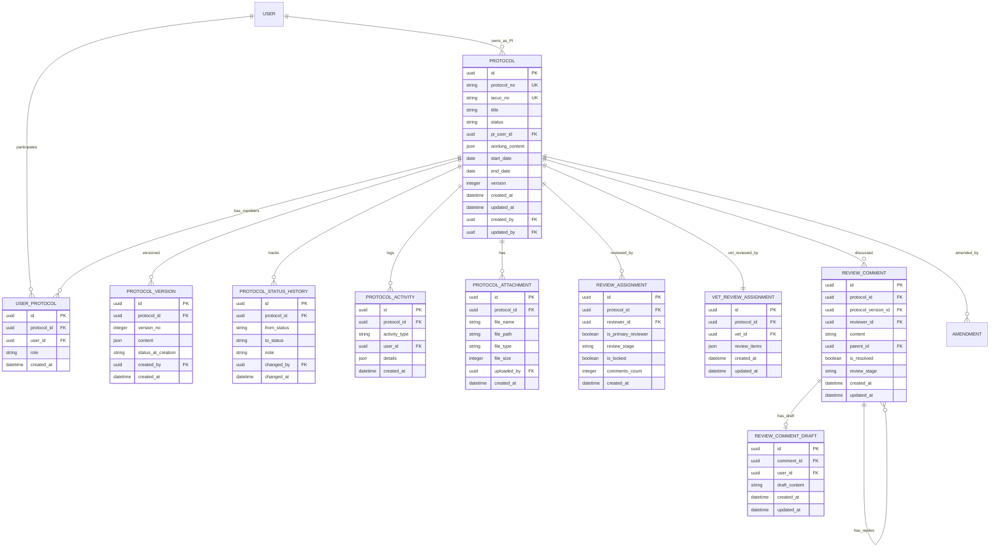
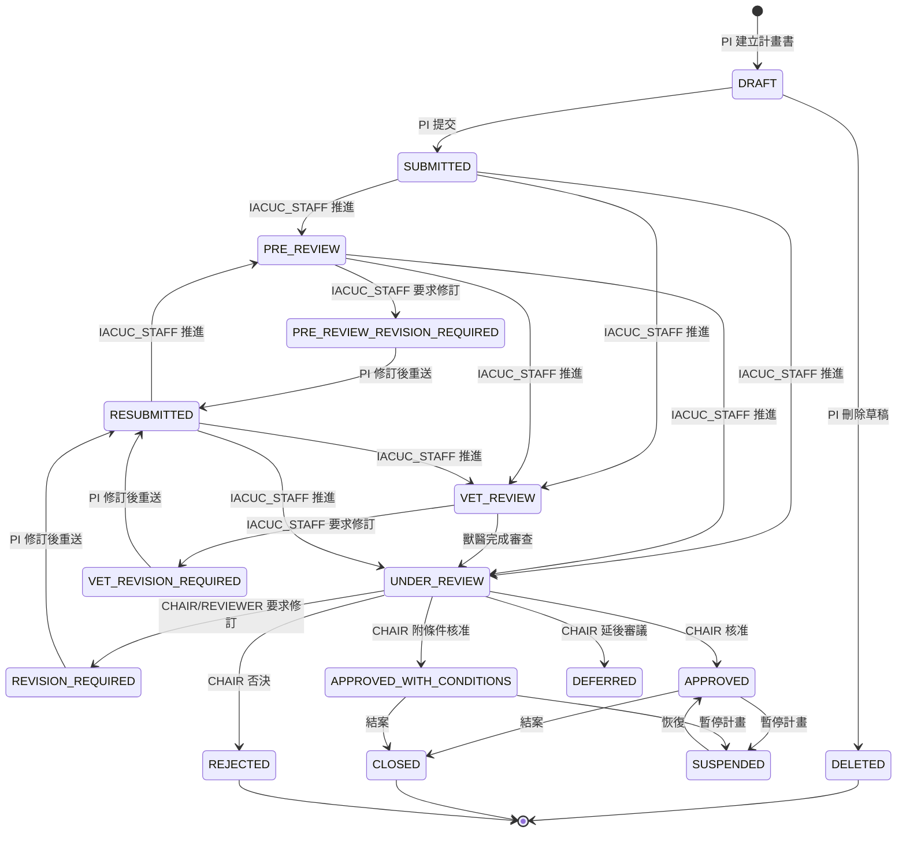

# 計畫書審查模組 — 軟體需求規格書

> **文件編號**：iPig-SRS-2026-02  
> **版本**：1.1  
> **日期**：2026-03-16  
> **所屬**：iPig 豬博士動物科技系統 — 通用軟體需求規格書

---

## 1. 模組概述

計畫書審查模組（AUP Protocol Review）負責管理 IACUC 動物使用計畫書（Animal Use Protocol, AUP）的完整生命週期，包括草稿撰寫、提交審查、多層審查流程、修訂回覆、核准/否決、暫停、結案，以及 PDF 匯出與手寫電子簽章。此模組為系統的核心業務流程之一，所有實驗動物的管理與操作皆須基於已核准的計畫書方可執行。

AUP 計畫書表單包含 9 大章節（研究資料、研究目的與 3Rs、試驗物質與對照組、研究設計與方法、參考文獻、手術計畫書、動物資訊、人員名單與職責、流程圖與附件），以 JSON 結構儲存於系統中，支援草稿儲存、版本快照與差異比對。審查流程設計為多層機制（行政預審 → 獸醫審查 → 委員會審查），支援多輪修訂往返，並實現審查委員匿名化，確保審查獨立性。

**與其他模組的關係**：

- 依賴 **01 使用者與角色模組**提供認證、授權與角色判定
- 與 **03 變更申請模組**直接關聯——已核准的計畫書透過變更申請流程修改
- 與 **04 動物管理模組**雙向關聯——動物須分配至已核准的計畫書、計畫書統計動物使用數量
- 依賴 **08 GLP 合規模組**之手寫電子簽章機制——主席核准計畫書時可使用手寫簽章
- **09 通知與稽核模組**訂閱本模組之狀態變更事件，自動發送通知與記錄活動日誌

**模組邊界**：

- **包含**：計畫書 CRUD、多層審查流程與狀態機、審查意見與巢狀回覆、審查委員指派、獸醫審查表單、共同編輯者管理、版本控制與差異比對、計畫書附件管理、PDF 匯出、手寫電子簽章核准、計畫編號與 IACUC 編號自動產生、計畫書表單驗證
- **不包含**：計畫書核准後之變更申請流程（屬 03 變更申請模組）、動物分配至計畫書之操作（屬 04 動物管理模組）、電子簽章底層機制（屬 08 GLP 合規模組）、通知與稽核日誌記錄（屬 09 通知與稽核模組）

---

## 2. 角色與權限

本模組涉及的角色引用自 [00_Index.md](./00_Index.md) 第 6 節之系統角色定義。

### 2.1 模組涉及角色與權限

| 角色 | 權限代碼 | 允許操作 |
|------|----------|----------|
| PI（計畫主持人） | aup.protocol.view_own, aup.protocol.create, aup.protocol.edit, aup.protocol.submit, aup.attachment.view, aup.attachment.download | 建立計畫書、編輯草稿、提交送審、回覆審查意見（正式送出）、管理附件、刪除自身草稿 |
| CLIENT（委託人） | aup.protocol.view_own, aup.attachment.view | 查看與自身組織相關之計畫書（唯讀）、查看附件 |
| IACUC_STAFF（執行秘書） | aup.protocol.view_all, aup.protocol.change_status, aup.review.assign, aup.review.view, aup.attachment.view, aup.attachment.download, aup.version.view | 管理審查流程（推進狀態）、指派審查委員與獸醫、指派共同編輯者、查看所有計畫書 |
| IACUC_CHAIR（IACUC 主席） | aup.protocol.view_all, aup.protocol.review, aup.protocol.approve, aup.protocol.change_status, aup.review.assign, aup.review.comment, aup.review.view | 審查決策（核准/附條件核准/否決/延後審議）、新增審查意見、手寫簽章核准 |
| REVIEWER（審查委員） | aup.protocol.view_all, aup.protocol.review, aup.review.comment, aup.review.view | 審查計畫書、新增審查意見；僅可查看非草稿狀態且自身受指派之計畫 |
| VET（獸醫師） | aup.protocol.view_all, aup.protocol.review, aup.review.comment, aup.review.view | 獸醫審查、填寫獸醫審查表單、新增審查意見；僅可查看受指派之計畫 |
| EXPERIMENT_STAFF（試驗工作人員） | aup.protocol.view_own | 作為共同編輯者（Co-editor）參與計畫書編輯、儲存回覆草稿 |
| admin（系統管理員） | 全部 AUP 權限 | 全部操作 |

### 2.2 特殊權限規則

- **PI 編輯限制**：PI 僅可編輯處於可編輯狀態（DRAFT、REVISION_REQUIRED、PRE_REVIEW_REVISION_REQUIRED、VET_REVISION_REQUIRED）之計畫書
- **共同編輯者角色限制**：共同編輯者（Co-editor）須具備 `EXPERIMENT_STAFF` 角色
- **審查委員可見範圍**：REVIEWER 與 VET 僅可查看自身受指派之計畫書（排除 DRAFT 與 REVISION_REQUIRED 狀態），不可查看所有計畫書
- **CLIENT 可見範圍**：CLIENT 可查看與自身所屬組織（`organization` 欄位相同）相關之所有計畫書
- **草稿回覆權限**：共同編輯者可儲存回覆草稿，但僅 PI 可正式送出回覆；草稿內容對審查委員不可見
- **審查委員匿名化**：PI 端介面中，審查委員身分以「委員 A」、「委員 B」等代稱顯示，確保審查獨立性

---

## 3. 功能需求

| 需求編號 | 名稱 | 描述 | 優先等級 | 驗收條件 |
|----------|------|------|----------|----------|
| FR-AUP-001 | 建立計畫書 | 具備建立權限之使用者可建立新計畫書，系統自動產生計畫編號並設定狀態為 DRAFT | P0 | 建立成功後產生格式為 `Pre-{民國年}-{三位數序號}` 之唯一編號；狀態為 DRAFT |
| FR-AUP-002 | 編輯計畫書草稿 | PI 或共同編輯者可編輯處於可編輯狀態之計畫書，更新各章節表單內容 | P0 | 僅 DRAFT、REVISION_REQUIRED、PRE_REVIEW_REVISION_REQUIRED、VET_REVISION_REQUIRED 狀態允許編輯；編輯後內容正確儲存 |
| FR-AUP-003 | 提交計畫書送審 | PI 或共同編輯者可將計畫書提交至 IACUC 審查，系統執行表單驗證 | P0 | 提交前須通過所有必填欄位與業務邏輯驗證；提交後狀態變更為 SUBMITTED；系統自動產生版本快照 |
| FR-AUP-004 | 計畫書表單驗證 | 系統應於提交時驗證所有必填欄位完整性、格式正確性、跨章節一致性及業務邏輯 | P0 | 必填欄位空白時顯示錯誤；Email/電話格式不符時提示；跨章節數值不一致時警告 |
| FR-AUP-005 | 刪除計畫書草稿 | PI 可刪除自身處於 DRAFT 狀態之計畫書，以軟刪除方式實作 | P1 | 刪除後狀態變更為 DELETED；列表查詢不顯示已刪除之計畫書 |
| FR-AUP-006 | 查看計畫書列表 | 依使用者角色顯示可存取之計畫書列表，支援狀態篩選、關鍵字搜尋、欄位排序與分頁 | P0 | 列表不含 DELETED 狀態；PI/CLIENT 僅見自身相關計畫；REVIEWER/VET 僅見受指派計畫；IACUC_STAFF/IACUC_CHAIR/admin 可見全部 |
| FR-AUP-007 | 查看計畫書詳情 | 使用者可查看計畫書之完整表單內容、審查狀態、版本歷程、活動日誌與附件 | P0 | 詳情頁面以分頁（Tab）呈現：申請表內容、版本歷程、活動紀錄、審查意見、審查委員、共同編輯者、附件、動物統計、變更申請 |
| FR-AUP-008 | 指派審查委員 | IACUC_STAFF 或 IACUC_CHAIR 可為計畫書指派 2–3 位正式審查委員 | P0 | 指派成功後建立審查指派紀錄；進入 UNDER_REVIEW 狀態須已指派 2–3 位委員 |
| FR-AUP-009 | 指派獸醫審查員 | IACUC_STAFF 可為計畫書指派獸醫審查員，每計畫書限一位 | P0 | 若未指定特定獸醫，系統依預設獸醫設定自動指派；指派之使用者須具備 VET 角色 |
| FR-AUP-010 | 新增審查意見 | 審查委員、獸醫或 IACUC_CHAIR 可對計畫書新增審查意見 | P0 | 審查意見須關聯至特定版本；意見內容長度上限 10,000 字元；僅允許於特定審查階段新增 |
| FR-AUP-011 | 回覆審查意見 | PI 可逐條回覆審查意見，支援巢狀回覆 | P0 | PI 可正式送出回覆；共同編輯者可儲存草稿但不可正式送出；回覆後記錄活動日誌 |
| FR-AUP-012 | 解決審查意見 | 審查委員或 IACUC_STAFF 可將已回覆之審查意見標記為「已解決」 | P1 | 標記後意見狀態更新為已解決 |
| FR-AUP-013 | 審查意見草稿 | PI 與共同編輯者可儲存審查意見回覆之草稿，草稿對審查委員不可見 | P1 | 草稿可多次儲存覆蓋；僅 PI 可將草稿轉為正式回覆 |
| FR-AUP-014 | 變更計畫書狀態 | IACUC_STAFF 或 IACUC_CHAIR 可變更計畫書狀態，推進審查流程 | P0 | 狀態轉換須符合狀態機規則；部分轉換有前置條件（如核准前須所有正式審查委員皆已發表意見） |
| FR-AUP-015 | 重送計畫書 | PI 完成修訂後可重新提交計畫書，狀態由修訂狀態轉為 RESUBMITTED | P0 | 重送時產生新版本快照；系統執行表單驗證 |
| FR-AUP-016 | 核准計畫書 | IACUC_CHAIR 可核准計畫書（含附條件核准），系統自動產生正式 IACUC 編號 | P0 | 核准後狀態變更為 APPROVED 或 APPROVED_WITH_CONDITIONS；系統將 APIG 編號替換為 PIG 編號；自動建立對應客戶紀錄 |
| FR-AUP-017 | 否決計畫書 | IACUC_CHAIR 可否決計畫書 | P0 | 否決後狀態變更為 REJECTED |
| FR-AUP-018 | 暫停計畫書 | 已核准之計畫書可被暫停 | P1 | 暫停後狀態變更為 SUSPENDED；計畫書下之動物操作受限 |
| FR-AUP-019 | 結案計畫書 | 已核准之計畫書可結案 | P1 | 結案後狀態變更為 CLOSED；系統自動停用對應之客戶紀錄 |
| FR-AUP-020 | 版本管理 | 系統應於每次提交、重送時自動建立不可變之版本快照 | P0 | 版本號自 1 遞增；版本內容為提交瞬間之 JSON 完整快照；歷史版本不可修改 |
| FR-AUP-021 | 版本比較 | 使用者可比較計畫書之任意兩個版本間的差異 | P1 | 差異以視覺化方式呈現新增、修改、刪除之內容 |
| FR-AUP-022 | 版本恢復 | 使用者可恢復至特定歷史版本之內容，恢復操作視為一次新的編輯 | P2 | 恢復後計畫書內容更新為所選版本之內容；產生活動日誌記錄 |
| FR-AUP-023 | 活動日誌 | 系統應自動記錄計畫書的所有操作活動 | P0 | 紀錄類型涵蓋：建立、更新、提交、重送、核准、否決、暫停、結案、刪除、狀態變更、審查指派、意見新增/回覆/解決、附件操作、版本建立/恢復、共同編輯者操作、動物分配/解除 |
| FR-AUP-024 | 狀態歷程 | 系統應記錄計畫書之每次狀態轉換，含操作者、時間與備註 | P0 | 狀態歷程可於計畫書詳情頁查閱 |
| FR-AUP-025 | 指派共同編輯者 | IACUC_STAFF 可為計畫書指派共同編輯者 | P1 | 共同編輯者須為 EXPERIMENT_STAFF 角色；進入 PRE_REVIEW 狀態前須至少指派 1 位共同編輯者 |
| FR-AUP-026 | 管理計畫書附件 | PI 或共同編輯者可上傳、查看與刪除計畫書附件 | P1 | 附件格式限 PDF；單檔大小上限 20 MB；每計畫書最多 10 個附件；僅上傳者或管理員可刪除 |
| FR-AUP-027 | 獸醫審查表單 | 獸醫審查員可填寫結構化審查查檢表 | P0 | 查檢表含 12 項標準審查項目；每項以 V（符合）/X（不符合）/—（不適用）標記；可附加意見說明 |
| FR-AUP-028 | 計畫書 PDF 匯出 | 使用者可將計畫書完整內容匯出為 PDF 文件 | P1 | PDF 涵蓋 9 大章節完整內容；分頁避免跨章節斷裂；檔名格式：`{計畫名稱}_{日期}.pdf` |
| FR-AUP-029 | 審查意見回覆表 PDF 匯出 | 使用者可將審查意見與回覆匯出為 PDF 文件 | P1 | PDF 按審查階段分區呈現（初審、獸醫審查、委員審查）；檔名格式：`審查意見回覆表_{計畫編號}.pdf` |
| FR-AUP-030 | 手寫電子簽章核准 | IACUC_CHAIR 可透過手寫簽名方式核准計畫書 | P1 | 支援手寫簽名輸入與簽名圖片上傳兩種方式；簽章紀錄包含簽章方式、時間、簽署者身分 |
| FR-AUP-031 | 計畫書搜尋 | 列表頁面應支援即時搜尋，含防抖動機制 | P1 | 搜尋輸入延遲 400 毫秒後觸發查詢；支援依計畫編號、名稱、PI 姓名等欄位搜尋 |
| FR-AUP-032 | 我的計畫 | 外部使用者（PI、CLIENT）可透過「我的計畫」入口查看與自身相關之計畫書 | P0 | PI 可查看自身為主持人之計畫；CLIENT 可查看同組織之計畫 |
| FR-AUP-033 | 延後審議 | IACUC_CHAIR 可將計畫書標記為延後審議 | P1 | 延後審議後狀態變更為 DEFERRED |
| FR-AUP-034 | 計畫書動物統計 | 系統應提供計畫書下之動物使用數量統計 | P2 | 統計包含計畫書下各狀態之動物數量 |
| FR-AUP-035 | 簽名圖片上傳 | 計畫書表單之簽名區域支援簽名圖片上傳 | P1 | 支援格式：PNG、JPG、GIF、BMP；單檔上限 5 MB；最多 5 個檔案 |
| FR-AUP-036 | 未儲存變更警示 | 計畫書編輯頁面離開時，若有未儲存之變更應提示使用者 | P1 | 瀏覽器離開或路由切換時彈出確認對話框 |

---

## 4. 使用案例

### UC-AUP-01：PI 建立並提交計畫書

**前置條件**：PI 已登入系統，具備 `aup.protocol.create` 與 `aup.protocol.submit` 權限。

**主要流程**：

1. PI 進入計畫書管理頁面，點擊「新增計畫書」。
2. 系統建立空白計畫書，自動產生計畫編號（格式：`Pre-{民國年}-{三位數序號}`），狀態設為 DRAFT。
3. PI 逐一填寫 9 大章節：研究資料、研究目的與 3Rs、試驗物質與對照組、研究設計與方法、參考文獻、手術計畫書（如適用）、動物資訊、人員名單與職責、流程圖與附件。
4. PI 可於任何時間點手動儲存草稿。
5. PI 填寫完成後點擊「提交」。
6. 系統執行表單驗證（必填欄位、格式、跨章節一致性、業務邏輯）。
7. 驗證通過，系統建立版本快照（版本 1），狀態變更為 SUBMITTED。
8. 系統產生 APIG 編號（格式：`APIG-{民國年}{三位數序號}`）。
9. 系統發送通知予 IACUC_STAFF。

**替代流程 A — 表單驗證失敗**：

1. 系統標示驗證錯誤之欄位並顯示錯誤訊息。
2. PI 修正後重新提交。

**後置條件**：計畫書進入審查流程，IACUC_STAFF 收到待處理通知。

**例外處理**：

- 計畫書尚無 APIG 編號時，系統於提交時自動產生。

---

### UC-AUP-02：IACUC 多層審查流程

**前置條件**：計畫書狀態為 SUBMITTED，IACUC_STAFF 已登入系統。

**主要流程**：

1. IACUC_STAFF 查看待審計畫書列表，開啟目標計畫書詳情。
2. IACUC_STAFF 指派至少 1 位共同編輯者（須為 EXPERIMENT_STAFF）。
3. IACUC_STAFF 將狀態推進至 PRE_REVIEW（行政預審）。
4. IACUC_STAFF 進行預審，可新增預審意見或要求預審修訂。
5. IACUC_STAFF 指派獸醫審查員，將狀態推進至 VET_REVIEW。
6. 獸醫審查員填寫獸醫審查查檢表（12 項 V/X/— 標記），可新增審查意見。
7. 獸醫完成審查後，IACUC_STAFF 指派 2–3 位正式審查委員，將狀態推進至 UNDER_REVIEW。
8. 審查委員各自審閱計畫書並新增審查意見。
9. IACUC_CHAIR 審閱所有意見，作出決策：
   - 核准（APPROVED）
   - 附條件核准（APPROVED_WITH_CONDITIONS）
   - 要求修訂（REVISION_REQUIRED）
   - 否決（REJECTED）
   - 延後審議（DEFERRED）

**替代流程 A — 預審階段要求修訂**：

1. IACUC_STAFF 將狀態設為 PRE_REVIEW_REVISION_REQUIRED。
2. PI 修訂後重送（RESUBMITTED）。
3. 回到主要流程步驟 3 或 5（視修訂範圍而定）。

**替代流程 B — 獸醫審查階段要求修訂**：

1. IACUC_STAFF 將狀態設為 VET_REVISION_REQUIRED。
2. PI 修訂後重送（RESUBMITTED）。
3. 回到主要流程步驟 5。

**替代流程 C — 委員審查後要求修訂（多輪往返）**：

1. 狀態設為 REVISION_REQUIRED。
2. PI 逐條回覆意見並修訂內容，重送計畫書。
3. 計畫書進入 RESUBMITTED 狀態，可由 IACUC_STAFF 推進至 PRE_REVIEW 或 UNDER_REVIEW。
4. 審查委員再次審閱，可反覆要求修訂。

**後置條件**：計畫書進入最終決議狀態（APPROVED / REJECTED / DEFERRED）。

**例外處理**：

- 核准前，系統檢查所有正式審查委員（`is_primary_reviewer = true`）皆已發表過意見，若有委員尚未發表則無法核准。

---

### UC-AUP-03：PI 回覆審查意見

**前置條件**：計畫書狀態為 REVISION_REQUIRED（或 PRE_REVIEW_REVISION_REQUIRED / VET_REVISION_REQUIRED），PI 已登入系統。

**主要流程**：

1. PI 進入計畫書詳情頁之「審查意見」分頁。
2. PI 逐條查閱審查意見。
3. PI 針對各意見撰寫回覆內容。
4. PI 可先儲存為草稿，草稿對審查委員不可見。
5. PI 修訂計畫書內容。
6. PI 點擊「重送」，系統執行表單驗證。
7. 驗證通過，系統建立新版本快照，狀態變更為 RESUBMITTED。

**替代流程 A — 共同編輯者協助回覆**：

1. 共同編輯者登入後查閱審查意見。
2. 共同編輯者撰寫回覆草稿並儲存。
3. PI 審閱草稿並正式送出。

**後置條件**：計畫書回到審查流程。

**例外處理**：

- 表單驗證失敗：系統標示錯誤欄位，PI 修正後重新提交。

---

### UC-AUP-04：匯出計畫書 PDF

**前置條件**：使用者已登入且有權查看該計畫書。

**主要流程**：

1. 使用者進入計畫書詳情頁。
2. 使用者點擊「匯出 PDF」按鈕。
3. 系統以伺服器端渲染產生 PDF 文件。
4. 瀏覽器開始下載 PDF 檔案。

**替代流程 A — 伺服器端匯出失敗**：

1. 系統改以前端渲染方式產生 PDF（擷取頁面截圖後拼接）。
2. PDF 按章節分頁，頁尾顯示頁碼。

**後置條件**：使用者取得 PDF 文件。

**例外處理**：無。

---

### UC-AUP-05：IACUC_CHAIR 手寫簽章核准

**前置條件**：計畫書狀態為 UNDER_REVIEW，所有正式審查委員皆已發表意見，IACUC_CHAIR 已登入系統。

**主要流程**：

1. IACUC_CHAIR 進入計畫書詳情頁。
2. IACUC_CHAIR 選擇核准方式為「手寫簽章」。
3. 系統開啟簽章介面，IACUC_CHAIR 以觸控或滑鼠手寫簽名。
4. IACUC_CHAIR 確認簽名，系統記錄簽章 SVG 與筆跡座標。
5. 系統將計畫書狀態變更為 APPROVED，產生正式 IACUC 編號。

**替代流程 A — 上傳簽名圖片**：

1. IACUC_CHAIR 選擇上傳已有之簽名圖片。
2. 系統驗證圖片格式與大小。
3. 後續同主要流程步驟 4–5。

**後置條件**：計畫書核准，具有不可否認之電子簽章紀錄。

**例外處理**：無。

---

## 5. 資料模型

### 5.1 邏輯 ERD

### 5.2 實體屬性表

#### PROTOCOL（計畫書）

| 屬性 | 類型說明 | 必填 | 約束條件 |
|------|----------|------|----------|
| id | UUID | 是 | 主鍵，系統自動產生 |
| protocol_no | 文字（最長 50 字元） | 是 | 唯一；格式 `Pre-{民國年}-{三位數序號}` |
| iacuc_no | 文字（最長 50 字元） | 否 | 唯一；提交時產生 APIG 編號，核准時替換為 PIG 編號 |
| title | 文字（最長 500 字元） | 是 | 計畫名稱；長度 1–500 字元 |
| status | 列舉（protocol_status） | 是 | 目前狀態；詳見列舉值定義 |
| pi_user_id | UUID | 是 | 外鍵，參照 USER；計畫主持人 |
| working_content | JSON 物件 | 否 | 計畫書表單內容，含 Section 1–8 之 JSON 結構 |
| start_date | 日期 | 否 | 計畫起始日 |
| end_date | 日期 | 否 | 計畫結束日 |
| version | 整數 | 是 | 樂觀鎖定版本號 |
| created_at | 日期時間 | 是 | 建立時間 |
| updated_at | 日期時間 | 是 | 最後更新時間 |
| created_by | UUID | 是 | 外鍵，參照 USER |
| updated_by | UUID | 否 | 外鍵，參照 USER |

#### PROTOCOL_VERSION（計畫書版本）

| 屬性 | 類型說明 | 必填 | 約束條件 |
|------|----------|------|----------|
| id | UUID | 是 | 主鍵 |
| protocol_id | UUID | 是 | 外鍵，參照 PROTOCOL |
| version_no | 整數 | 是 | 版本號，自 1 遞增 |
| content | JSON 物件 | 是 | 版本快照，提交瞬間之完整 JSON |
| status_at_creation | 文字 | 否 | 建立版本時之計畫書狀態 |
| created_by | UUID | 是 | 外鍵，參照 USER |
| created_at | 日期時間 | 是 | 建立時間 |

#### USER_PROTOCOL（計畫書成員）

| 屬性 | 類型說明 | 必填 | 約束條件 |
|------|----------|------|----------|
| id | UUID | 是 | 主鍵 |
| protocol_id | UUID | 是 | 外鍵，參照 PROTOCOL |
| user_id | UUID | 是 | 外鍵，參照 USER |
| role | 列舉（protocol_role） | 是 | 成員角色 |
| created_at | 日期時間 | 是 | 加入時間 |

約束：`(protocol_id, user_id)` 組合唯一。

#### PROTOCOL_STATUS_HISTORY（狀態歷程）

| 屬性 | 類型說明 | 必填 | 約束條件 |
|------|----------|------|----------|
| id | UUID | 是 | 主鍵 |
| protocol_id | UUID | 是 | 外鍵，參照 PROTOCOL |
| from_status | 列舉（protocol_status） | 否 | 原始狀態 |
| to_status | 列舉（protocol_status） | 是 | 目標狀態 |
| note | 文字 | 否 | 操作備註 |
| changed_by | UUID | 是 | 外鍵，參照 USER |
| changed_at | 日期時間 | 是 | 變更時間 |

#### PROTOCOL_ACTIVITY（活動日誌）

| 屬性 | 類型說明 | 必填 | 約束條件 |
|------|----------|------|----------|
| id | UUID | 是 | 主鍵 |
| protocol_id | UUID | 是 | 外鍵，參照 PROTOCOL |
| activity_type | 列舉（protocol_activity_type） | 是 | 活動類型 |
| user_id | UUID | 是 | 外鍵，參照 USER |
| details | JSON 物件 | 否 | 活動詳細資訊（如回覆內容摘要，超過 50 字截斷） |
| created_at | 日期時間 | 是 | 活動時間 |

#### PROTOCOL_ATTACHMENT（計畫書附件）

| 屬性 | 類型說明 | 必填 | 約束條件 |
|------|----------|------|----------|
| id | UUID | 是 | 主鍵 |
| protocol_id | UUID | 是 | 外鍵，參照 PROTOCOL |
| file_name | 文字 | 是 | 原始檔名 |
| file_path | 文字 | 是 | 儲存路徑 |
| file_type | 文字 | 是 | 檔案 MIME 類型 |
| file_size | 整數 | 是 | 檔案大小（位元組） |
| uploaded_by | UUID | 是 | 外鍵，參照 USER |
| created_at | 日期時間 | 是 | 上傳時間 |

#### REVIEW_ASSIGNMENT（審查指派）

| 屬性 | 類型說明 | 必填 | 約束條件 |
|------|----------|------|----------|
| id | UUID | 是 | 主鍵 |
| protocol_id | UUID | 是 | 外鍵，參照 PROTOCOL |
| reviewer_id | UUID | 是 | 外鍵，參照 USER |
| is_primary_reviewer | 布林 | 是 | 是否為正式審查委員 |
| review_stage | 文字 | 是 | 審查階段 |
| is_locked | 布林 | 是 | 是否鎖定 |
| comments_count | 整數 | 是 | 預設 0；已發表意見數 |
| created_at | 日期時間 | 是 | 指派時間 |

約束：`(protocol_id, reviewer_id)` 組合唯一。

#### VET_REVIEW_ASSIGNMENT（獸醫審查指派）

| 屬性 | 類型說明 | 必填 | 約束條件 |
|------|----------|------|----------|
| id | UUID | 是 | 主鍵 |
| protocol_id | UUID | 是 | 外鍵，參照 PROTOCOL；唯一 |
| vet_id | UUID | 是 | 外鍵，參照 USER；須為 VET 角色 |
| review_items | JSON 物件 | 否 | 審查查檢表內容（12 項，每項含 compliance 與 comment） |
| created_at | 日期時間 | 是 | 建立時間 |
| updated_at | 日期時間 | 是 | 最後更新時間 |

約束：每計畫書限一筆獸醫指派（`protocol_id` 唯一）。

#### REVIEW_COMMENT（審查意見）

| 屬性 | 類型說明 | 必填 | 約束條件 |
|------|----------|------|----------|
| id | UUID | 是 | 主鍵 |
| protocol_id | UUID | 否 | 外鍵，參照 PROTOCOL |
| protocol_version_id | UUID | 否 | 外鍵，參照 PROTOCOL_VERSION |
| reviewer_id | UUID | 是 | 外鍵，參照 USER |
| content | 文字（最長 10,000 字元） | 是 | 意見內容 |
| parent_id | UUID | 否 | 外鍵，自參照；支援巢狀回覆 |
| is_resolved | 布林 | 是 | 預設 `false`；是否已解決 |
| review_stage | 文字 | 是 | 審查階段 |
| created_at | 日期時間 | 是 | 建立時間 |
| updated_at | 日期時間 | 是 | 最後更新時間 |

約束：`protocol_version_id` 與 `protocol_id` 至少一個不為空。

約束：`review_stage` 僅允許值為 `PRE_REVIEW`、`PRE_REVIEW_REVISION_REQUIRED`、`VET_REVIEW`、`VET_REVISION_REQUIRED`、`UNDER_REVIEW`。

#### REVIEW_COMMENT_DRAFT（審查意見草稿）

| 屬性 | 類型說明 | 必填 | 約束條件 |
|------|----------|------|----------|
| id | UUID | 是 | 主鍵 |
| comment_id | UUID | 是 | 外鍵，參照 REVIEW_COMMENT |
| user_id | UUID | 是 | 外鍵，參照 USER |
| draft_content | 文字 | 是 | 草稿內容 |
| created_at | 日期時間 | 是 | 建立時間 |
| updated_at | 日期時間 | 是 | 最後更新時間 |

### 5.3 列舉值定義

#### 計畫書狀態（protocol_status）

| 值 | 名稱 | 說明 |
|----|------|------|
| DRAFT | 草稿 | 初始狀態，PI 編輯中 |
| SUBMITTED | 已提交 | PI 已提交送審 |
| PRE_REVIEW | 行政預審 | IACUC_STAFF 進行行政預審 |
| PRE_REVIEW_REVISION_REQUIRED | 預審退修 | 預審階段要求 PI 修訂 |
| VET_REVIEW | 獸醫審查 | 獸醫審查員進行審查 |
| VET_REVISION_REQUIRED | 獸審退修 | 獸醫審查階段要求 PI 修訂 |
| UNDER_REVIEW | 審查中 | 委員會審查進行中 |
| REVISION_REQUIRED | 需修訂 | 委員會要求 PI 修訂 |
| RESUBMITTED | 已重送 | PI 修訂後重新提交 |
| APPROVED | 核准 | 計畫書已核准 |
| APPROVED_WITH_CONDITIONS | 附條件核准 | 計畫書附條件核准 |
| DEFERRED | 延後審議 | 延後至下次委員會審議 |
| REJECTED | 否決 | 計畫書遭否決 |
| SUSPENDED | 暫停 | 已核准之計畫書暫停執行 |
| CLOSED | 結案 | 計畫書結案 |
| DELETED | 已刪除 | 軟刪除，前端不顯示 |

#### 計畫書活動類型（protocol_activity_type）

| 值 | 名稱 | 說明 |
|----|------|------|
| CREATED | 建立 | 計畫書建立 |
| UPDATED | 更新 | 計畫書內容更新 |
| SUBMITTED | 提交 | 首次提交送審 |
| RESUBMITTED | 重送 | 修訂後重新提交 |
| APPROVED | 核准 | 計畫書核准 |
| APPROVED_WITH_CONDITIONS | 附條件核准 | 附條件核准 |
| CLOSED | 結案 | 計畫書結案 |
| REJECTED | 否決 | 計畫書否決 |
| SUSPENDED | 暫停 | 計畫書暫停 |
| DELETED | 刪除 | 軟刪除 |
| STATUS_CHANGED | 狀態變更 | 一般狀態變更 |
| REVIEWER_ASSIGNED | 審查委員指派 | 指派審查委員 |
| VET_ASSIGNED | 獸醫指派 | 指派獸醫審查員 |
| COEDITOR_ASSIGNED | 共同編輯者加入 | 指派共同編輯者 |
| COEDITOR_REMOVED | 共同編輯者移除 | 移除共同編輯者 |
| COMMENT_ADDED | 意見新增 | 審查意見新增 |
| COMMENT_REPLIED | 意見回覆 | 審查意見回覆 |
| COMMENT_RESOLVED | 意見解決 | 審查意見標記為已解決 |
| ATTACHMENT_UPLOADED | 附件上傳 | 上傳計畫書附件 |
| ATTACHMENT_DELETED | 附件刪除 | 刪除計畫書附件 |
| VERSION_CREATED | 版本建立 | 產生版本快照 |
| VERSION_RECOVERED | 版本恢復 | 恢復至歷史版本 |
| AMENDMENT_CREATED | 變更申請建立 | 建立變更申請 |
| AMENDMENT_SUBMITTED | 變更申請提交 | 提交變更申請 |
| ANIMAL_ASSIGNED | 動物分配 | 動物分配至計畫 |
| ANIMAL_UNASSIGNED | 動物解除 | 動物從計畫解除分配 |

#### 計畫書成員角色（protocol_role）

| 值 | 名稱 | 說明 |
|----|------|------|
| PI | 計畫主持人 | 計畫書之主持人 |
| CLIENT | 委託人 | 委託單位聯繫人 |
| CO_EDITOR | 共同編輯者 | 可編輯計畫書之試驗工作人員 |

#### 獸醫審查項目合規標記

| 值 | 名稱 | 說明 |
|----|------|------|
| V | 符合 | 該項目符合要求 |
| X | 不符合 | 該項目不符合要求 |
| — | 不適用 | 該項目不適用於本計畫 |

#### 附件類型

| 值 | 名稱 | 說明 |
|----|------|------|
| reference_paper | 參考文獻 | 與計畫相關之參考文獻檔案 |
| hazard_certificate | 危害性物質證書 | 使用危害性物質之相關證書 |
| other | 其他 | 其他類型之附件 |

---

## 6. 業務規則

| 規則編號 | 規則名稱 | 規則描述 |
|----------|----------|----------|
| BR-AUP-01 | 計畫編號格式 | 計畫編號格式為 `Pre-{民國年}-{三位數序號}`（例：Pre-115-001）；民國年 = 西元年 − 1911；序號按年度遞增 |
| BR-AUP-02 | APIG 編號格式 | 計畫書首次提交時自動產生 APIG 編號，格式為 `APIG-{民國年}{三位數序號}`（例：APIG-115001）；序號上限 999 |
| BR-AUP-03 | PIG 編號格式 | 計畫書核准時，系統將 APIG 編號替換為 PIG 編號，格式為 `PIG-{民國年}{三位數序號}`；PIG 與 APIG 共用年度流水號空間，避免編號衝突 |
| BR-AUP-04 | 標題長度限制 | 計畫書標題長度須介於 1–500 字元 |
| BR-AUP-05 | 可編輯狀態 | 計畫書僅於以下狀態允許編輯內容：DRAFT、REVISION_REQUIRED、PRE_REVIEW_REVISION_REQUIRED、VET_REVISION_REQUIRED |
| BR-AUP-06 | 提交允許狀態 | 計畫書僅於以下狀態允許提交或重送：DRAFT、REVISION_REQUIRED、PRE_REVIEW_REVISION_REQUIRED、VET_REVISION_REQUIRED |
| BR-AUP-07 | 刪除允許狀態 | 計畫書僅於 DRAFT 狀態允許軟刪除；REVISION_REQUIRED 狀態不允許刪除（PRE_REVIEW_REVISION_REQUIRED 與 VET_REVISION_REQUIRED 亦不允許） |
| BR-AUP-08 | 提交時表單驗證 | 提交時須驗證：(1) 研究標題必填；(2) GLP 計畫須填寫預定申請註冊之權責機關；(3) 計畫類型必填；(4) 各章節業務邏輯驗證（詳見下列驗證規則） |
| BR-AUP-09 | 正式審查委員數量 | 進入 UNDER_REVIEW 狀態須已指派 2–3 位正式審查委員（`is_primary_reviewer = true`） |
| BR-AUP-10 | 核准前意見門檻 | 核准或附條件核准前，所有正式審查委員（`is_primary_reviewer = true`）皆須已發表過至少一條審查意見 |
| BR-AUP-11 | 獸醫指派唯一性 | 每計畫書僅可指派一位獸醫審查員；若已有指派則覆蓋更新 |
| BR-AUP-12 | 獸醫角色檢查 | 獸醫審查員須具備 VET 角色；若未指定特定獸醫，系統依系統設定之預設獸醫自動指派，或預設為第一位 VET 角色使用者 |
| BR-AUP-13 | 共同編輯者角色限制 | 共同編輯者須具備 EXPERIMENT_STAFF 角色 |
| BR-AUP-14 | 預審前置條件 | 從 SUBMITTED 進入 PRE_REVIEW 狀態前，須至少指派 1 位共同編輯者 |
| BR-AUP-15 | 審查意見長度上限 | 審查意見（含回覆）之內容長度上限 10,000 字元 |
| BR-AUP-16 | 審查意見階段限制 | 審查意見僅允許於以下狀態新增：PRE_REVIEW、PRE_REVIEW_REVISION_REQUIRED、VET_REVIEW、VET_REVISION_REQUIRED、UNDER_REVIEW |
| BR-AUP-17 | 草稿回覆權限 | 共同編輯者可儲存回覆草稿，但僅 PI 可將草稿轉為正式回覆 |
| BR-AUP-18 | 活動日誌摘要截斷 | 活動日誌中回覆內容超過 50 字時，截斷為前 47 字加「...」 |
| BR-AUP-19 | 版本號遞增 | 版本號自 1 開始，每次提交或重送遞增 1；版本內容不可修改 |
| BR-AUP-20 | 核准自動建立客戶 | 計畫書核准時，系統依 IACUC 編號自動建立對應之客戶紀錄（Partner） |
| BR-AUP-21 | 結案自動停用客戶 | 計畫書結案時，系統自動將對應之客戶紀錄設為停用（`is_active = false`） |
| BR-AUP-22 | DELETED 狀態不顯示 | 列表查詢一律排除 DELETED 狀態之計畫書 |
| BR-AUP-23 | 自動補產生 APIG 編號 | 若計畫書於 SUBMITTED 或 PRE_REVIEW 狀態仍無 APIG 編號，系統於查詢時自動補產生 |
| BR-AUP-24 | 審查委員匿名化 | PI 端介面中，審查委員身分以固定 seed 之匿名對應顯示（如「委員 A」~「委員 Z」），匿名映射依計畫書 ID 產生 seed 確保一致性 |
| BR-AUP-25 | 附件格式限制 | 計畫書附件僅允許 PDF 格式；單檔大小上限 20 MB；每計畫書最多 10 個附件 |
| BR-AUP-26 | 簽名圖片限制 | 簽名區域圖片僅允許 PNG、JPG、JPEG、GIF、BMP 格式；單檔上限 5 MB；最多 5 個檔案 |
| BR-AUP-27 | Email 格式驗證 | PI、Sponsor、SD 之 Email 欄位須符合 Email 格式（`^[^\s@]+@[^\s@]+\.[^\s@]+$`） |
| BR-AUP-28 | 電話格式驗證 | PI 與 Sponsor 之電話欄位須為 9–10 碼數字（可含連字號） |
| BR-AUP-29 | 動物年齡範圍 | 動物最小年齡不得低於 3 週；最大年齡須大於最小年齡 |
| BR-AUP-30 | 動物體重範圍 | 動物最小體重不得低於 20 公斤；最大體重須大於最小體重 |
| BR-AUP-31 | 疼痛等級條件必填 | 疼痛等級為 D 或 E 時，須填寫疼痛處置策略；疼痛等級為 E 時，須提供不給止痛之科學理由 |
| BR-AUP-32 | 手術章節條件必填 | 若研究設計選擇存活性手術或非存活性手術，則手術計畫書（章節 6）所有必填欄位須完整填寫 |
| BR-AUP-33 | GLP 計畫權責機關 | 若計畫標記為 GLP 計畫（`is_glp = true`），則預定申請註冊之權責機關（`registration_authorities`）為必填 |
| BR-AUP-34 | 分組動物數量一致性 | 所有分組之動物數量加總須等於動物資訊章節之動物總數（系統提示但不阻擋） |
| BR-AUP-35 | 獸醫審查查檢表項目 | 獸醫審查查檢表包含 12 項標準審查項目，每項須標記合規狀態（V/X/—） |

---

## 7. 狀態機

### 7.1 計畫書狀態流轉圖

### 7.2 狀態說明表

| 狀態 | 說明 | 允許操作 | 可轉換至 |
|------|------|----------|----------|
| DRAFT | 草稿，PI 編輯中 | 編輯、提交、刪除 | SUBMITTED, DELETED |
| SUBMITTED | PI 已提交，等待行政處理 | 狀態推進 | PRE_REVIEW, VET_REVIEW, UNDER_REVIEW |
| PRE_REVIEW | 行政預審進行中 | 新增預審意見、要求修訂、推進 | PRE_REVIEW_REVISION_REQUIRED, VET_REVIEW, UNDER_REVIEW |
| PRE_REVIEW_REVISION_REQUIRED | 預審退修，等待 PI 修訂 | PI 編輯並重送 | RESUBMITTED |
| VET_REVIEW | 獸醫審查進行中 | 填寫查檢表、新增意見、要求修訂 | VET_REVISION_REQUIRED, UNDER_REVIEW |
| VET_REVISION_REQUIRED | 獸審退修，等待 PI 修訂 | PI 編輯並重送 | RESUBMITTED |
| UNDER_REVIEW | 委員會審查進行中 | 新增意見、要求修訂、核准、否決、延後 | REVISION_REQUIRED, APPROVED, APPROVED_WITH_CONDITIONS, REJECTED, DEFERRED |
| REVISION_REQUIRED | 需修訂，等待 PI 回覆 | PI 編輯、回覆意見、重送 | RESUBMITTED |
| RESUBMITTED | PI 修訂後重新提交 | 狀態推進 | PRE_REVIEW, VET_REVIEW, UNDER_REVIEW |
| APPROVED | 已核准 | 暫停、結案 | SUSPENDED, CLOSED |
| APPROVED_WITH_CONDITIONS | 附條件核准 | 暫停、結案 | SUSPENDED, CLOSED |
| DEFERRED | 延後審議 | 等待下次委員會 | — |
| REJECTED | 已否決 | 無（終端狀態） | — |
| SUSPENDED | 暫停執行 | 恢復 | APPROVED |
| CLOSED | 已結案 | 無（終端狀態） | — |
| DELETED | 已軟刪除 | 無（終端狀態） | — |

### 7.3 狀態轉換副作用

| 轉換 | 副作用 |
|------|--------|
| → SUBMITTED | 產生版本快照；產生 APIG 編號（若尚未有）；通知 IACUC_STAFF |
| → RESUBMITTED | 產生版本快照；通知審查相關人員 |
| → PRE_REVIEW | 前置條件：至少 1 位共同編輯者 |
| → UNDER_REVIEW | 前置條件：2–3 位正式審查委員已指派 |
| → APPROVED / APPROVED_WITH_CONDITIONS | 前置條件：所有正式審查委員已發表意見；產生 PIG 編號（替換 APIG）；自動建立 Partner（客戶）；通知 PI |
| → REJECTED | 通知 PI |
| → REVISION_REQUIRED | 通知 PI |
| → PRE_REVIEW_REVISION_REQUIRED | 通知 PI |
| → VET_REVISION_REQUIRED | 通知 PI |
| → CLOSED | 自動停用對應客戶紀錄 |
| → DELETED | 軟刪除，前端列表不顯示 |

---

## 8. 畫面清單

| 畫面名稱 | 用途說明 | 所需權限 | 備註 |
|----------|----------|----------|------|
| 計畫書列表頁 | 瀏覽所有可存取之計畫書，支援狀態篩選、搜尋、排序 | `aup.protocol.view_own` 或 `aup.protocol.view_all` | 路徑：`/protocols` |
| 新增計畫書頁 | 建立新計畫書並填寫表單 | `aup.protocol.create` | 路徑：`/protocols/new` |
| 計畫書詳情頁 | 查看計畫書完整資訊，包含多個分頁 | `aup.protocol.view_own` 或 `aup.protocol.view_all` | 路徑：`/protocols/:id` |
| 計畫書編輯頁 | 編輯計畫書各章節內容 | `aup.protocol.edit`（或 PI / Co-editor） | 路徑：`/protocols/:id/edit`；含未儲存變更警示 |
| 申請表內容分頁 | 顯示計畫書 9 大章節完整內容 | 同詳情頁 | 計畫書詳情頁之分頁 |
| 審查意見分頁 | 查看/新增/回覆審查意見 | `aup.review.view`、`aup.review.comment` | 計畫書詳情頁之分頁；支援 PDF 匯出 |
| 審查委員分頁 | 查看/指派審查委員與獸醫；獸醫審查表單 | `aup.review.assign`（指派）、VET（填寫表單） | 計畫書詳情頁之分頁 |
| 共同編輯者分頁 | 查看/指派共同編輯者 | `aup.review.assign` | 計畫書詳情頁之分頁 |
| 版本歷程分頁 | 查看計畫書所有版本與內容比較 | `aup.version.view` | 計畫書詳情頁之分頁 |
| 活動紀錄分頁 | 查看計畫書所有活動日誌 | 同詳情頁 | 計畫書詳情頁之分頁 |
| 附件管理分頁 | 上傳/下載/刪除計畫書附件 | `aup.attachment.view`、`aup.attachment.download` | 計畫書詳情頁之分頁 |
| 動物統計分頁 | 查看計畫書下之動物數量統計 | 同詳情頁 | 計畫書詳情頁之分頁 |
| 變更申請分頁 | 查看計畫書之變更申請列表 | 同詳情頁 | 計畫書詳情頁之分頁；連結至 03 模組 |
| 我的計畫頁 | PI/CLIENT 查看自身相關之計畫書 | PI 或 CLIENT 角色 | 路徑：`/my-projects` |
| 我的計畫詳情頁 | PI/CLIENT 查看計畫書詳情 | PI 或 CLIENT 角色 | 路徑：`/my-projects/:id` |
| 版本比較對話框 | 並排比較兩個版本之差異 | `aup.version.view` | 彈出式對話框 |
| 手寫簽章對話框 | 手寫電子簽名或上傳簽名圖片 | IACUC_CHAIR | 彈出式對話框 |

---

## 9. 外部介面與整合需求

### 9.1 PDF 匯出

| 整合項目 | 說明 |
|----------|------|
| 匯出方式 | 優先使用伺服器端渲染產生 PDF；伺服器端失敗時改用前端渲染（截圖拼接） |
| 計畫書 PDF | 涵蓋 9 大章節完整內容；按章節分頁；頁尾含頁碼；紙張規格 A4 |
| 審查意見回覆表 PDF | 按審查階段分區（初審 / 獸醫審查 / 委員審查）；前端渲染產生 |
| 檔案命名 | 計畫書：`{計畫名稱}_{YYYY-MM-DD}.pdf`；回覆表：`審查意見回覆表_{計畫編號}.pdf` |

### 9.2 SMTP Email 通知

本模組之狀態變更事件透過 09 通知與稽核模組觸發 Email 通知，通知情境包含：

| 情境 | 通知對象 |
|------|----------|
| 計畫書提交 | IACUC_STAFF |
| 計畫書重送 | 相關審查人員 |
| 要求修訂（各階段） | PI |
| 核准/附條件核准 | PI |
| 否決 | PI |
| 審查委員指派 | 被指派之審查委員 |
| 獸醫指派 | 被指派之獸醫 |
| 新增審查意見 | PI、相關審查人員 |

---

## 10. AUP 計畫書表單結構

計畫書草稿儲存於 `PROTOCOL.working_content` 欄位（JSON 物件），包含以下章節：

| 章節 | 名稱 | 主要內容 |
|------|------|----------|
| Section 1 | 研究資料 | GLP 屬性、研究名稱與編號、PI 資料、委託單位資料、SD 資料、試驗機構、試驗時程、計畫類型/種類、經費來源 |
| Section 2 | 研究目的與 3Rs | 研究目的與重要性、Replacement 替代原則、替代方案搜尋紀錄、Reduction 減量設計（含分組計畫）、是否重複試驗 |
| Section 3 | 試驗物質與對照組 | 試驗物質清單、對照物質清單 |
| Section 4 | 研究設計與方法 | 麻醉方案、動物試驗流程、疼痛等級、飲食限制、實驗/人道終點、動物處置、屍體處理、非醫藥級化學品、危害性物質、管制藥品 |
| Section 5 | 參考文獻 | 法源依據、適用指南、參考文獻列表 |
| Section 6 | 手術計畫書 | 手術種類、術前準備、無菌措施、手術內容、術中監控、術後影響、多次手術、術後照護與止痛、用藥方案 |
| Section 7 | 動物資訊 | 動物種類、品系、性別、數量、年齡體重範圍、來源、飼養地點 |
| Section 8 | 人員名單與職責 | 人員清單（姓名、職稱、角色、年資、訓練紀錄） |
| Section 9 | 流程圖與附件 | 附件上傳、簽名圖片 |

### 10.1 詳細欄位定義引用

各章節之完整欄位定義（欄位名稱、資料類型、必填條件、驗證規則、列舉選項、條件必填邏輯）詳見：

> **[AUP 提交與審查系統規格書](../../docs/project/AUP.md)**

該文件定義了 `working_content` JSON 結構內每個章節的所有欄位，包含：

- Section 1（§2–§2.10）：GLP 屬性、PI/Sponsor/SD 資料、計畫類型與種類、試驗物質類型、技術類別、經費來源、權責機關等 30+ 欄位
- Section 2（§3）：研究目的、3Rs 原則、替代方案搜尋、減量設計、分組計畫表等 10+ 欄位
- Section 3（§4）：試驗物質與對照物質清單（每筆含名稱、批號、效期、無菌性、用途等 9 欄位）
- Section 4（§5）：麻醉方案、途徑選擇、採血計畫、影像檢查、保定方式、疼痛等級、飲食限制、終點、處置、危害性物質、管制藥品等 40+ 欄位
- Section 5（§6）：參考文獻列表
- Section 6（§7）：手術計畫書（手術種類、術前準備、無菌措施、手術內容、術中監控、術後照護、用藥方案等 15+ 欄位）
- Section 7（§8）：動物清單（每筆含種類、品系、性別、數量、年齡、體重、來源、飼養地點等 8 欄位）
- Section 8（§9）：人員清單（每筆含姓名、職稱、角色、年資、訓練紀錄等 5+ 欄位，含條件式訓練要求驗證）

### 10.2 驗證狀態聲明

> **⚠️ 一致性注意**：上述引用文件（`docs/project/AUP.md`）係根據現有系統原始碼撰寫，但尚未進行逐欄位與程式碼之交叉驗證。於新系統開發前，建議執行以下驗證步驟：
>
> 1. 比對 `docs/project/AUP.md` 各欄位定義與前端驗證邏輯（`frontend/src/pages/protocols/protocol-edit/validation.ts`）是否一致
> 2. 比對列舉選項值與前端常數（`frontend/src/pages/protocols/protocol-edit/constants.ts`）是否一致
> 3. 比對各 Section 元件（`SectionBasic.tsx` ~ `SectionSignature.tsx`）之 UI 行為與文件描述是否一致
> 4. 比對後端提交驗證邏輯（`backend/src/services/protocol/status.rs` 之 `validate_protocol_content`）是否涵蓋文件列出之所有必填規則
>
> 如發現不一致，應以**程式碼實際行為**為準，並同步更新 `docs/project/AUP.md` 與本 SRS 第 6 節之相關業務規則。

---

*文件版本歷程*

| 版本 | 日期 | 修改摘要 | 作者 |
|------|------|----------|------|
| 1.0 | 2026-03-16 | 初版建立，含程式碼審查補充（PreReview/VetReview 退修狀態、編號產生規則、前端驗證常數、獸醫審查查檢表、審查委員匿名化、草稿回覆流程、核准自動建立 Partner 等） | — |
| 1.1 | 2026-03-16 | 第 10 節新增詳細欄位定義引用與驗證狀態聲明 | — |
