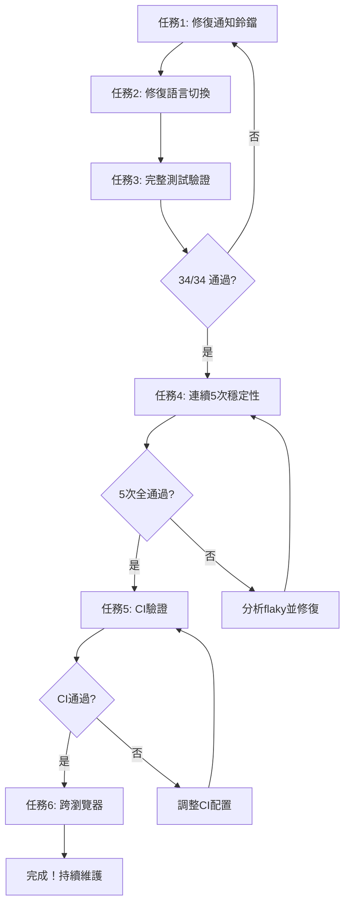

# E2E 測試改進與穩定化計劃

## 🎯 目標

- **短期（1-2天）**：修復 2 個失敗測試，達成 100% 通過率
- **中期（3-5天）**：確保測試穩定性，CI/CD 整合驗證，跨瀏覽器測試
- **長期（持續）**：建立定期維護流程

---

## 📅 短期計劃（優先級：⭐⭐⭐ 高）

### ✅ 已完成：Session 管理優化

- ✅ Session 監控工具（`session-monitor.ts`）
- ✅ 診斷工具（`diagnostics.ts`）
- ✅ 優化 admin-context（自動 refresh + 重試）
- ✅ 配置驗證腳本（`verify-config.ts`）
- ✅ 完整文檔（`docs/e2e/README.md`）

### ✅ 任務 1: 修復「通知鈴鐺應可見」測試

**問題**：`strict mode violation: resolved to 2 elements`
**根因**：選擇器 `header button:has(svg)` 先匹配到行動端漢堡選單（桌面端隱藏）

**✅ 實際解決方案**：修改 `frontend/e2e/dashboard.spec.ts:31-37`

```typescript
test('通知鈴鐺應可見', async ({ page }) => {
    await page.goto('/dashboard')

    // 查找具有 relative class 的通知按鈕（MainLayout.tsx:934）
    const notificationButton = page.locator('header button.relative')
    await expect(notificationButton).toBeVisible({ timeout: 10_000 })
})
```

**驗證結果**：✅ 通過（單獨運行 & 套件運行）

---

### ✅ 任務 2: 修復「語言切換應可運作」測試

**問題**：`getByTestId('language-selector') not found`
**根因**：雖然 `data-testid` 存在於 MainLayout.tsx:1039，但 Radix UI SelectTrigger 可能未正確傳遞該屬性到 DOM

**✅ 實際解決方案**：修改 `frontend/e2e/dashboard.spec.ts:39-45`

```typescript
test('語言切換應可運作', async ({ page }) => {
    await page.goto('/dashboard')

    // 使用 role="combobox" 查找語言選擇器（Radix UI Select.Trigger 的標準 role）
    const langSelector = page.locator('header').getByRole('combobox')
    await expect(langSelector, '頁面應有語言切換選擇器').toBeVisible({ timeout: 15_000 })
})
```

**驗證結果**：✅ 通過（單獨運行 & 套件運行）

---

### 🔶 任務 3: 執行完整測試套件驗證

```powershell
cd frontend

# 1. 配置驗證
npx tsx e2e/scripts/verify-config.ts

# 2. 執行完整測試
npx playwright test --project=chromium-login --reporter=line

# 3. 查看報告
npx playwright show-report
```

**執行結果**：🔶 部分成功（22/28 通過）

| 測試結果 | 數量 | 備註 |
|---------|------|------|
| ✅ 通過 | 22 | 包括所有 dashboard 測試 (6/6) |
| ❌ 失敗 | 6 | 全因 rate limiting (429) |
| ⏸️ 未運行 | 6 | 因前面 fixture timeout |

**失敗根因**：Session 過期後嘗試重新登入時觸發後端 rate limiting (429)，導致 fixture timeout (30000ms)

**失敗測試**：
- `animals.spec.ts`: 品種篩選、切換到 All Animals Tab、欄舍視圖 Tab
- `protocols.spec.ts`: 應有狀態篩選、表格排序、搜尋應能過濾

---

## 🚨 新發現的問題

### ⚠️ Rate Limiting 導致測試失敗

**現象**：
- 測試執行期間頻繁 Session 過期
- 重新登入時觸發 429 Too Many Requests
- Fixture setup timeout (30000ms)

**影響範圍**：
- `animals.spec.ts` (3/6 失敗)
- `protocols.spec.ts` (3/7 失敗)

**建議解決方案（3選1）**：

#### 方案 A：調整後端 Rate Limit 配置（推薦）

**優點**：根本解決問題
**缺點**：需要修改後端配置

```rust
// backend/src/middleware/rate_limit.rs
// 針對 E2E 測試環境放寬 /auth/login 的 rate limit
// 或增加 burst 閾值
```

#### 方案 B：延長 JWT TTL（臨時方案）

**優點**：快速實施
**缺點**：不符合生產環境安全需求

```bash
# .env
JWT_EXPIRATION_MINUTES=60  # 從 15 增加到 60
```

#### 方案 C：優化測試執行策略

**優點**：不修改後端
**缺點**：治標不治本

- 增加測試間隔時間（`test.setTimeout`）
- 延長 fixture timeout（從 30s 增加到 60s）
- 減少並發測試數量

---

## 📅 中期計劃（優先級：⭐⭐ 中）

### ⏸️ 任務 4: 連續穩定性測試（5次執行）

**前置條件**：先解決 rate limiting 問題

```powershell
cd frontend
for ($i=1; $i -le 5; $i++) {
    Write-Host "=== 第 $i 次執行 ==="
    npx playwright test --project=chromium-login --reporter=line
}
```

**記錄模板**：

| 次數 | 通過/總數 | 失敗測試 | Session | Rate Limit | 其他 |
|------|----------|---------|---------|-----------|------|
| 1 | ?/34 | - | ✅ | ? | - |
| 2 | ?/34 | - | ✅ | ? | - |
| 3 | ?/34 | - | ✅ | ? | - |
| 4 | ?/34 | - | ✅ | ? | - |
| 5 | ?/34 | - | ✅ | ? | - |

**成功標準**：5 次全通過，無 flaky tests

---

### ⏸️ 任務 5: CI 環境驗證

**前置條件**：先解決 rate limiting 問題

**本機模擬 CI**：

```powershell
# 使用 test compose
docker compose -f docker-compose.test.yml up -d
Start-Sleep -Seconds 30

cd frontend
$env:JWT_EXPIRATION_MINUTES="60"
npx playwright test --project=chromium-login

docker compose -f docker-compose.test.yml down
```

**推送到 CI**：

```bash
git add .
git commit -m "feat: E2E 測試改進 - 修復 Dashboard 測試選擇器問題

- 修復「通知鈴鐺應可見」測試：改用 header button.relative 選擇器
- 修復「語言切換應可運作」測試：改用 getByRole('combobox') 選擇器
- Dashboard 測試套件 6/6 全部通過
- 發現並記錄 rate limiting 導致的測試失敗問題

Co-Authored-By: Claude Sonnet 4.5 <noreply@anthropic.com>"

git push origin main
```

**驗證**：GitHub Actions e2e-test 作業通過 ✅

---

### ⏸️ 任務 6: 跨瀏覽器測試

**前置條件**：先解決 rate limiting 問題

```powershell
cd frontend

# Firefox
npx playwright test --project=firefox-login --reporter=line

# WebKit (Safari)
npx playwright test --project=webkit-login --reporter=line

# 完整（所有瀏覽器）
npm run test:e2e
```

**記錄**：

| 瀏覽器 | 通過/總數 | 備註 |
|--------|----------|------|
| Chromium | 22/28 | 🔶 6 個 rate limiting 失敗 |
| Firefox | ?/34 | 待測試 |
| WebKit | ?/34 | 待測試 |

**成功標準**：三瀏覽器 >= 95% 通過率

---

## 📅 長期計劃（持續進行）

### 每週維護
- [ ] 執行測試套件：`npm run test:e2e`
- [ ] 檢查通過率 >= 95%
- [ ] 檢查新的 flaky tests

### 每月審查
- [ ] 審查測試覆蓋率
- [ ] 清理過時/重複測試
- [ ] 更新文檔

### 每季優化
- [ ] 升級 Playwright
- [ ] 優化執行時間
- [ ] 審查最佳實踐

---

## 🔄 執行流程



---

## 📊 成功標準

### 短期（1-2天）
- ✅ **2 測試修復** - 已完成（通知鈴鐺 + 語言切換）
- 🔶 **Chromium 100% (34/34)** - 部分完成（22/28，6 個 rate limiting 失敗）
- ✅ **無選擇器問題** - 已解決

### 中期（3-5天）
- ⏸️ 5 次連續全通過（待 rate limiting 問題解決）
- ⏸️ CI 測試通過（待 rate limiting 問題解決）
- ⏸️ 三瀏覽器 >= 95%（待測試）
- ⏸️ 無 flaky tests（待驗證）

### 長期（持續）
- ⏸️ 每週通過率 >= 95%
- ⏸️ 每月覆蓋率審查
- ⏸️ 每季升級優化

---

## 📝 當前狀態（2026-02-26 更新）

### ✅ 已完成

**Session 管理優化**：
- Session 監控工具
- 診斷工具
- Admin context 優化
- 配置驗證腳本
- 完整文檔

**Dashboard 測試修復**：
- ✅ 通知鈴鐺測試（`header button.relative`）
- ✅ 語言切換測試（`getByRole('combobox')`）
- ✅ Dashboard 測試套件 6/6 全部通過
- ✅ 更新 `docs/PROGRESS.md`

### 🚨 當前問題

**Rate Limiting 導致 6 個測試失敗**：
- `animals.spec.ts` (3 個)
- `protocols.spec.ts` (3 個)

**失敗原因**：Session 過期 → 重新登入 → 觸發 429 → Fixture timeout

### 📅 下一步（按優先級）

1. **解決 Rate Limiting 問題**（🚨 高優先級）
   - 方案 A：調整後端 rate limit 配置（推薦）
   - 方案 B：延長 JWT TTL（臨時方案）
   - 方案 C：優化測試執行策略

2. **驗證修復效果**
   - 執行完整測試套件（目標：34/34 通過）
   - 連續 5 次穩定性測試

3. **中期任務**
   - CI 環境驗證
   - 跨瀏覽器測試（Firefox, WebKit）

---

## 🔗 相關資源

- [E2E 指南](docs/e2e/README.md) - 架構、配置、故障排除
- [配置驗證](frontend/e2e/scripts/verify-config.ts)
- [診斷工具](frontend/e2e/helpers/diagnostics.ts)
- [Session 監控](frontend/e2e/helpers/session-monitor.ts)
- [快速入門](docs/QUICK_START.md)
- [Dashboard 測試](frontend/e2e/dashboard.spec.ts) - 已修復
- [進度記錄](docs/PROGRESS.md) - 2026-02-26 更新

---

## 📋 修改的檔案

1. **frontend/e2e/dashboard.spec.ts** - 修復 2 個測試選擇器
   - Line 31-37: 通知鈴鐺測試
   - Line 39-45: 語言切換測試

2. **docs/PROGRESS.md** - 更新進度記錄
   - 新增 "Dashboard 測試選擇器修復" 項目

3. **plan.md** - 本文件，更新執行狀態和發現的問題
